# 餐饮AI店长 — 全链路数据流架构文档

> **版本**：v1.0  
> **更新日期**：2026-07  
> **维护方**：餐饮AI店长项目组  
> **文档定位**：系统级数据流设计文档，可直接作为开发排期输入

---

## 目录

- [1. 系统总览](#1-系统总览)
- [2. 技术栈全景](#2-技术栈全景)
- [3. 系统架构图](#3-系统架构图)
- [4. 数据库架构](#4-数据库架构)
- [5. 上行数据流（用户→系统）](#5-上行数据流用户系统)
- [6. 下行数据流（系统→用户）](#6-下行数据流系统用户)
- [7. 横向数据流（系统内部）](#7-横向数据流系统内部)
- [8. MCP Server 工具规范](#8-mcp-server-工具规范)
- [9. AI平台架构](#9-ai平台架构)
- [10. 对话驱动迭代机制](#10-对话驱动迭代机制)
- [11. 实现状态矩阵](#11-实现状态矩阵)
- [12. 开发排期建议](#12-开发排期建议)

---

## 1. 系统总览

餐饮AI店长是一个**零服务器成本**的餐饮全链路智能管理系统，通过 GitHub Pages 前端 + Supabase 数据库 + Coze AI平台 + MCP Server 的组合，实现从订单采集、数据分析、智能决策到用户触达的完整闭环。

### 核心设计原则

| 原则 | 说明 |
|------|------|
| **零服务器成本** | 前端托管 GitHub Pages，数据库用 Supabase 免费层，AI 用 Coze 平台，无自建服务器 |
| **对话驱动迭代** | 每周日23:00自动分析用户对话，生成迭代报告，形成数据闭环 |
| **MCP统一数据出口** | 所有 AI 智能体通过 MCP Server 统一访问 Supabase，避免直连数据库 |
| **渐进式扩展** | V1基础6表 → V2扩展15表 → V3迭代3表，按需迭代 |

---

## 2. 技术栈全景

### 2.1 技术选型一览

| 层级 | 技术 | 选型/版本 | 成本 | 选型原因 |
|------|------|-----------|------|----------|
| **前端** | GitHub Pages | 30个独立HTML页面 | 免费 | 零服务器成本，CDN全球加速，Git版本管理天然集成 |
| **前端仓库** | GitHub | wuli-bot/canyin-ai | 免费 | 代码托管 + Pages托管一体化 |
| **数据库** | Supabase PostgreSQL | URL: `https://vovzgflfdwngfuqnxjc.supabase.co` | 免费层 | 托管PostgreSQL，自带REST API和实时订阅，免运维 |
| **AI平台** | Coze（扣子） | 4大智能体 + 25位AI数字员工 | 按量计费 | 可视化编排工作流，原生支持MCP协议，多渠道发布 |
| **备用AI** | 阿里云百炼 | qwen-plus模型 | 按量计费 | Coze不可用时降级方案，国内网络稳定 |
| **MCP Server** | Python + FastAPI + SSE | 端口8765 | 低 | MCP协议标准实现，SSE支持流式响应，轻量高效 |
| **微信小程序** | 原生小程序 | AppID: `wx97425a7556eb8572` | 免费 | 微信生态原生触达，主体：长沙市望城区周兰英餐饮店 |
| **消息推送** | 飞书群机器人 | Webhook | 免费 | 餐饮运营团队飞书办公，推送日报/预警 |
| **打印机** | 飞鹅云打印机 | 回调Webhook | 硬件成本 | 外卖订单自动接单打印，回调写入数据库 |

### 2.2 技术架构分层

```
┌─────────────────────────────────────────────────────┐
│                    用户触达层                         │
│  微信小程序 · H5页面(GitHub Pages) · 飞书群 · 打印机  │
├─────────────────────────────────────────────────────┤
│                    AI 智能层                          │
│  Coze 4大智能体 · 25位数字员工 · 千问Agent(备用)      │
├─────────────────────────────────────────────────────┤
│                   数据服务层                          │
│  MCP Server (FastAPI + SSE, 端口8765)                │
│  4个核心工具：菜单/库存/门店/日报                      │
├─────────────────────────────────────────────────────┤
│                   数据存储层                          │
│  Supabase PostgreSQL · 24张表 · V1/V2/V3             │
├─────────────────────────────────────────────────────┤
│                   外部数据源                          │
│  美团 · 京东 · 饿了么 · 飞鹅打印机                    │
└─────────────────────────────────────────────────────┘
```

---

## 3. 系统架构图

### 3.1 全局架构图

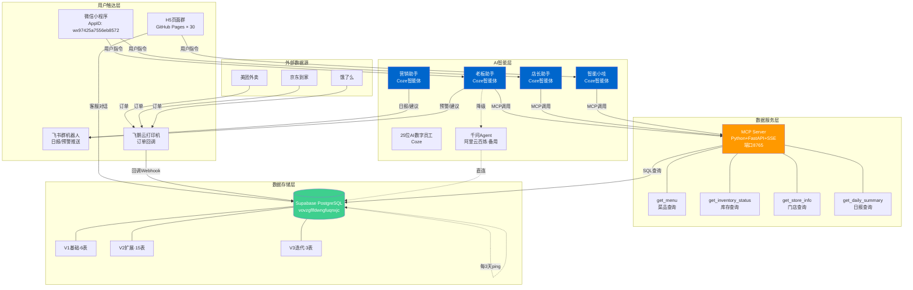

### 3.2 数据流总览图

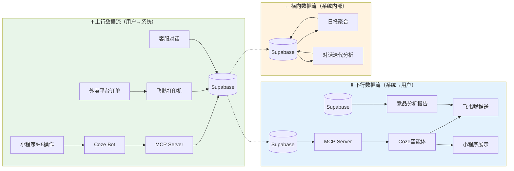

---

## 4. 数据库架构

### 4.1 数据库全景

```mermaid
erDiagram
    %% V1 基础表（6张）
    stores ||--o{ store_transactions : "一店多单"
    stores ||--o{ store_dishes : "一店多菜"
    stores ||--|| store_configs : "一店一配置"
    stores ||--o{ conversations : "一店多对话"
    store_transactions ||--o{ store_daily_summary : "聚合"
    stores ||--o{ store_daily_summary : "一店多日报"

    %% V2 扩展表（15张）
    stores ||--o{ supplier_profiles : "一店多供应商"
    supplier_profiles ||--o{ purchase_acceptance : "一供应商多验收"
    supplier_profiles ||--o{ supplier_scores : "一供应商多评分"
    stores ||--o{ ingredient_inventory : "一店多食材库存"
    stores ||--o{ food_safety_checklist : "一店多检查项"
    stores ||--o{ equipment_registry : "一店多设备"
    equipment_registry ||--o{ maintenance_logs : "一设备多维护"
    stores ||--o{ data_quality_metrics : "数据质量监控"
    stores ||--o{ decision_confidence_logs : "决策置信度"
    stores ||--o{ loss_records : "损耗记录"
    loss_records ||--o{ loss_daily_summary : "聚合"
    stores ||--o{ staff_profiles : "一店多员工"
    staff_profiles ||--o{ staff_schedule : "一员工多排班"
    staff_profiles ||--o{ staff_training : "一员工多培训"
    stores ||--o{ staff_tasks : "一店多任务"

    %% V3 迭代表（3张）
    conversations ||--o{ feedback_labels : "对话标签化"
    stores ||--o{ iteration_reports : "迭代报告"
    iteration_reports ||--o{ iteration_tasks : "一报告多任务"
```

### 4.2 V1 基础表（6张）— 核心业务数据

| # | 表名 | 用途 | 核心字段 | 实现状态 |
|---|------|------|----------|----------|
| 1 | `stores` | 门店主表 | store_id, name, address, phone | ✅ 已实现 |
| 2 | `conversations` | 对话记录 | store_id, role, content, created_at | ✅ 已实现 |
| 3 | `store_transactions` | 交易/订单 | store_id, amount, platform, created_at | ✅ 已实现 |
| 4 | `store_dishes` | 菜品目录 | store_id, name, price, category | ✅ 已实现 |
| 5 | `store_daily_summary` | 日报聚合 | store_id, date, total_revenue, order_count | ✅ 已实现 |
| 6 | `store_configs` | 门店配置 | store_id, config_key, config_value | ✅ 已实现 |

### 4.3 V2 扩展表（15张）— 全链路管理

| # | 表名 | 用途 | 所属模块 | 实现状态 |
|---|------|------|----------|----------|
| 7 | `supplier_profiles` | 供应商档案 | 供应链管理 | ✅ 已实现 |
| 8 | `purchase_acceptance` | 采购验收记录 | 供应链管理 | ✅ 已实现 |
| 9 | `supplier_scores` | 供应商评分 | 供应链管理 | ✅ 已实现 |
| 10 | `ingredient_inventory` | 食材库存 | 库存管理 | ✅ 已实现 |
| 11 | `food_safety_checklist` | 食安检查清单 | 食品安全 | ✅ 已实现 |
| 12 | `equipment_registry` | 设备台账 | 设备管理 | ✅ 已实现 |
| 13 | `maintenance_logs` | 维护日志 | 设备管理 | ✅ 已实现 |
| 14 | `data_quality_metrics` | 数据质量指标 | 系统监控 | ✅ 已实现 |
| 15 | `decision_confidence_logs` | 决策置信度日志 | 系统监控 | ✅ 已实现 |
| 16 | `loss_records` | 损耗记录 | 损耗管理 | ✅ 已实现 |
| 17 | `loss_daily_summary` | 损耗日报聚合 | 损耗管理 | ✅ 已实现 |
| 18 | `staff_profiles` | 员工档案 | 人员管理 | ✅ 已实现 |
| 19 | `staff_schedule` | 排班表 | 人员管理 | ✅ 已实现 |
| 20 | `staff_training` | 培训记录 | 人员管理 | ✅ 已实现 |
| 21 | `staff_tasks` | 任务分配 | 人员管理 | ✅ 已实现 |

### 4.4 V3 迭代表（3张）— 对话驱动进化

| # | 表名 | 用途 | 触发周期 | 实现状态 |
|---|------|------|----------|----------|
| 22 | `feedback_labels` | 对话反馈标签 | 实时/批处理 | ✅ 已实现 |
| 23 | `iteration_reports` | 迭代分析报告 | 每周日23:00 | ✅ 已实现 |
| 24 | `iteration_tasks` | 迭代任务清单 | 报告生成后 | ✅ 已实现 |

### 4.5 数据库保活策略

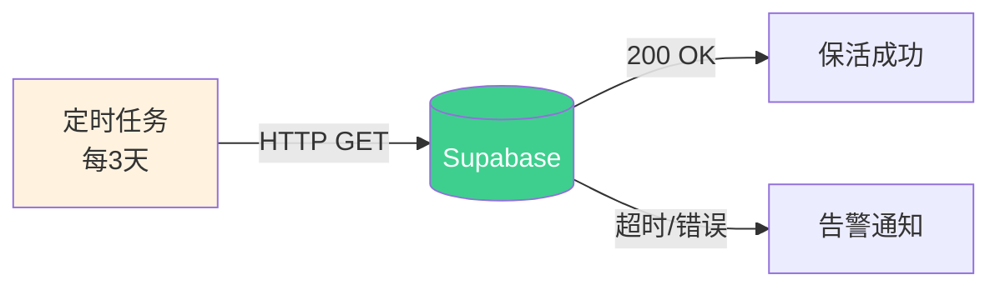

> **原因**：Supabase 免费层项目闲置7天后会自动暂停，需定期 ping 保持活跃。

---

## 5. 上行数据流（用户→系统）

### 5.1 用户指令流（小程序/H5 → Coze → MCP → Supabase）

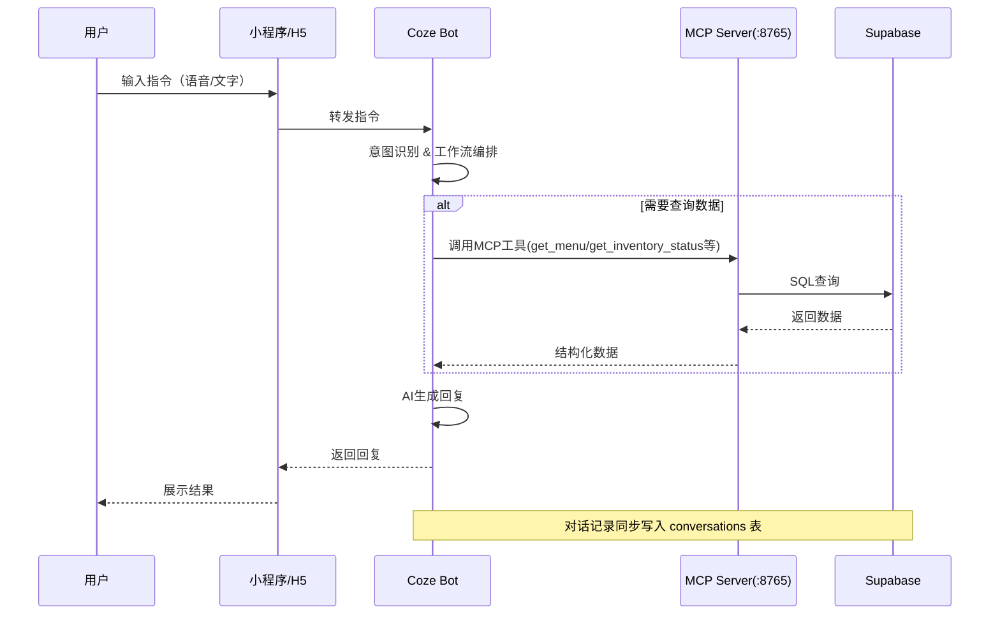

**技术选型说明**：

| 环节 | 技术方案 | 选型原因 |
|------|----------|----------|
| 指令传输 | Coze Bot API | 原生支持多渠道发布，小程序/H5统一接入 |
| 意图识别 | Coze工作流编排 | 可视化编排，无需自建NLP服务 |
| 数据查询 | MCP Server (SSE) | MCP协议标准化AI工具调用，SSE支持流式传输 |
| 数据库访问 | Supabase REST API | 无需直连数据库，HTTP接口安全便捷 |

### 5.2 外卖订单流（平台 → 飞鹅打印机 → Supabase）

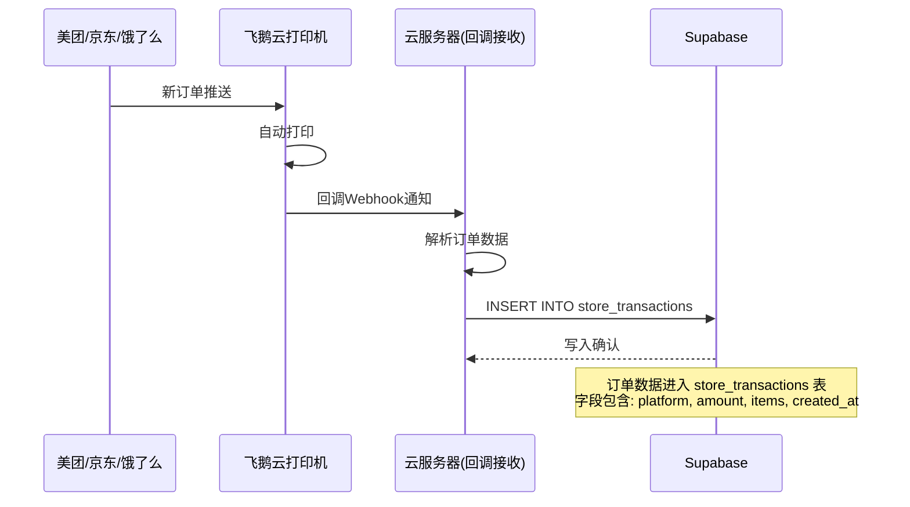

**技术选型说明**：

| 环节 | 技术方案 | 选型原因 |
|------|----------|----------|
| 订单接收 | 飞鹅云打印机回调 | 硬件级自动接单，无需开发对接各平台API |
| 回调处理 | 云服务器接收Webhook | 轻量级HTTP服务，仅做数据转发 |
| 数据写入 | Supabase INSERT | 直接写入store_transactions，触发后续聚合 |

**数据流详情**：

```
美团订单 → 飞鹅打印机 → Webhook回调 → 解析{platform:"meituan", amount, items} → store_transactions
京东订单 → 飞鹅打印机 → Webhook回调 → 解析{platform:"jddj", amount, items}    → store_transactions
饿了么订单 → 飞鹅打印机 → Webhook回调 → 解析{platform:"eleme", amount, items}  → store_transactions
```

### 5.3 客服对话流（H5 → Supabase → 迭代分析）

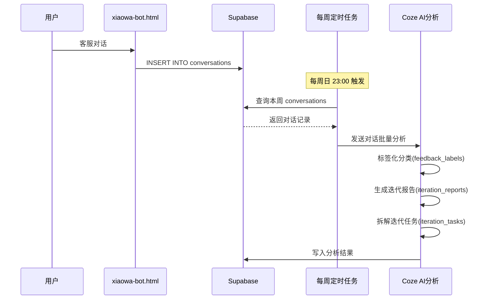

**技术选型说明**：

| 环节 | 技术方案 | 选型原因 |
|------|----------|----------|
| 对话采集 | H5页面直连Supabase | 零中间层，降低延迟 |
| 对话存储 | conversations表 | 统一存储所有渠道对话 |
| 定时分析 | 每周日23:00自动触发 | 低峰期执行，不影响日常使用 |
| 标签化 | Coze AI分析 | 利用AI理解对话语义，自动分类 |

---

## 6. 下行数据流（系统→用户）

### 6.1 智能推送流（Supabase → MCP → Coze → 飞书/小程序）

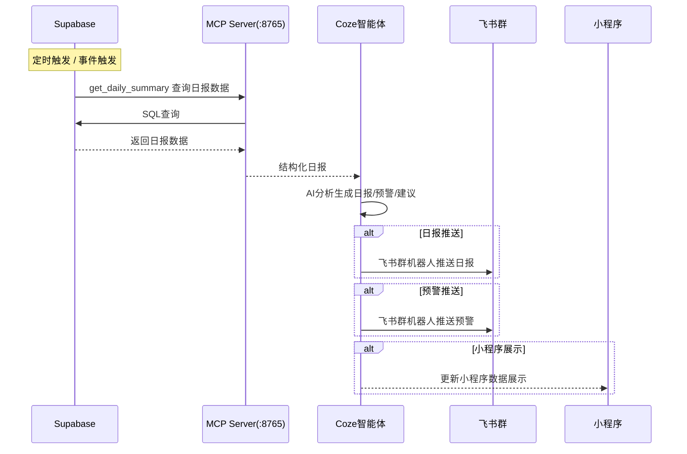

**推送类型明细**：

| 推送类型 | 触发条件 | 推送渠道 | 数据来源 | 实现状态 |
|----------|----------|----------|----------|----------|
| 营业日报 | 每日固定时间 | 飞书群 | store_daily_summary | ✅ 已实现 |
| 异常预警 | 库存不足/损耗异常 | 飞书群 | ingredient_inventory / loss_records | ✅ 已实现 |
| 营销建议 | 周度分析 | 飞书群 | store_transactions + store_dishes | ✅ 已实现 |
| 迭代报告 | 每周日23:00 | 飞书群 | iteration_reports | ✅ 已实现 |
| 实时查询响应 | 用户主动查询 | 小程序/H5 | MCP实时查询 | ✅ 已实现 |

### 6.2 竞品监控流（采集 → Supabase → 分析 → 飞书）

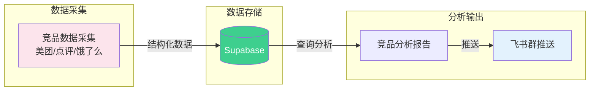

> **说明**：竞品数据采集当前为半自动化流程，后续计划接入自动化采集脚本。

---

## 7. 横向数据流（系统内部）

### 7.1 日报聚合流（订单 → 日报）

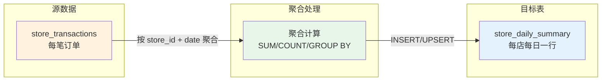

**聚合逻辑**：

| 聚合维度 | 源表 | 目标表 | 聚合方式 |
|----------|------|--------|----------|
| 日维度 | store_transactions | store_daily_summary | 按 store_id + date GROUP BY |
| 损耗日维度 | loss_records | loss_daily_summary | 按 store_id + date GROUP BY |

### 7.2 对话迭代流（对话 → 标签 → 报告 → 任务）

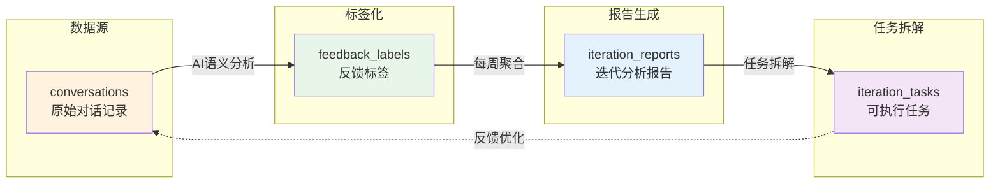

**迭代闭环说明**：

```
用户对话 → AI标签化分类 → 周度聚合分析 → 生成迭代报告 → 拆解可执行任务 → 优化AI回复 → 更好的用户体验 → 更多对话
```

### 7.3 选址诊断流（独立模块）

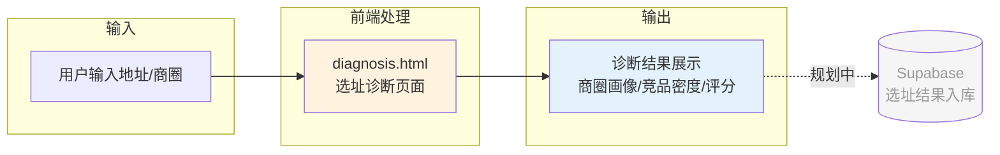

> **当前状态**：选址诊断结果在前端展示，**暂未入库**。规划中将诊断结果写入数据库，支持历史对比和持续优化。

### 7.4 全链路数据流完整图

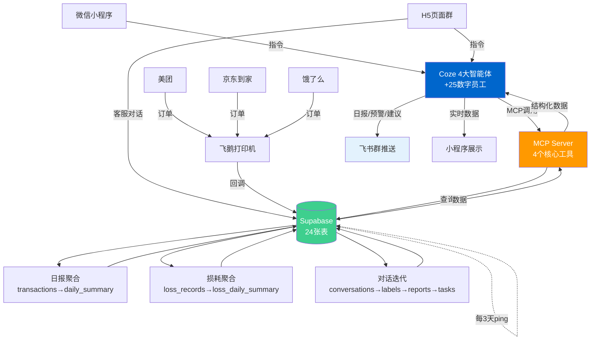

---

## 8. MCP Server 工具规范

### 8.1 架构概述

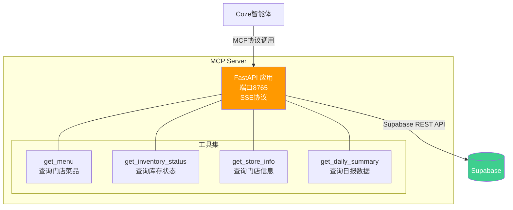

### 8.2 工具详细规范

| # | 工具名 | 功能 | 输入参数 | 输出 | 关联表 | 实现状态 |
|---|--------|------|----------|------|--------|----------|
| 1 | `get_menu` | 查询门店菜品 | store_id | 菜品列表(名称/价格/分类) | store_dishes | ✅ 已实现 |
| 2 | `get_inventory_status` | 查询库存状态 | store_id | 食材库存明细(当前量/预警线) | ingredient_inventory | ✅ 已实现 |
| 3 | `get_store_info` | 查询门店信息 | store_id | 门店基础信息+配置 | stores, store_configs | ✅ 已实现 |
| 4 | `get_daily_summary` | 查询日报数据 | store_id, date | 日营收/订单量/损耗等 | store_daily_summary | ✅ 已实现 |

### 8.3 技术选型说明

| 维度 | 选型 | 原因 |
|------|------|------|
| 协议 | MCP (Model Context Protocol) | AI工具调用行业标准，Coze原生支持 |
| 传输 | SSE (Server-Sent Events) | 支持流式响应，适合AI场景的长文本输出 |
| 框架 | FastAPI | 异步高性能，自动生成API文档，Python生态友好 |
| 端口 | 8765 | 避开常用端口冲突 |
| 数据库连接 | Supabase REST API | 无需维护数据库连接池，HTTP无状态 |

### 8.4 规划中的MCP工具

| # | 工具名 | 功能 | 关联表 | 实现状态 |
|---|--------|------|--------|----------|
| 5 | `get_supplier_scores` | 查询供应商评分 | supplier_profiles, supplier_scores | 🔲 规划中 |
| 6 | `get_staff_schedule` | 查询排班 | staff_profiles, staff_schedule | 🔲 规划中 |
| 7 | `get_equipment_status` | 查询设备状态 | equipment_registry, maintenance_logs | 🔲 规划中 |
| 8 | `get_loss_summary` | 查询损耗日报 | loss_records, loss_daily_summary | 🔲 规划中 |
| 9 | `get_iteration_report` | 查询迭代报告 | iteration_reports, iteration_tasks | 🔲 规划中 |

---

## 9. AI平台架构

### 9.1 Coze智能体矩阵

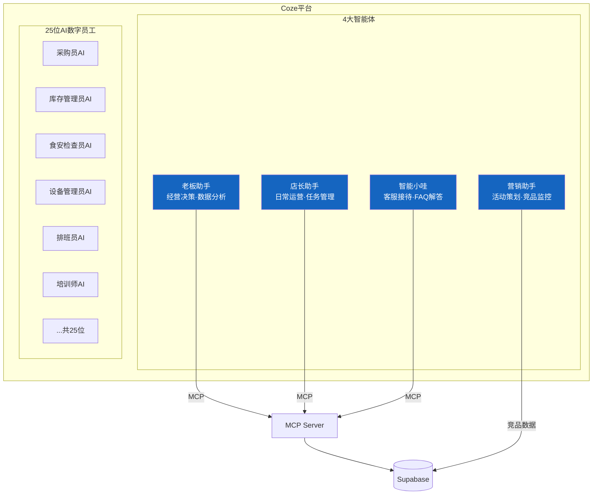

### 9.2 智能体职责矩阵

| 智能体 | 核心职责 | 数据权限 | 触发方式 | 输出渠道 |
|--------|----------|----------|----------|----------|
| 老板助手 | 经营决策、数据分析、预警 | 全部24张表 | 用户指令 / 定时触发 | 飞书群 / 小程序 |
| 店长助手 | 日常运营、任务分配、排班 | 运营相关表 | 用户指令 | 小程序 / 飞书群 |
| 营销助手 | 活动策划、竞品分析、复购提升 | 交易/菜品表 | 用户指令 / 定时触发 | 飞书群 |
| 智能小哇 | 客服接待、FAQ、对话记录 | conversations | 用户对话 | H5 / 小程序 |

### 9.3 降级方案

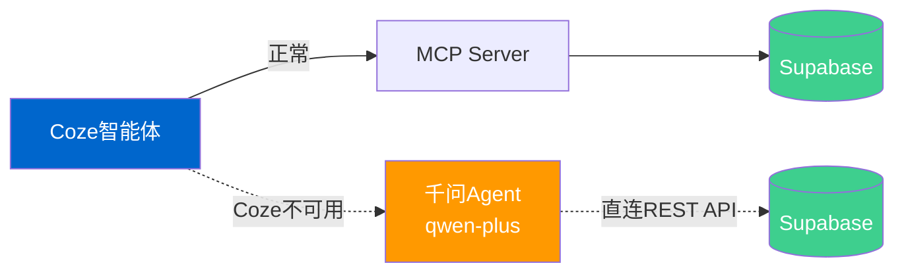

> **降级策略**：当 Coze 平台不可用时，自动切换至阿里云百炼平台的千问Agent（qwen-plus模型），通过直连Supabase REST API维持基本服务。降级模式不支持MCP工具调用和工作流编排，仅支持基础对话+数据查询。

---

## 10. 对话驱动迭代机制

### 10.1 迭代闭环架构

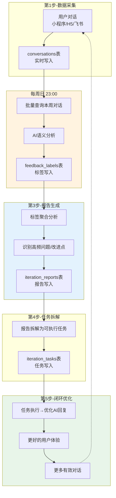

### 10.2 迭代周期说明

| 阶段 | 时间 | 操作 | 涉及表 |
|------|------|------|--------|
| 日常采集 | 实时 | 对话写入 | conversations |
| 标签化 | 每周日 23:00 | AI分析标签 | feedback_labels |
| 报告生成 | 每周日 23:00 | 聚合分析 | iteration_reports |
| 任务拆解 | 报告生成后 | 拆解任务 | iteration_tasks |
| 优化执行 | 下周持续 | 执行任务优化 | 反馈至 conversations |

---

## 11. 实现状态矩阵

### 11.1 数据流实现状态

| 数据流 | 方向 | 描述 | 实现状态 |
|--------|------|------|----------|
| 用户指令→Coze→MCP→Supabase | 上行 | 用户查询菜品/库存/门店/日报 | ✅ 已实现 |
| 外卖订单→飞鹅→Supabase | 上行 | 三平台订单自动入库 | ✅ 已实现 |
| 客服对话→Supabase | 上行 | H5客服对话存储 | ✅ 已实现 |
| Supabase→MCP→Coze→飞书推送 | 下行 | 日报/预警/建议推送 | ✅ 已实现 |
| Supabase→MCP→Coze→小程序展示 | 下行 | 实时数据展示 | ✅ 已实现 |
| 竞品采集→Supabase→分析→飞书 | 下行 | 竞品监控推送 | 🔶 半自动 |
| 订单→日报聚合 | 横向 | transactions→daily_summary | ✅ 已实现 |
| 损耗→损耗日报聚合 | 横向 | loss_records→loss_daily_summary | ✅ 已实现 |
| 对话→标签→报告→任务 | 横向 | 对话驱动迭代闭环 | ✅ 已实现 |
| 选址诊断→入库 | 横向 | diagnosis.html结果存储 | 🔲 规划中 |
| Supabase保活 | 横向 | 每3天自动ping | ✅ 已实现 |
| Coze→千问降级 | 横向 | AI平台故障切换 | 🔲 规划中 |

### 11.2 组件实现状态

| 组件 | 描述 | 实现状态 |
|------|------|----------|
| GitHub Pages × 30页面 | 前端页面群 | ✅ 已实现 |
| Supabase V1 基础6表 | 核心业务数据 | ✅ 已实现 |
| Supabase V2 扩展15表 | 全链路管理 | ✅ 已实现 |
| Supabase V3 迭代3表 | 对话驱动进化 | ✅ 已实现 |
| MCP Server 4工具 | 数据查询服务 | ✅ 已实现 |
| MCP Server 5工具(规划) | 扩展数据查询 | 🔲 规划中 |
| Coze 4大智能体 | AI决策中枢 | ✅ 已实现 |
| Coze 25位数字员工 | 专业岗位AI | ✅ 已实现 |
| 微信小程序 | 用户触达 | ✅ 已实现 |
| 飞鹅打印机回调 | 订单自动接单 | ✅ 已实现 |
| 飞书群机器人 | 消息推送 | ✅ 已实现 |
| 千问Agent备用 | 降级方案 | 🔲 规划中 |
| 对话迭代定时任务 | 每周自动分析 | ✅ 已实现 |
| Supabase保活定时 | 每3天ping | ✅ 已实现 |

### 11.3 H5页面清单（30个）

> 以下为 GitHub Pages 托管的独立HTML页面，仓库 `wuli-bot/canyin-ai`。

| # | 页面 | 功能 | 数据流类型 | 实现状态 |
|---|------|------|------------|----------|
| 1 | index.html | 首页/导航 | 展示 | ✅ |
| 2 | xiaowa-bot.html | 客服对话 | 上行→Supabase | ✅ |
| 3 | diagnosis.html | 选址诊断 | 独立(暂未入库) | ✅ |
| 4-30 | （其余27个页面） | 各功能模块 | 按需 | ✅ |

> **注**：30个H5页面均已部署上线，具体页面清单详见仓库 `wuli-bot/canyin-ai` 的 `docs/` 目录。

---

## 12. 开发排期建议

### 12.1 规划中功能优先级

| 优先级 | 功能 | 依赖 | 预估工作量 | 关联数据流 |
|--------|------|------|------------|------------|
| P0 | MCP工具扩展(5→9) | MCP Server | 2-3天 | 上行数据流 |
| P0 | 选址诊断结果入库 | Supabase建表 | 1-2天 | 横向数据流 |
| P1 | 千问Agent降级方案 | 阿里云百炼 | 3-5天 | 横向数据流 |
| P1 | 竞品监控全自动化 | 采集脚本 | 5-7天 | 下行数据流 |
| P2 | MCP工具权限分级 | MCP Server | 2-3天 | 上行数据流 |
| P2 | 实时数据推送(SSE) | 前端改造 | 3-5天 | 下行数据流 |
| P3 | 多门店数据隔离 | Supabase RLS | 2-3天 | 全链路 |

### 12.2 数据流优化方向

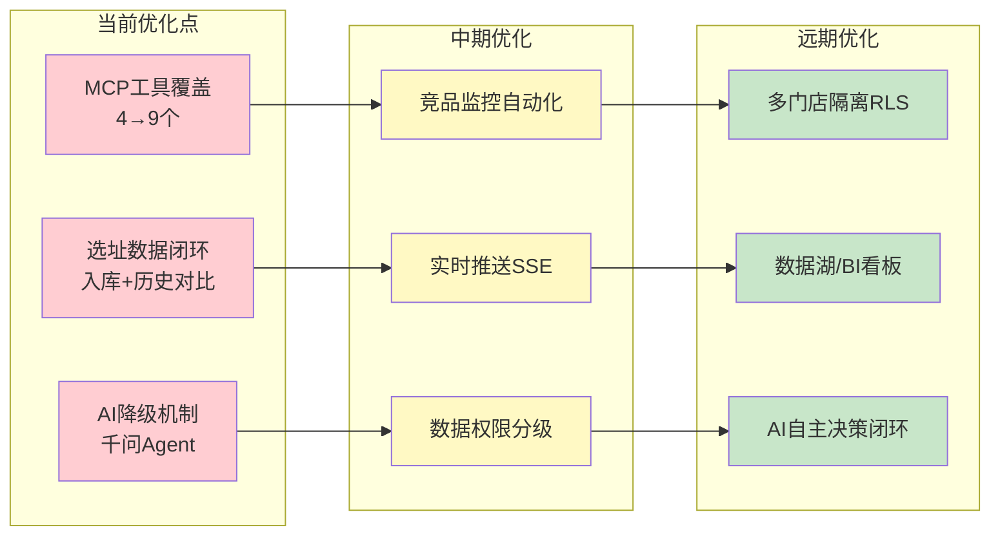

---

## 附录A：数据流完整索引

| 编号 | 数据流名称 | 方向 | 源 | 目标 | 涉及组件 | 状态 |
|------|-----------|------|-----|------|----------|------|
| UF-01 | 用户指令查询 | 上行 | 小程序/H5 | Supabase | Coze→MCP | ✅ |
| UF-02 | 外卖订单入库 | 上行 | 美团/京东/饿了么 | Supabase | 飞鹅→回调服务 | ✅ |
| UF-03 | 客服对话存储 | 上行 | H5 | Supabase | 直连 | ✅ |
| DF-01 | 日报推送 | 下行 | Supabase | 飞书群 | MCP→Coze→飞书 | ✅ |
| DF-02 | 预警推送 | 下行 | Supabase | 飞书群 | MCP→Coze→飞书 | ✅ |
| DF-03 | 实时数据展示 | 下行 | Supabase | 小程序 | MCP→Coze | ✅ |
| DF-04 | 竞品分析推送 | 下行 | Supabase | 飞书群 | 采集→分析→推送 | 🔶 |
| HF-01 | 订单日报聚合 | 横向 | store_transactions | store_daily_summary | SQL聚合 | ✅ |
| HF-02 | 损耗日报聚合 | 横向 | loss_records | loss_daily_summary | SQL聚合 | ✅ |
| HF-03 | 对话迭代闭环 | 横向 | conversations | iteration_tasks | AI分析链 | ✅ |
| HF-04 | 选址诊断 | 横向 | diagnosis.html | (暂未入库) | 前端独立 | 🔲 |
| HF-05 | 数据库保活 | 横向 | 定时任务 | Supabase | HTTP ping | ✅ |
| HF-06 | AI降级切换 | 横向 | Coze | 千问Agent | 故障检测 | 🔲 |

---

## 附录B：关键配置信息

| 配置项 | 值 | 备注 |
|--------|-----|------|
| GitHub仓库 | `wuli-bot/canyin-ai` | 前端代码+Pages托管 |
| Supabase URL | `https://vovzgflfdwngfuqnxjc.supabase.co` | 数据库 |
| Supabase保活周期 | 每3天 | 防止免费层暂停 |
| MCP Server端口 | 8765 | FastAPI + SSE |
| MCP工具数量 | 4(已实现) / 9(规划) | — |
| Coze智能体数量 | 4大智能体 + 25数字员工 | — |
| 小程序AppID | `wx97425a7556eb8572` | 微信原生小程序 |
| 小程序主体 | 长沙市望城区周兰英餐饮店 | 个体工商户 |
| 备用AI模型 | qwen-plus | 阿里云百炼平台 |
| 迭代分析周期 | 每周日 23:00 | 自动触发 |
| 数据库表总数 | 24张 | V1(6) + V2(15) + V3(3) |
| H5页面总数 | 30个 | GitHub Pages托管 |

---

> **文档结束** | 本文档为纯设计文档，不包含可运行代码。如需技术实现细节，请参考各模块开发文档。