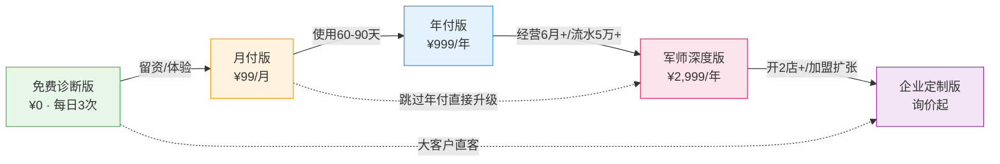
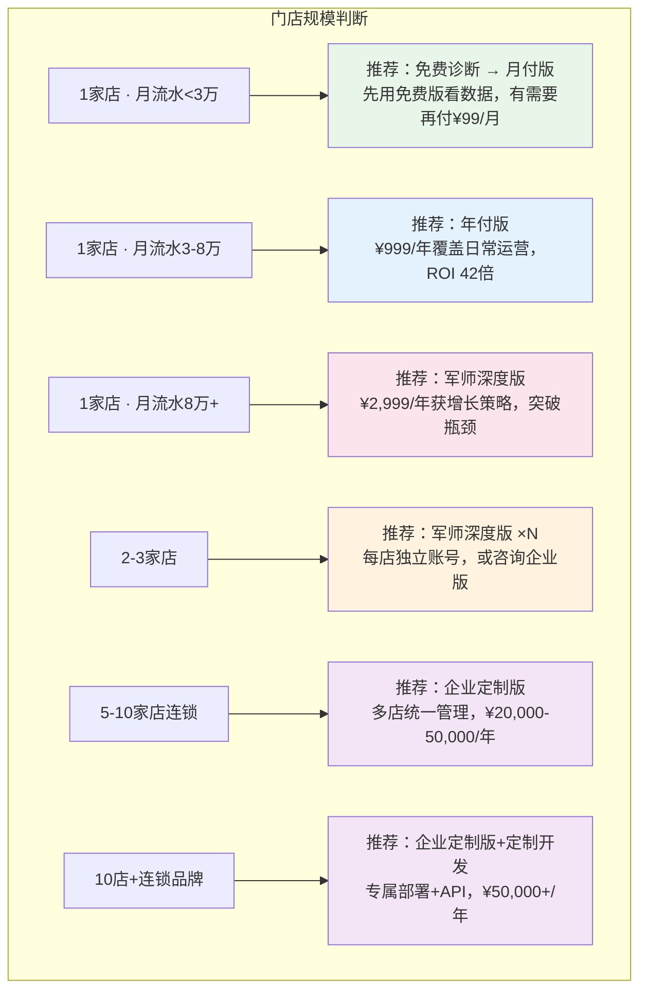
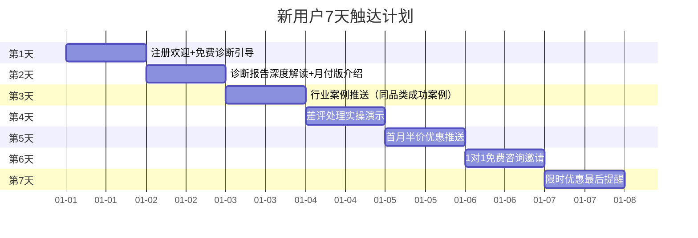
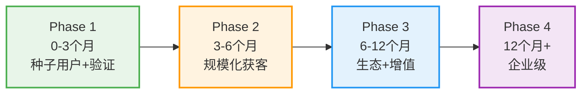
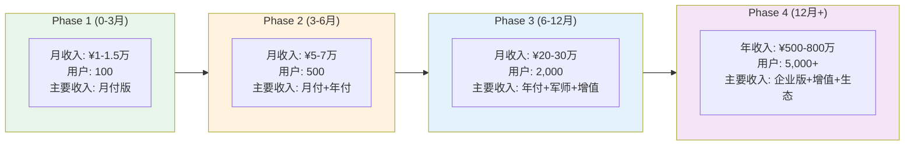

# 餐饮AI店长 · 完整商业化体系文档

> **文档定位**：餐饮AI店长项目的商业化顶层设计文档，涵盖定价体系、增值服务、回本分析、转化漏斗、竞品对比与商业化路线图。
>
> **版本**：v1.0 | **更新日期**：2026-07

---

## 目录

1. [完整定价体系设计](#1-完整定价体系设计)
2. [增值付费项目](#2-增值付费项目)
3. [回本周期分析](#3-回本周期分析)
4. [转化漏斗设计](#4-转化漏斗设计)
5. [竞品定价对比](#5-竞品定价对比)
6. [商业化路线图](#6-商业化路线图)

---

## 1. 完整定价体系设计

### 1.1 五档定价总览

| 档位 | 版本名称 | 价格 | 计费周期 | 目标用户 | 核心价值主张 |
|:---:|:---:|:---:|:---:|:---:|:---:|
| ① | 免费诊断版 | ¥0 | 每日3次 | 探索期餐饮经营者 | 3秒出诊断报告，先看数据再决定 |
| ② | AI店长月付版 | ¥99/月 | 按月 | 单店经营者，想先试用 | 6大模块覆盖日常运营，月费一杯咖啡钱 |
| ③ | AI店长年付版 | ¥999/年（≈¥83/月） | 按年 | 单店经营者，长期使用 | 月付全部 + 3项进阶能力，年省¥189 |
| ④ | AI军师深度版 | ¥2,999/年 | 按年 | 精品门店，追求增长 | 全功能 + 1对1咨询，陪伴式增长 |
| ⑤ | 企业定制版 | 询价（起步¥20,000/年） | 按年 | 连锁品牌（3店+） | 专属部署 + 多店管理 + 定制开发 |

### 1.2 功能矩阵详表

> ✅ = 包含 | 🔒 = 不包含 | ⭐ = 该档新增 | ➕ = 需额外付费

| 功能模块 | 免费诊断 | 月付版 ¥99/月 | 年付版 ¥999/年 | 军师深度版 ¥2,999/年 | 企业定制版 |
|:---|:---:|:---:|:---:|:---:|:---:|
| **诊断与分析** | | | | | |
| 区域商圈诊断 | ✅（每日3次） | ✅（不限次） | ✅ | ✅ | ✅ |
| 品类分析报告 | ✅ | ✅ | ✅ | ✅ | ✅ |
| 竞品密度热力图 | ✅（基础） | ✅（详细） | ✅ | ⭐ 区域竞品诊断 | ✅（全维度） |
| **日常运营模块** | | | | | |
| 差评处理 & 智能回复 | — | ⭐ | ✅ | ✅ | ✅ |
| 私域引流方案 | — | ⭐ | ✅ | ✅ | ✅ |
| 成本核算（BOM计算） | — | ⭐ | ✅ | ✅ | ✅ |
| 财务报表（日/周/月报） | — | ⭐ | ✅ | ✅ | ✅ |
| 菜品分析 & 销售排行 | — | ⭐ | ✅ | ✅ | ✅ |
| 库存管理 & 补货预警 | — | ⭐ | ✅ | ✅ | ✅ |
| **进阶能力** | | | | | |
| 去AI味改写引擎 | — | — | ⭐ | ✅ | ✅ |
| 语音点餐助手 | — | — | ⭐ | ✅ | ✅ |
| 复购引擎（7次触达+会员体系） | — | — | ⭐ | ✅ | ✅ |
| **军师级深度** | | | | | |
| 区域竞品深度诊断 | — | — | — | ⭐ | ✅ |
| 定价策略（多平台定价+满减方案） | — | — | — | ⭐ | ✅ |
| 菜单优化 & 菜单设计 | — | — | — | ⭐ | ✅ |
| 1对1专家咨询（季度1次） | — | — | — | ⭐ | ✅（月度1次） |
| 选址分析报告 | — | — | — | — | ✅ |
| **企业级能力** | | | | | |
| 专属部署 & 品牌定制 | — | — | — | — | ⭐ |
| 数据API接口 | — | — | — | — | ⭐ |
| 多店统一管理 & 数据看板 | — | — | — | — | ⭐ |
| 定制功能开发 | — | — | — | — | ⭐ |
| 专属客户成功经理 | — | — | — | — | ⭐ |
| SLA保障（99.9%可用性） | — | — | — | — | ⭐ |

### 1.3 各档功能边界说明

#### 免费诊断版 → 月付版 的升级跃点

```
免费版能力边界：仅提供"看数据"——区域诊断 + 品类分析 + 竞品密度
                  ↓ 升级触发条件：用户查看诊断报告后，提示"6大运营模块可解决以上问题"
月付版解锁能力：从"看数据"到"用工具"——差评处理、成本核算、财务报表等6大模块
```

**升级心理触发点**：用户看到自己的竞品密度过高 → 系统提示"差评处理模块可帮您提升评分，抢占排名" → 用户产生付费意愿。

#### 月付版 → 年付版 的升级跃点

```
月付版能力边界：6大基础模块，无进阶AI能力
                  ↓ 升级触发条件：用户使用1-2个月后，系统推送"年付版解锁3项进阶能力"
年付版新增能力：去AI味改写（内容自然度↑）、语音点餐（人力成本↓）、复购引擎（老客复购↑）
```

**升级经济触发点**：年付¥999 vs 月付¥99×12=¥1,188，年省¥189（约16%折扣），用户使用超3个月后留存率高，年付转化窗口在**第60-90天**。

#### 年付版 → 军师深度版 的升级跃点

```
年付版能力边界：单店日常运营全覆盖，但缺乏增长策略指导
                  ↓ 升级触发条件：用户年流水增长遇瓶颈，需要专家级策略
军师版新增能力：区域竞品诊断 + 定价策略 + 菜单优化 + 1对1咨询
```

**升级场景触发点**：用户经营6个月以上，月流水稳定在5万+ → 系统推送"军师版帮您突破增长天花板" → 1对1咨询作为高价值锚点。

#### 军师深度版 → 企业定制版 的升级跃点

```
军师版能力边界：单店深度运营，不支持多店管理
                  ↓ 升级触发条件：用户开始开第二家店，或加盟商接入
企业版新增能力：多店管理 + 数据API + 专属部署 + 定制开发
```

### 1.4 升级路径设计



**升级激励策略**：

| 升级路径 | 激励方式 | 预期转化周期 |
|:---:|:---|:---:|
| 免费 → 月付 | 首月¥49体验价（半价） | 3-7天 |
| 月付 → 年付 | 年付赠送"复购引擎"1个月体验 | 60-90天 |
| 年付 → 军师 | 赠送1次免费1对1咨询（价值¥500） | 4-6个月 |
| 军师 → 企业 | 免费数据迁移 + 首年9折 | 触发条件达成即推 |

---

## 2. 增值付费项目

### 2.1 增值服务总览

| 增值项目 | 定价模式 | 价格区间 | 适用版本 | 预估毛利率 |
|:---|:---:|:---:|:---:|:---:|
| 1对1专家咨询 | 按次/按套餐 | ¥300-800/次 | 年付及以上 | 85%+ |
| 定制功能开发 | 按项目报价 | ¥3,000-50,000/项 | 企业定制版 | 60-70% |
| 数据API | 按量计费 | ¥0.01-0.05/次调用 | 企业定制版 | 90%+ |
| 培训服务 | 按场次/按系列 | ¥200-2,000/场 | 所有付费版 | 80%+ |
| 增值模板/素材包 | 按包购买 | ¥29-199/包 | 所有付费版 | 95%+ |

### 2.2 1对1专家咨询定价

| 咨询类型 | 单次价格 | 套餐价格 | 内容范围 |
|:---|:---:|:---:|:---|
| 基础诊断咨询 | ¥300/次（30分钟） | ¥1,200/5次 | 经营数据分析 + 基础优化建议 |
| 深度策略咨询 | ¥500/次（60分钟） | ¥2,000/5次 | 定价策略 + 菜单优化 + 竞品应对 |
| 专家级咨询 | ¥800/次（90分钟） | ¥3,600/5次 | 全方位经营诊断 + 增长方案 + 跟踪辅导 |
| 紧急危机咨询 | ¥1,000/次（不限时长） | — | 食品安全事件/集中差评/平台处罚等 |

> **军师深度版用户**：每年包含2次深度策略咨询（已含在¥2,999年费中），超出部分按套餐价8折。
>
> **企业定制版用户**：每月1次专家级咨询（已含），超出部分按套餐价7折。

### 2.3 定制开发定价

| 开发类型 | 定价区间 | 工期 | 说明 |
|:---|:---:|:---:|:---|
| 小功能定制 | ¥3,000-8,000 | 1-2周 | 如：自定义报表模板、特殊菜品计算规则 |
| 中型模块开发 | ¥8,000-20,000 | 2-4周 | 如：特定供应商API对接、自定义营销活动引擎 |
| 大型系统定制 | ¥20,000-50,000 | 4-8周 | 如：连锁中央厨房系统、加盟商管理系统 |
| 硬件集成方案 | ¥10,000-30,000 | 3-6周 | 如：对接特定品牌POS机、电子秤、KDS屏 |

**定价原则**：人力成本 × 1.5-2.0倍报价，确保60%+毛利率。

### 2.4 数据API按量计费

| API能力 | 计费方式 | 单价 | 免费额度 |
|:---|:---:|:---:|:---:|
| 基础数据查询 | 按次 | ¥0.01/次 | 1,000次/月 |
| 区域诊断API | 按次 | ¥0.05/次 | 100次/月 |
| 竞品分析API | 按次 | ¥0.05/次 | 100次/月 |
| 批量数据导出 | 按次 | ¥0.10/次 | 50次/月 |
| 实时数据推送 | 按月 | ¥500/月 | — |
| 自定义数据模型 | 按月 | ¥1,000/月 | — |

**阶梯计费规则**：

```
月调用量 0-10,000次：标准价
月调用量 10,001-100,000次：标准价 × 0.8
月调用量 100,000+次：标准价 × 0.6
```

### 2.5 培训服务定价

| 培训类型 | 形式 | 价格 | 时长 | 内容 |
|:---|:---:|:---:|:---:|:---|
| 新手入门培训 | 线上直播 | ¥99/场 | 90分钟 | 系统基础操作 + 6大模块使用 |
| 进阶运营培训 | 线上直播 | ¥199/场 | 120分钟 | 数据分析 + 增长策略 + 案例拆解 |
| 专属培训 | 线下/1对1 | ¥1,000/场 | 半天 | 上门培训 + 个性化指导 |
| 培训系列课 | 录播+社群 | ¥999/套 | 10节课 | 从0到1运营全攻略 |
| 企业内训 | 线下 | ¥2,000/场 | 1天 | 团队培训 + SOP制定 |

### 2.6 增值模板/素材包

| 素材包类型 | 价格 | 内容 |
|:---|:---:|:---|
| 差评回复话术包 | ¥29 | 200+行业差评回复模板，覆盖8大场景 |
| 外卖菜单设计模板 | ¥49 | 10套高转化菜单模板 + 排版指南 |
| 朋友圈营销素材包 | ¥39 | 30天朋友圈文案 + 配图建议 |
| 节日营销方案包 | ¥99 | 全年12个节日营销活动方案 |
| 私域引流SOP包 | ¥69 | 完整私域引流流程 + 话术 + 触达模板 |
| 定价策略工具包 | ¥199 | Excel定价计算器 + 满减设计模板 + 利润测算表 |
| 全套素材大礼包 | ¥299 | 以上全部素材包（原价¥484，省¥185） |

---

## 3. 回本周期分析

### 3.1 技术成本基线

> 数据来源：P0-2百店成本测算

| 成本项 | 月均成本 | 说明 |
|:---|:---:|:---|
| Supabase Pro | ~¥180/月（$25） | 9家门店以内可用Pro版 |
| Supabase Team | ~¥2,150/月（$299） | 10店以上需升级Team版 |
| 腾讯云轻量服务器 | ~¥14/月（¥208/15月） | 固定成本 |
| 千问API（qwen-plus） | ~¥50-200/月 | 按Token用量浮动 |
| 小程序认证 | ~¥25/月（¥300/年） | 固定成本 |
| GitHub Pages | ¥0 | 免费 |
| 飞书 | ¥0 | 免费 |
| Coze | ¥0（当前免费） | 未来Token计费预留 |
| **初始投入** | **¥54,008**（一次性） | 开发+测试+上线 |
| **月均运营成本（9店）** | **~¥269-419/月** | 含云服务+API+认证 |

### 3.2 各档套餐回本周期测算

#### 测算假设

- **单店月均营收**：¥30,000-80,000（取中位¥50,000）
- **AI店长为单店带来的月均增收**：差评挽回¥500 + 成本优化¥800 + 复购提升¥1,200 + 人力替代¥1,000 = **约¥3,500/月**
- **技术成本分摊**：按用户数均摊

#### 免费诊断版

| 指标 | 数值 |
|:---|:---|
| 用户成本 | ¥0 |
| 平台成本 | ~¥0.5/次诊断（API调用） |
| 回本方式 | 通过转化付费用户回本 |
| 预估转化价值 | 每个免费用户LTV ≈ ¥300（假设20%转化月付，平均留存4个月） |

#### 月付版 ¥99/月

| 指标 | 数值 |
|:---|:---|
| 用户付费 | ¥99/月 |
| 平台成本分摊 | ~¥30-50/月（API+云服务均摊） |
| 毛利 | ¥49-69/月（毛利率50-70%） |
| 用户回本周期 | **< 1个月**（月增收¥3,500 vs 付费¥99） |
| 用户ROI | **35倍+**（¥3,500 ÷ ¥99） |

#### 年付版 ¥999/年

| 指标 | 数值 |
|:---|:---|
| 用户付费 | ¥999/年（≈¥83/月） |
| 平台成本分摊 | ~¥30-50/月 |
| 毛利 | ¥33-53/月（毛利率40-64%） |
| 用户回本周期 | **< 1个月**（月增收¥3,500 vs 月均付费¥83） |
| 用户ROI | **42倍+**（¥3,500 ÷ ¥83） |
| vs 月付节省 | ¥189/年（16%） |

#### 军师深度版 ¥2,999/年

| 指标 | 数值 |
|:---|:---|
| 用户付费 | ¥2,999/年（≈¥250/月） |
| 平台成本分摊 | ~¥50-80/月（含咨询人力成本分摊） |
| 毛利 | ¥170-200/月（毛利率68-80%） |
| 用户回本周期 | **约1个月**（月增收¥3,500-5,000 vs 月均付费¥250） |
| 用户ROI | **14-20倍**（¥3,500-5,000 ÷ ¥250） |
| 1对1咨询价值 | 2次咨询 ≈ ¥1,000，占年费33% |

#### 企业定制版

| 指标 | 数值 |
|:---|:---|
| 用户付费 | ¥20,000+/年 |
| 平台成本 | ~¥500-1,500/月（专属资源+API） |
| 毛利 | ¥1,200-1,200+/月（毛利率70-90%） |
| 用户回本周期 | **1-3个月**（多店增收¥20,000-60,000/月 vs 年费¥20,000） |
| 用户ROI | **10-30倍**（视门店数量） |

### 3.3 不同门店规模推荐方案



### 3.4 ROI计算示例

#### 示例1：单店快餐店（月流水¥50,000）

| 收益项 | 月均增收 | 计算逻辑 |
|:---|:---:|:---|
| 差评挽回（评分4.2→4.6） | +¥500 | 月均减少3条差评 × 每条差评影响¥170营收 |
| 成本核算优化（损耗降低） | +¥800 | BOM精准计算，月均降低食材损耗1.6% |
| 复购引擎（老客复购+15%） | +¥1,200 | 老客月均消费¥8,000 × 复购提升15% |
| 私域引流（减少平台佣金） | +¥1,000 | 月均引流50单绕开外卖平台，省佣金¥20/单 |
| **合计月增收** | **+¥3,500** | |
| 年付版月均成本 | ¥83 | ¥999÷12 |
| **净ROI** | **4,112%** | (¥3,500-¥83) ÷ ¥83 × 100% |
| **回本周期** | **8.5天** | ¥83 ÷ (¥3,500÷30) |

#### 示例2：3店连锁（月流水¥180,000）

| 收益项 | 月均增收 | 计算逻辑 |
|:---|:---:|:---|
| 三店差评挽回 | +¥1,500 | ¥500 × 3店 |
| 三店成本优化 | +¥2,400 | ¥800 × 3店 |
| 三店复购提升 | +¥3,600 | ¥1,200 × 3店 |
| 多店数据看板（决策效率提升） | +¥2,000 | 减少管理时间成本，优化采购 |
| 统一定价策略（利润率+2%） | +¥3,600 | ¥180,000 × 2% |
| **合计月增收** | **+¥13,100** | |
| 企业版月均成本 | ¥1,667 | ¥20,000÷12 |
| **净ROI** | **686%** | (¥13,100-¥1,667) ÷ ¥1,667 × 100% |
| **回本周期** | **46天** | ¥1,667 ÷ (¥13,100÷30) |

---

## 4. 转化漏斗设计

### 4.1 完整转化漏斗

```mermaid
graph TB
    subgraph 第一层：触达
    T1["小红书内容触达<br/>预估 50,000/月"]
    T2["知乎专业回答<br/>预估 20,000/月"]
    T3["微信群/朋友圈<br/>预估 15,000/月"]
    T4["线下地推/异业合作<br/>预估 5,000/月"]
    end
    
    subgraph 第二层：免费诊断
    F1["免费诊断使用<br/>预估 3,000/月<br/>转化率 3.75%"]
    end
    
    subgraph 第三层：留资
    L1["留资（微信/手机号）<br/>预估 900/月<br/>转化率 30%"]
    end
    
    subgraph 第四层：付费试用
    P1["月付版付费<br/>预估 180/月<br/>转化率 20%"]
    end
    
    subgraph 第五层：年付升级
    P2["年付版升级<br/>预估 72/月<br/>转化率 40%（60-90天内）"]
    end
    
    subgraph 第六层：军师升级
    P3["军师版升级<br/>预估 7/月<br/>转化率 10%（6个月内）"]
    end
    
    subgraph 第七层：企业版
    P4["企业定制版<br/>预估 1/月<br/>转化率 15%（3-6个月）"]
    end
    
    T1 --> F1
    T2 --> F1
    T3 --> F1
    T4 --> F1
    F1 --> L1
    L1 --> P1
    P1 --> P2
    P2 --> P3
    P3 --> P4
    
    style F1 fill:#e8f5e9
    style P1 fill:#fff3e0
    style P2 fill:#e3f2fd
    style P3 fill:#fce4ec
    style P4 fill:#f3e5f5
```

### 4.2 各环节转化率假设

| 漏斗环节 | 转化率 | 行业参考 | 优化策略 |
|:---|:---:|:---:|:---|
| 触达 → 免费诊断使用 | 3-5% | 内容营销行业2-5% | 优化内容钩子，突出"3秒出诊断" |
| 免费诊断 → 留资 | 25-35% | SaaS行业20-40% | 诊断报告末尾留资引导"解锁完整报告" |
| 留资 → 月付付费 | 15-25% | SaaS行业10-30% | 7天试用+首月半价+1对1引导 |
| 月付 → 年付升级 | 35-45% | 订阅SaaS行业30-50% | 60天推送+年省¥189+赠送复购引擎 |
| 年付 → 军师升级 | 8-12% | 高客单SaaS 5-15% | 经营6月推送+免费咨询体验+增长案例 |
| 军师 → 企业版 | 10-20% | 企业级SaaS 10-25% | 开店扩张节点触发+数据迁移补贴 |

### 4.3 触达策略

#### 小红书（核心渠道 · 预估贡献50%流量）

| 内容类型 | 发布频率 | 目标 |
|:---|:---:|:---|
| 餐饮经营干货（"日流水从2千到2万，我做了这3件事"） | 3篇/周 | 建立专业人设 |
| 诊断案例分享（"这家店为什么倒闭了？AI诊断告诉你"） | 2篇/周 | 引导免费诊断 |
| 差评处理实操（"一条差评毁了一个月排名，这样回复能救回来"） | 1篇/周 | 引导月付版 |
| 行业趋势分析（"2026年外卖平台新规则，餐饮人必看"） | 1篇/周 | 建立权威感 |

**小红书引流路径**：笔记 → 评论区/私信引导 → 免费诊断小程序 → 留资 → 付费转化

#### 知乎（信任建立渠道 · 预估贡献20%流量）

| 内容类型 | 发布频率 | 目标 |
|:---|:---:|:---|
| 长文回答（"餐饮店如何降低成本？系统化方法"） | 2篇/周 | SEO长尾流量 |
| 行业深度分析（"外卖平台抽佣对比分析"） | 1篇/周 | 建立专业信任 |
| 案例拆解（"我帮一家火锅店月增3万流水的全过程"） | 1篇/月 | 高质量转化内容 |

#### 微信生态（私域转化渠道 · 预估贡献20%流量）

| 触达方式 | 频率 | 目标 |
|:---|:---:|:---|
| 公众号文章 | 2篇/周 | 内容沉淀+SEO |
| 朋友圈营销 | 每日1条 | 保持触达 |
| 社群运营 | 每日互动 | 建立信任+口碑传播 |
| 1对1私聊 | 按需 | 高意向用户转化 |

#### 线下/异业合作（高转化渠道 · 预估贡献10%流量）

| 渠道 | 方式 | 预期转化率 |
|:---|:---|:---:|
| 餐饮供应链商 | 联合推广，打包销售 | 15-25% |
| 餐饮培训学校 | 课程嵌入+学员优惠 | 20-30% |
| 外卖代运营公司 | 互补合作，互相推荐 | 10-20% |
| 地推扫街 | 免费诊断+现场演示 | 8-15% |

### 4.4 用户生命周期触达计划



---

## 5. 竞品定价对比

### 5.1 竞品定价概览

> 竞品数据来源：据《2026餐饮收银系统选购指南》（网易，2026-06）、《2026年度十大收银软件榜单》（咸宁新闻网，2026-05）、《餐饮收银系统一套多少钱》（腾讯云开发者社区，2022-11）、《扫码点餐系统多少钱一套》（客如云官网，2025-04）等。

| 竞品 | 定位 | 定价模式 | 价格区间 | 核心功能 | 适合用户 |
|:---|:---|:---|:---|:---|:---|
| **客如云** | 餐饮SaaS+硬件 | 软硬件捆绑，按年付费 | 基础版¥699/年，进阶版¥1,299/年，硬件¥1,200-5,300 | 收银、外卖对接、扫码点餐、后厨出票、会员管理 | 中小型餐饮门店 |
| **美团收银** | 餐饮SaaS+硬件 | 软硬件捆绑+模块化定价 | 智能版首次¥3,000-5,000，年费¥2,500，外卖对接¥189/年/平台 | 收银、外卖深度绑定、团购、会员储值 | 重度依赖美团生态的餐饮商户 |
| **哗啦啦** | 连锁餐饮SaaS | 纯SaaS年费+模块拆分 | 基础¥3,000+会员¥1,000+供应链¥3,000/年，硬件¥2,000-5,000 | 后端供应链、进销存、中央厨房、连锁管理 | 大型连锁餐饮企业 |
| **二维火** | 餐饮SaaS | 软件按年收费 | 年费¥1,300起 | 收银、记账、基础管理 | 中小型餐饮 |
| **收钱吧** | 餐饮SaaS+硬件 | 软件+硬件分开 | 软件¥89，扫码点餐开通费¥299 | 收银、扫码点餐 | 小型餐饮/夫妻店 |
| **日进斗金** | 餐饮SaaS | 首年低价+交易费率 | 首年¥99，费率0.38% | 收银、外卖对接、会员、库存 | 中小餐饮商户 |

### 5.2 差异化对比分析

| 对比维度 | 餐饮AI店长 | 客如云 | 美团收银 | 哗啦啦 |
|:---|:---|:---|:---|:---|
| **核心定位** | AI运营顾问 | 收银+管理系统 | 收银+平台生态 | 连锁供应链管理 |
| **是否需要硬件** | ❌ 纯软件 | ✅ 必须买硬件 | ✅ 必须买硬件 | ✅ 必须买硬件 |
| **初始投入** | ¥0-999 | ¥1,899-6,599 | ¥3,000-5,000+ | ¥5,000-10,000+ |
| **年使用成本** | ¥0-2,999 | ¥699-1,299 | ¥2,500+ | ¥7,000+ |
| **AI能力** | ✅ 核心能力 | ❌ 基础统计 | ❌ 基础统计 | ❌ 基础统计 |
| **差评处理** | ✅ AI自动生成 | ❌ 无 | ❌ 无 | ❌ 无 |
| **定价策略** | ✅ AI生成方案 | ❌ 无 | ❌ 无 | ❌ 无 |
| **复购引擎** | ✅ 7次触达 | ❌ 基础会员 | ❌ 基础会员 | ❌ 基础会员 |
| **1对1咨询** | ✅ 包含在军师版 | ❌ 无 | ❌ 无 | ❌ 需额外付费 |
| **多店管理** | ✅ 企业版 | ✅ 进阶版 | ✅ 智能版 | ✅ 核心优势 |
| **收银功能** | ❌ 无（纯运营） | ✅ 核心功能 | ✅ 核心功能 | ✅ 核心功能 |
| **上手难度** | 低（微信小程序） | 中 | 高 | 高 |

### 5.3 差异化定价策略

#### 策略一：错位竞争——不做收银，做"收银之上的AI大脑"

```
客如云/美团/哗啦啦 = 收银工具（管钱、管单、管硬件）
餐饮AI店长 = 运营顾问（管增长、管成本、管复购）

→ 不直接竞争，而是互补关系
→ 可以作为客如云/美团用户的"增值插件"
→ 未来可探索与收银系统厂商的渠道合作
```

#### 策略二：价格锚定——用竞品价格衬托性价比

```
竞品年费对比：
  哗啦啦全套      ¥7,000+/年
  美团智能版      ¥2,500+/年（不含硬件）
  客如云进阶版    ¥1,299/年（不含硬件）
  
餐饮AI店长：
  年付版          ¥999/年  ← 比客如云便宜23%，且无需硬件
  军师版          ¥2,999/年 ← 比美团贵但含AI+咨询，无硬件成本
  
价格锚点话术："一套收银系统年费¥2,500+，硬件¥3,000+，
              而AI店长年付版只要¥999，还能帮您每月多赚¥3,500。"
```

#### 策略三：免费策略——竞品不敢做的"真免费"

```
竞品免费策略：
  客如云：15天试用（需绑定硬件）
  美团：无免费版
  哗啦啦：无免费版
  
餐饮AI店长：
  免费诊断版：永久免费，每日3次
  → 比竞品试用更轻量，无门槛
  → 通过免费诊断建立信任，转化付费
```

#### 策略四：增值服务变现——软件低价，服务高价

```
传统SaaS：软件费 = 唯一收入
餐饮AI店长：
  软件订阅（¥999-2,999/年）= 基础收入
  增值服务（咨询¥300-800/次，培训¥99-2,000/场，素材¥29-299/包）= 增量收入
  
→ 增值服务毛利率80-95%，是利润放大器
→ 目标：增值服务收入 = 软件订阅收入的30-50%
```

---

## 6. 商业化路线图

### 6.1 四阶段路线图总览



### 6.2 Phase 1：种子用户 + 验证（0-3个月）

**核心目标**：验证产品-市场匹配（PMF），获取首批100个付费用户

| 维度 | 目标 |
|:---|:---|
| 付费用户数 | 100（月付80 + 年付20） |
| 月收入 | ¥10,000-15,000 |
| 免费诊断用户 | 1,000+ |
| 留资转化率 | ≥25% |
| 月付→年付转化 | ≥30% |

**关键动作**：

| 优先级 | 动作 | 时间 | 负责人 |
|:---:|:---|:---:|:---:|
| P0 | 上线免费诊断小程序，打通留资链路 | 第1-2周 | 技术 |
| P0 | 小红书发布30篇内容（诊断案例+干货） | 第1-4周 | 运营 |
| P0 | 建立100人种子用户微信群 | 第2-4周 | 运营 |
| P1 | 1对1电话访谈20位种子用户 | 第3-6周 | 创始人 |
| P1 | 根据反馈迭代6大模块功能 | 第4-8周 | 技术 |
| P1 | 上线月付版付费链路（微信支付） | 第3-4周 | 技术 |
| P2 | 知乎发布10篇专业长文 | 第5-8周 | 运营 |
| P2 | 推出首月半价活动 | 第6周 | 运营 |
| P2 | 收集首批用户案例（5个成功案例） | 第8-12周 | 运营 |

**里程碑**：
- 第4周：免费诊断用户突破500
- 第8周：付费用户突破50
- 第12周：付费用户突破100，月收入破万

**预算**：¥5,000（内容制作¥2,000 + 工具/推广¥2,000 + 备用¥1,000）

### 6.3 Phase 2：规模化获客（3-6个月）

**核心目标**：建立可复制的获客模型，付费用户达到500+

| 维度 | 目标 |
|:---|:---|
| 付费用户数 | 500（月付350 + 年付120 + 军师30） |
| 月收入 | ¥50,000-70,000 |
| 免费诊断用户 | 5,000+ |
| CAC（获客成本） | ≤¥80 |
| LTV/CAC | ≥5 |
| 月留存率 | ≥85% |

**关键动作**：

| 优先级 | 动作 | 时间 |
|:---:|:---|:---:|
| P0 | 小红书矩阵号运营（3个号，日更） | 第3-4月 |
| P0 | 上线年付版+军师版完整功能 | 第3月 |
| P0 | 建立内容SOP（选题库+模板+发布流程） | 第3月 |
| P1 | 上线推荐裂变功能（老带新各得1个月） | 第4月 |
| P1 | 异业合作签约3家（供应链/培训/代运营） | 第4-5月 |
| P1 | 投放小红书信息流广告（日预算¥100-200） | 第4-6月 |
| P2 | 上线增值服务（素材包+培训课） | 第5月 |
| P2 | 建立代理商渠道（2-3个城市试点） | 第5-6月 |
| P2 | 举办线上"餐饮AI增长大会"（500人） | 第6月 |

**里程碑**：
- 第16周：付费用户突破200
- 第20周：月收入突破¥30,000
- 第24周：付费用户突破500，月收入破5万

**预算**：¥20,000（广告投放¥10,000 + 内容制作¥5,000 + 活动¥3,000 + 备用¥2,000）

### 6.4 Phase 3：生态 + 增值（6-12个月）

**核心目标**：增值服务收入占比达到30%，建立行业生态

| 维度 | 目标 |
|:---|:---|
| 付费用户数 | 2,000+（月付1,200 + 年付600 + 军师150 + 企业50） |
| 月收入 | ¥200,000-300,000 |
| 增值服务收入占比 | ≥30% |
| NPS（净推荐值） | ≥50 |
| 代理商数量 | 10+ |

**关键动作**：

| 优先级 | 动作 | 时间 |
|:---:|:---|:---:|
| P0 | 上线企业定制版（多店管理+API） | 第7月 |
| P0 | 增值服务全面上线（咨询+培训+API+定制开发） | 第7-8月 |
| P0 | 代理商体系正式运营（10城覆盖） | 第7-9月 |
| P1 | 推出"餐饮AI增长学院"（录播课+社群） | 第8月 |
| P1 | 与收银系统厂商探索渠道合作（客如云/日进斗金） | 第8-10月 |
| P1 | 上线数据API开放平台 | 第9月 |
| P2 | 举办线下"餐饮AI峰会"（1,000人，2城） | 第10月 |
| P2 | 推出行业白皮书（餐饮AI应用报告） | 第11月 |
| P2 | 探索融资（Pre-A轮，估值¥3,000-5,000万） | 第11-12月 |

**里程碑**：
- 第32周：付费用户突破1,000
- 第40周：月收入突破¥150,000
- 第48周：付费用户突破2,000，月收入破20万

**预算**：¥80,000（团队扩张¥40,000 + 活动峰会¥20,000 + 技术开发¥15,000 + 备用¥5,000）

### 6.5 Phase 4：企业级（12个月+）

**核心目标**：成为餐饮AI运营领域第一品牌，年收入突破¥500万

| 维度 | 目标 |
|:---|:---|
| 付费用户数 | 5,000+ |
| 年收入 | ¥500万-800万 |
| 企业版客户 | 100+ |
| 代理商网络 | 30+城市 |
| 品牌认知度 | 餐饮AI领域Top1 |

**关键动作**：

| 优先级 | 动作 | 时间 |
|:---:|:---|:---:|
| P0 | 企业版功能全面升级（BI看板+AI预测+智能补货） | 第13-15月 |
| P0 | 拓展品类（从餐饮到零售/美业/服务业） | 第14-16月 |
| P0 | 建立全国代理商网络（30城） | 第13-18月 |
| P1 | 推出"餐饮AI开放平台"（PaaS化） | 第15-18月 |
| P1 | 战略合作（美团/饿了么/抖音生活服务） | 第16-20月 |
| P1 | A轮融资（估值¥1-2亿） | 第18-24月 |
| P2 | 海外市场探索（东南亚餐饮市场） | 第20-24月 |
| P2 | 推出硬件产品（AI智能收银一体机） | 第22-24月 |

### 6.6 收入预测总览



### 6.7 盈亏平衡分析

| 阶段 | 月收入 | 月成本 | 月净利 | 累计状态 |
|:---|:---:|:---:|:---:|:---:|
| Phase 1（第3月） | ¥15,000 | ¥8,000（含初始投入摊销） | +¥7,000 | 接近盈亏平衡 |
| Phase 2（第6月） | ¥70,000 | ¥25,000 | +¥45,000 | 盈利 |
| Phase 3（第12月） | ¥300,000 | ¥80,000 | +¥220,000 | 规模化盈利 |
| Phase 4（第24月） | ¥600,000/月 | ¥200,000 | +¥400,000 | 高利润 |

> **关键盈亏平衡点**：月收入达到¥8,000-10,000时实现盈亏平衡，对应约**80-100个月付用户**或**10个年付用户**。根据Phase 1计划，预计在第10-12周达成。

---

## 附录

### A. 定价心理学锚点设计

| 心理学原理 | 应用场景 | 具体做法 |
|:---|:---|:---:|
| 诱饵效应 | 年付 vs 月付选择 | 月付¥99/月 vs 年付¥83/月，年付显得更划算 |
| 锚定效应 | 军师版定价 | 先展示"1对1咨询¥800/次"，再展示军师版¥2,999/年含2次咨询 |
| 损失厌恶 | 免费版引导付费 | "您今日已有2条差评未处理，预计影响¥340营收" |
| 社会认同 | 所有版本 | "已有XXX家门店使用AI店长提升营收" |
| 稀缺性 | 限时优惠 | "首月半价仅限前100名" |

### B. 关键指标定义

| 指标 | 定义 | 目标值 |
|:---|:---|:---:|
| CAC（获客成本） | 获取一个付费用户的总营销成本 | ≤¥80 |
| LTV（生命周期价值） | 用户全生命周期贡献收入 | ≥¥800 |
| LTV/CAC | 投入产出比 | ≥5 |
| 月留存率 | 次月仍付费用户占比 | ≥85% |
| NPS | 净推荐值 | ≥50 |
| ARPU | 单用户月均收入 | ≥¥120 |
| 增值服务渗透率 | 购买增值服务的付费用户占比 | ≥30% |

### C. 风险与应对

| 风险 | 影响 | 应对措施 |
|:---|:---|:---|
| Coze开始收费 | 成本上升 | 预留Token计费空间，千问API作为备选 |
| 竞品推出AI功能 | 差异化缩小 | 持续迭代AI能力，建立数据壁垒 |
| 用户留存率低 | LTV下降 | 优化产品体验，建立用户依赖 |
| 平台政策变化 | 渠道受限 | 多渠道布局，不过度依赖单一平台 |
| 团队扩张瓶颈 | 交付能力不足 | 标准化流程+代理商体系分担 |

---

> **文档维护**：本文档随商业化进展定期更新，每阶段结束后复盘并调整下一阶段策略。
>
> **关联文档**：P0-2百店成本测算 | 产品功能需求文档 | 技术架构设计文档
