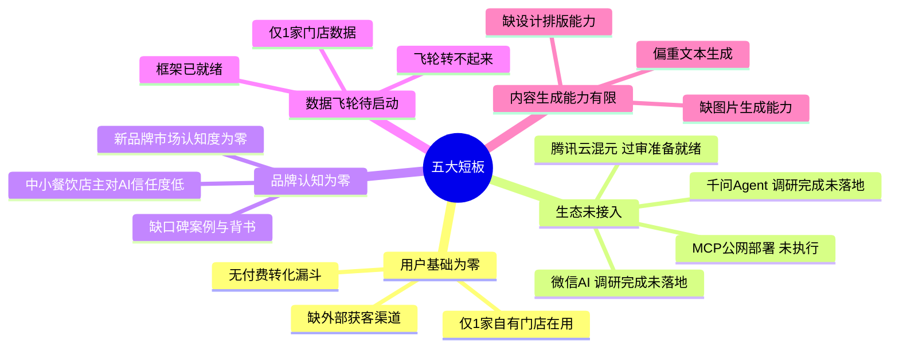
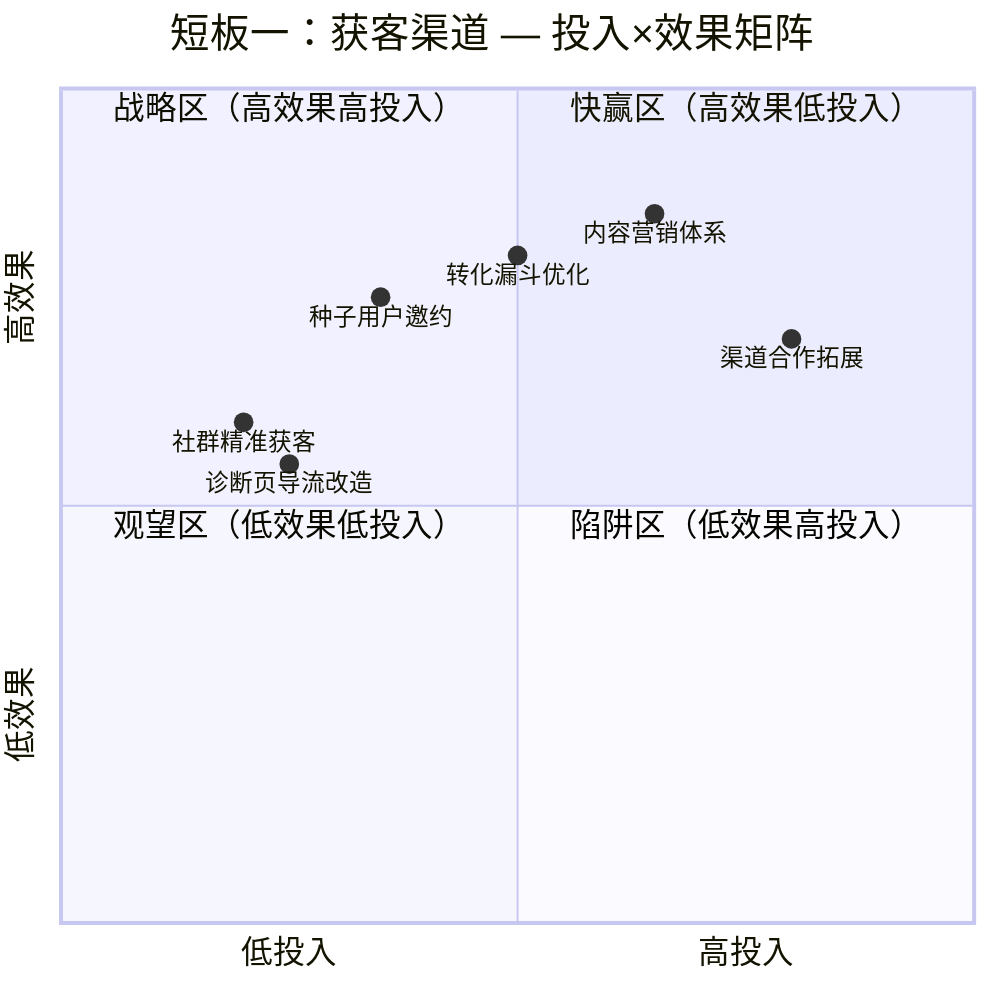
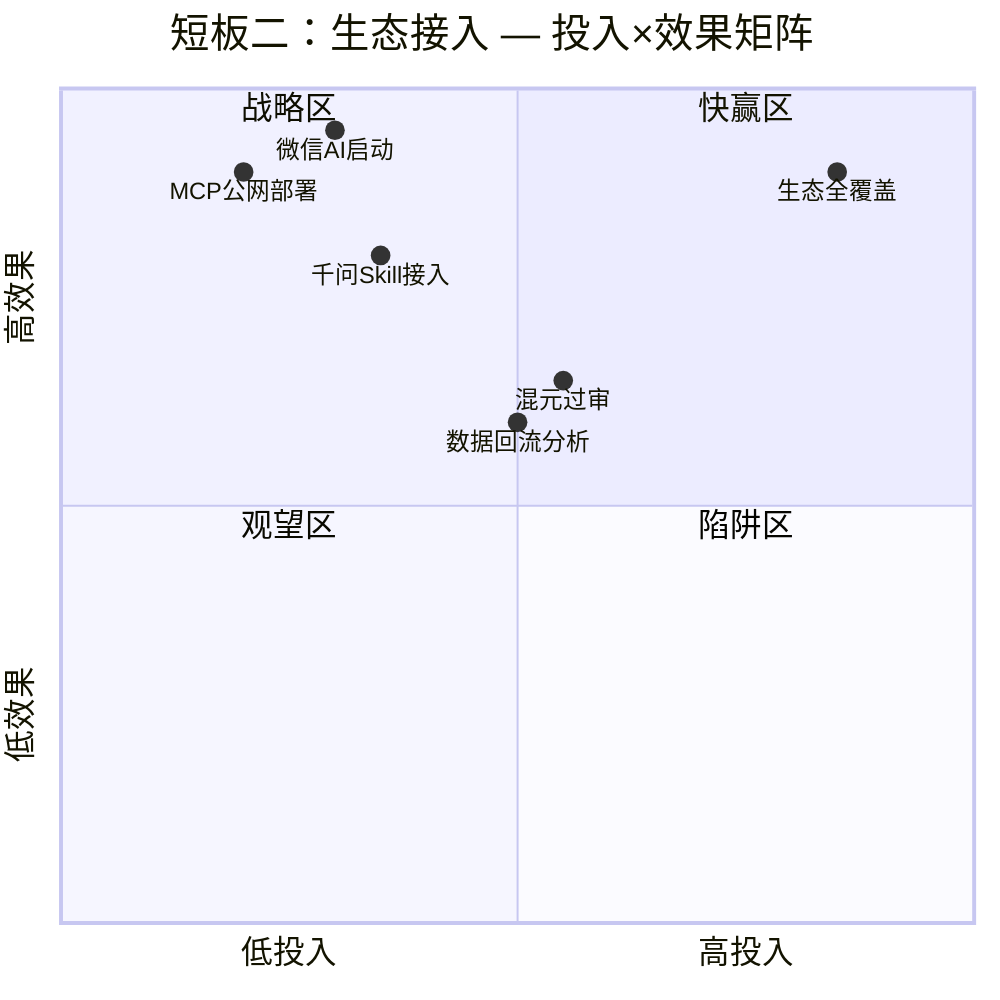
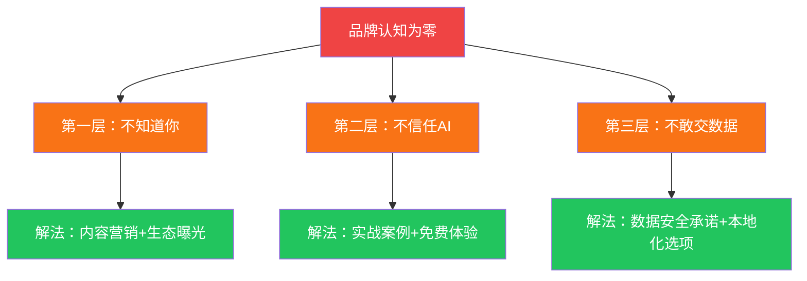
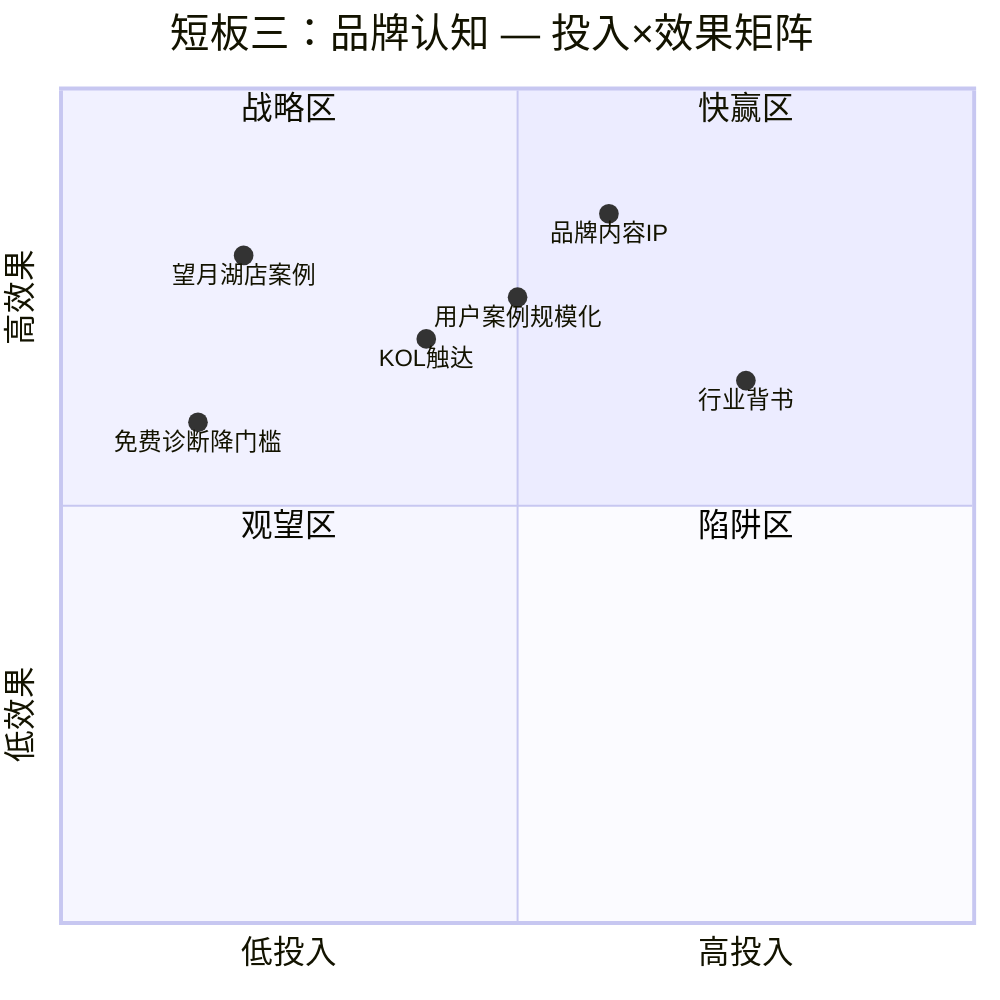
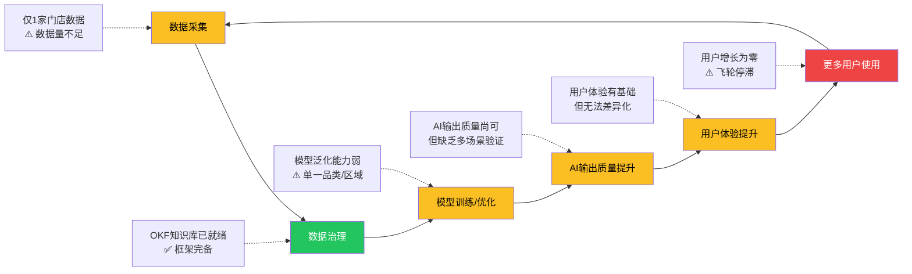
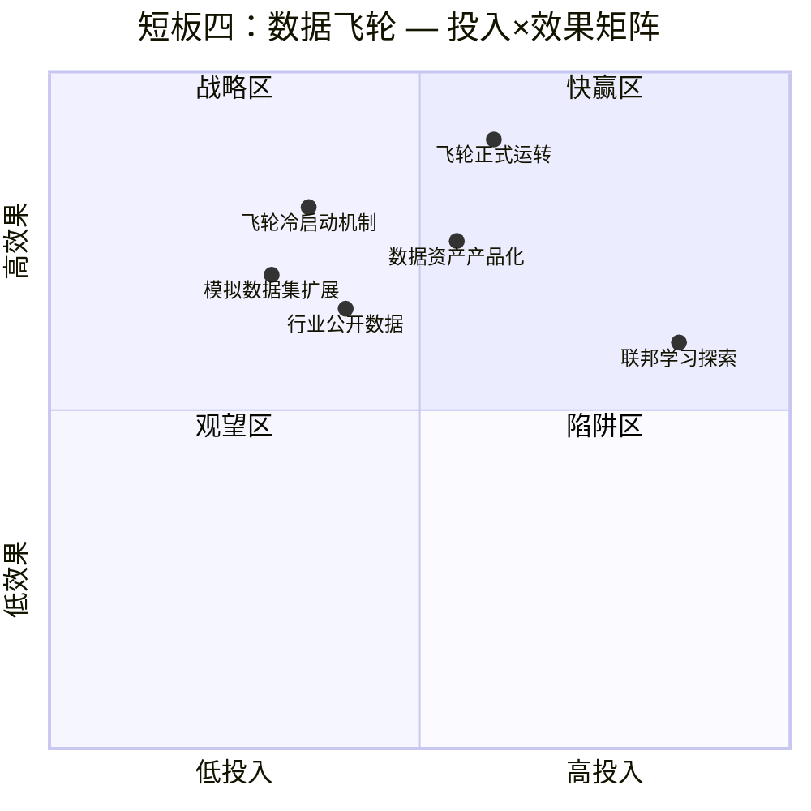
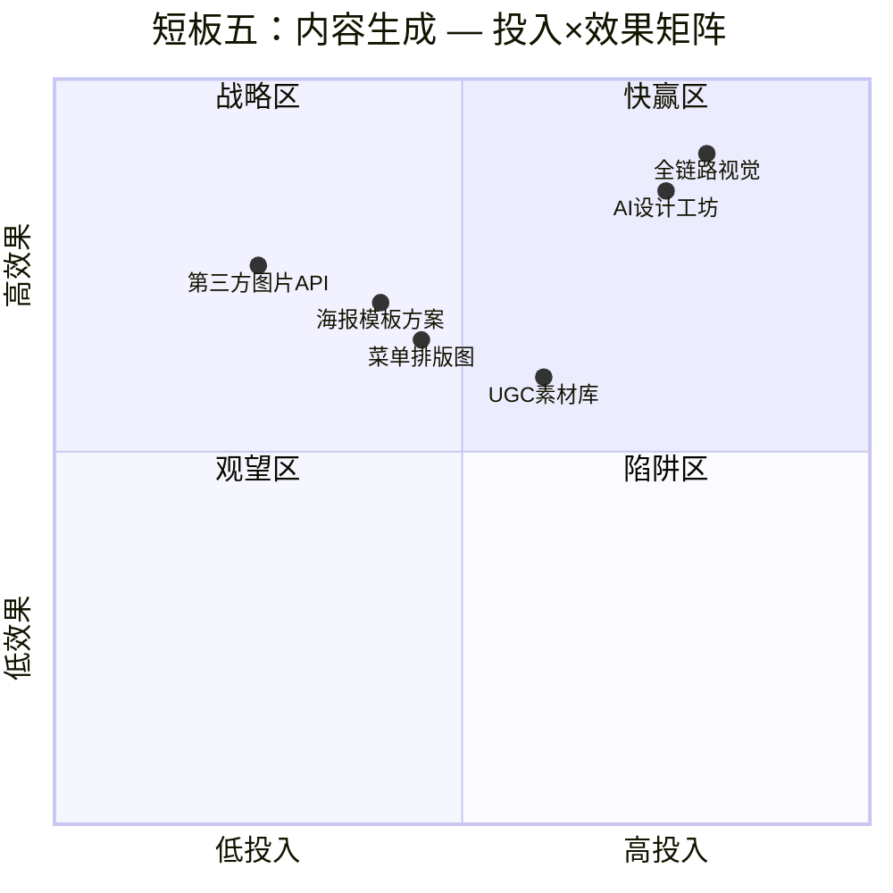
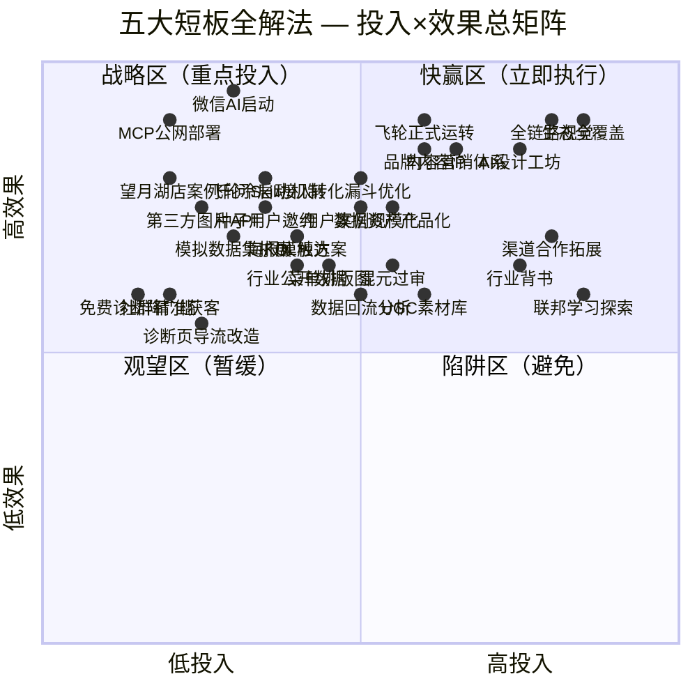
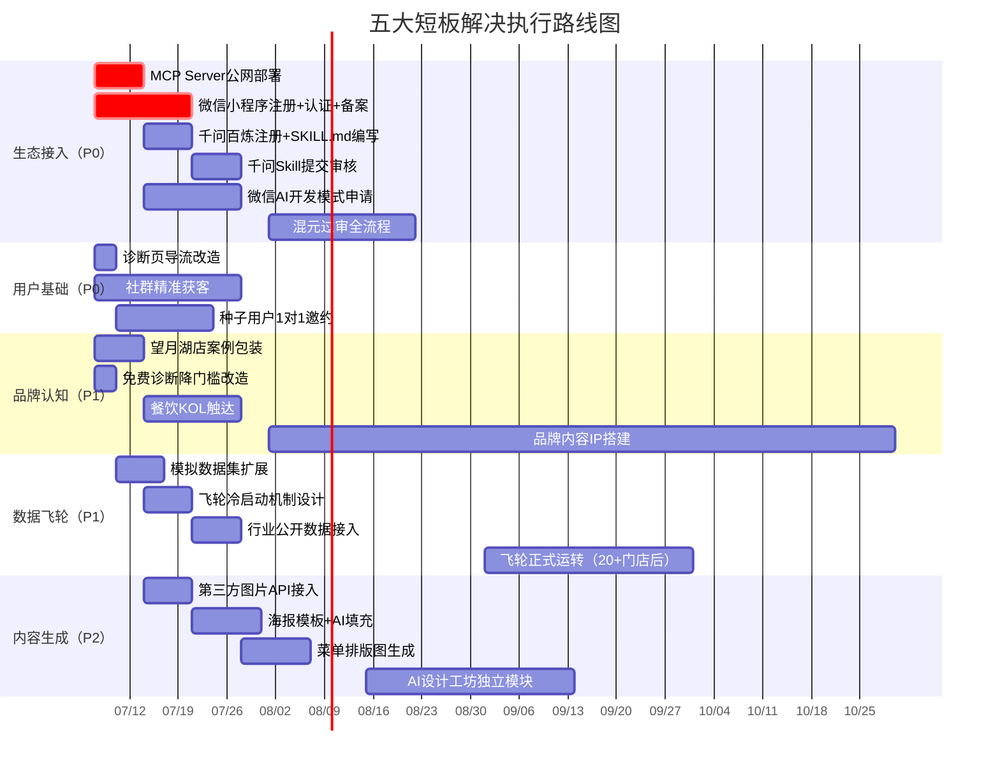

# 餐饮AI店长 — 产品短板解决方案库

> **文档版本**：v1.0  
> **创建日期**：2026-07-05  
> **文档定位**：产品全景报告第十五章「五大待补短板」的执行级解决方案  
> **适用范围**：产品规划、优先级决策、资源分配参考  
> **关联文档**：`ecosystem_research_20260701.md`、`wechat_ai_integration_plan.md`、`qianwen_agent_integration_plan.md`、`cost_calc_100shop.md`

---

## 目录

- [短板总览](#短板总览)
- [短板一：用户基础为零 — 缺获客渠道](#短板一用户基础为零--缺获客渠道)
- [短板二：生态未接入 — 千问/微信AI待执行](#短板二生态未接入--千问微信ai待执行)
- [短板三：品牌认知为零 — 需从零建立信任](#短板三品牌认知为零--需从零建立信任)
- [短板四：数据飞轮待启动 — 数据量不足](#短板四数据飞轮待启动--数据量不足)
- [短板五：内容生成能力有限 — 缺"从零生成图片/设计"](#短板五内容生成能力有限--缺从零生成图片设计)
- [解法优先级总矩阵](#解法优先级总矩阵)
- [执行路线图](#执行路线图)

---

## 短板总览



### 短板关联关系

五大短板并非孤立存在，它们之间存在**因果链条与飞轮效应**：


**核心洞察**：生态接入（短板二）是整个飞轮的起点——它直接决定用户基础（短板一）能否突破零点，进而决定数据飞轮（短板四）能否启动。品牌认知（短板三）和内容生成（短板五）是乘数效应，能在飞轮转动后加速增长。

---

## 短板一：用户基础为零 — 缺获客渠道

### 现状分析

| 维度 | 详情 |
|------|------|
| **具体表现** | 产品已上线25+功能模块，但实际在用门店仅望月湖店1家（自有门店）。无外部付费用户，无注册用户增长数据，无转化漏斗可分析 |
| **影响程度** | 🔴 **致命** — 产品再好没有人用就没有飞轮。没有用户→没有数据→没有口碑→没有新用户，形成负向循环 |
| **紧迫性评级** | **高** — 与生态接入并列为最高优先级，用户获取是产品存亡的关键 |

### 根因拆解

```mermaid
fishbone
    用户基础为零
    "获客入口" : 无外部流量入口, 诊断页面无导流, 无SEO/SEM投放
    "转化路径" : 免费诊断→付费无衔接, 缺试用期机制, 转化触点未设计
    "产品触达" : 仅Web端访问, 无小程序入口, 无社群运营
    "市场推广" : 零推广预算, 无内容营销, 无地推计划
```

### 短期解法（1-4周内可落地）

#### 动作1：诊断页面导流改造

| 项目 | 详情 |
|------|------|
| **具体动作** | 在 `diagnosis.html` 免费诊断结果页底部增加「升级AI店长」CTA卡片，展示付费版12项技能一览，引导注册。诊断结果中嵌入「该区域同类门店平均月营收对比」数据，制造紧迫感 |
| **所需资源** | 前端开发2天；望月湖店模拟数据（`mock_data_wangyuehu.sql`）作为对比基准 |
| **预期效果** | 诊断页日UV→注册转化率从0%提升至5-8% |

#### 动作2：餐饮社群精准获客

| 项目 | 详情 |
|------|------|
| **具体动作** | ① 加入美团/饿了么商家社群、餐饮加盟社群、外卖运营交流群（目标10个群，覆盖2000+店主）<br>② 以「免费区域竞品诊断工具」为钩子，在群内分享诊断链接<br>③ 诊断结果中植入「AI店长帮你解决TOP3问题」引导 |
| **所需资源** | 0预算；创始人时间投入（每日1小时社群运营）；诊断页每日3次免费额度作为自然限制 |
| **预期效果** | 2周内获取50-100次诊断使用，5-15个注册用户 |

#### 动作3：种子用户1对1邀约

| 项目 | 详情 |
|------|------|
| **具体动作** | 从望月湖店周边3km筛选20家餐饮门店，创始人上门/电话邀约免费试用。承诺首月全功能免费+1对1专属服务。收集使用反馈作为产品迭代输入 |
| **所需资源** | 创始人时间（2周内完成20家邀约）；望月湖店实战案例作为信任背书 |
| **预期效果** | 4周内转化3-5家活跃用户，形成首批口碑案例 |

### 长期解法（1-6个月）

#### 动作1：内容营销体系搭建

| 项目 | 详情 |
|------|------|
| **具体动作** | ① 每周发布2篇餐饮经营干货内容（小红书+公众号+抖音），主题围绕「AI帮你算成本」「差评自动回复」「外卖定价策略」等已有技能场景<br>② 内容中自然植入诊断页链接和产品入口<br>③ 积累「餐饮AI实战」内容IP，建立专业认知 |
| **所需资源** | 内容运营1人（可兼职）；已有12个AI技能作为内容素材源 |
| **预期效果** | 3个月内月均自然流量500+，注册用户100+，付费用户15-30 |

#### 动作2：免费→付费转化漏斗优化

| 项目 | 详情 |
|------|------|
| **具体动作** | ① 设计7天试用期机制：诊断用户自动获得7天AI店长全功能体验<br>② 试用期第3天推送「你的门店本周节省了XX元」效果报告<br>③ 试用期第6天推送¥99/月限时优惠（首月半价¥49）<br>④ 建立用户行为追踪：诊断→注册→激活→付费全链路数据 |
| **所需资源** | 前后端开发1周；Supabase用户行为表；飞书机器人推送 |
| **预期效果** | 试用期→付费转化率15-25%，与行业SaaS标杆持平 |

#### 动作3：渠道合作拓展

| 项目 | 详情 |
|------|------|
| **具体动作** | ① 与餐饮SaaS服务商（如客如云、哗啦啦）探讨API集成可能性，作为增值模块嵌入其生态<br>② 与餐饮培训机构、加盟品牌合作，AI店长作为培训工具/加盟赋能包<br>③ 与美团/饿了么区域BD合作，向新开店商家推荐 |
| **所需资源** | BD人力；合作方案PPT；MCP Server公网部署作为技术对接基础 |
| **预期效果** | 6个月内通过渠道获取50-100家门店用户 |

### 解法优先级矩阵



---

## 短板二：生态未接入 — 千问/微信AI待执行

### 现状分析

| 维度 | 详情 |
|------|------|
| **具体表现** | 四项生态接入均已完成深度调研但零执行：<br>① 微信AI开发模式 — 991行方案文档已完成，小程序账号/认证/备案均未办理<br>② 千问Agent — 1091行方案文档已完成，阿里云百炼未注册<br>③ MCP公网部署 — 腾讯云TKE方案已确定，未部署<br>④ 腾讯云混元 — 5份过审准备文档已就绪，未提交审核 |
| **影响程度** | 🔴 **致命** — 生态接入是获取用户基础的关键路径。微信14亿用户+千问已接入肯德基/瑞幸，错过生态红利窗口期将严重制约增长 |
| **紧迫性评级** | **高** — 微信AI和千问生态均处于开放初期红利期，先发优势明显，窗口期预计6-12个月 |

### 调研完成度 vs 执行完成度

```mermaid
graph LR
    subgraph 调研完成 ✅
        A1[微信AI接入方案<br/>991行]
        A2[千问Agent接入方案<br/>1091行]
        A3[MCP公网部署方案<br/>腾讯云TKE]
        A4[混元过审准备包<br/>5份文档]
    end

    subgraph 执行待办 ❌
        B1[小程序注册+认证+备案]
        B2[阿里云百炼注册+API Key]
        B3[TKE容器部署+域名+HTTPS]
        B4[混元开通+类目申请+提审]
    end

    A1 --> B1
    A2 --> B2
    A3 --> B3
    A4 --> B4

    style A1 fill:#22c55e,color:#fff
    style A2 fill:#22c55e,color:#fff
    style A3 fill:#22c55e,color:#fff
    style A4 fill:#22c55e,color:#fff
    style B1 fill:#ef4444,color:#fff
    style B2 fill:#ef4444,color:#fff
    style B3 fill:#ef4444,color:#fff
    style B4 fill:#ef4444,color:#fff
```

### 短期解法（1-4周内可落地）

#### 动作1：MCP Server公网部署（P0，1周内启动）

| 项目 | 详情 |
|------|------|
| **具体动作** | ① 腾讯云注册轻量服务器（2C4G5M，¥208/15个月）<br>② 将现有FastAPI MCP Server打包为Docker镜像<br>③ 部署至腾讯云，绑定 `mcp.canyin-ai.com` 域名<br>④ 配置HTTPS（腾讯云免费DV证书）+ Bearer Token认证<br>⑤ 开放4个MCP工具：`query_store_data`、`analyze_reviews`、`calculate_cost`、`generate_marketing_copy` |
| **所需资源** | 腾讯云服务器（¥14/月）；域名（已有或¥60/年新购）；Docker镜像打包0.5天；部署调试1天 |
| **预期效果** | MCP Server公网可达，为千问Skill、微信AI、外部集成提供统一API入口。**这是所有生态接入的技术前提** |
| **依赖关系** | 无前置依赖，可立即启动 |

#### 动作2：千问Agent Skill接入（P1，第2周启动）

| 项目 | 详情 |
|------|------|
| **具体动作** | ① 阿里云注册+个人实名认证（支付宝快捷登录）<br>② 开通百炼服务，领取新用户7000万免费Tokens<br>③ 创建API Key，配置环境变量<br>④ 编写SKILL.md（按千问标准格式，封装4个MCP工具）<br>⑤ 提交Skill审核上架 |
| **所需资源** | 阿里云账号（免费）；百炼免费额度（90天有效）；SKILL.md编写1-2天；MCP公网部署完成（依赖动作1） |
| **预期效果** | 千问App内可搜索到「餐饮AI店长」Skill，用户通过千问直接使用4项核心能力。预估月成本¥200-800（免费额度覆盖前3个月） |
| **窗口期** | 千问6月3日刚开放生态，肯德基为首个餐饮品牌。抢先接入可获得生态早期流量扶持 |

#### 动作3：微信AI开发模式启动（P0，第1周并行启动）

| 项目 | 详情 |
|------|------|
| **具体动作** | ① mp.weixin.qq.com 注册微信小程序（企业主体，用个体户执照）<br>② 完成微信认证（¥300/年）<br>③ 完成小程序ICP备案<br>④ 申请AI开发模式（内测阶段，尽早排队）<br>⑤ 编写SKILL.md + mcp.json（已有991行方案可直接执行） |
| **所需资源** | 个体户营业执照（已有）；微信认证¥300；备案0费用；SKILL.md编写2天（方案已就绪） |
| **预期效果** | 进入微信AI开发模式内测队列。微信提审开放后第一时间上线，触达14亿微信用户 |
| **注意事项** | 当前开发模式处于内测，暂未开放代码提审。但注册/认证/备案/申请可并行推进，不浪费等待时间 |

### 长期解法（1-6个月）

#### 动作1：四线并进生态全覆盖

| 项目 | 详情 |
|------|------|
| **具体动作** | ① **微信AI**：内测通过后完善SKILL.md，提审上线<br>② **千问Agent**：从Skill形态升级为Agent形态（千问Agent仍在测试中），实现多轮对话能力<br>③ **MCP公网**：完善对外接入文档（参考瑞幸开放平台结构），支持第三方开发者接入<br>④ **腾讯云混元**：完成算法备案→开通混元→类目申请→小程序提审全流程，作为微信AI的模型底座 |
| **所需资源** | 持续开发投入（预估2人月）；算法备案（可自行办理或委托代理¥3000-5000）；混元API调用费用 |
| **预期效果** | 6个月内完成四线生态全覆盖，形成「微信AI+千问+MCP开放+混元底座」的生态矩阵，日均触达潜力10万+ |

#### 动作2：生态数据回流与统一分析

| 项目 | 详情 |
|------|------|
| **具体动作** | ① 建立统一用户身份体系（跨微信/千问/Web的UnionID映射）<br>② 各生态渠道使用数据回流至Supabase统一分析<br>③ 按渠道维度统计：诊断次数→注册转化→付费转化→留存率<br>④ 动态调整各渠道投入比例 |
| **所需资源** | 后端开发1-2周；Supabase数据表设计 |
| **预期效果** | 清晰掌握各生态渠道ROI，优化资源分配。识别高转化渠道加大投入 |

### 解法优先级矩阵



---

## 短板三：品牌认知为零 — 需从零建立信任

### 现状分析

| 维度 | 详情 |
|------|------|
| **具体表现** | 「餐饮AI店长」作为新品牌，市场认知度为零。无品牌搜索量，无媒体报道，无用户评价，无行业背书。中小餐饮店主对AI工具天然信任度低——「AI能管好我的店？不可能」 |
| **影响程度** | 🟡 **严重** — 品牌认知为零直接拉低所有获客渠道的转化率。即使流量来了，用户也不信任，不敢输入门店数据，不愿付费 |
| **紧迫性评级** | **中** — 品牌建设是长期工程，短期靠案例和口碑可缓解。但在生态接入后需同步启动品牌建设，避免「有入口无转化」 |

### 信任缺失三层模型



### 短期解法（1-4周内可落地）

#### 动作1：望月湖店实战案例包装

| 项目 | 详情 |
|------|------|
| **具体动作** | ① 将望月湖店使用AI店长的全过程数据整理为案例报告：<br>　• 使用前 vs 使用后的成本对比（BOM精确度提升）<br>　• 差评响应时间从X小时降至X分钟<br>　• 外卖定价优化带来的客单价变化<br>　• 复购率提升数据<br>② 制作1页纸案例卡片（图文版），用于社群传播和上门拜访<br>③ 录制3分钟店主口述视频（望月湖店老板真实反馈） |
| **所需资源** | 望月湖店运营数据（`mock_data_wangyuehu.sql` + 实际数据）；案例设计1天；视频录制0.5天 |
| **预期效果** | 形成「自有店实战验证」的信任锚点。案例卡片在社群传播可提升诊断页点击率30%+ |
| **优势利用** | ✅ 五大独家优势之「实战验证 — 自有店跑出来的系统」 |

#### 动作2：免费诊断降低信任门槛

| 项目 | 详情 |
|------|------|
| **具体动作** | ① 强化诊断页的「无需注册、无需登录、无需填手机号」零门槛体验<br>② 诊断结果中加入「基于公开数据+AI分析，不涉及您的经营隐私」安全声明<br>③ 诊断结果底部增加「已为XX家门店提供诊断」社会证明计数器（从1开始真实展示） |
| **所需资源** | 前端微调0.5天 |
| **预期效果** | 降低首次使用心理门槛，诊断完成率从当前预估40%提升至60%+ |

#### 动作3：餐饮行业KOL触达

| 项目 | 详情 |
|------|------|
| **具体动作** | ① 筛选10个餐饮行业垂直KOL/自媒体（粉丝1万-10万区间，性价比最高）<br>② 以「免费AI诊断工具体验」为切入点，邀请KOL试用并分享<br>③ KOL内容中自然植入诊断页链接 |
| **所需资源** | 0-¥5000预算（部分KOL可免费体验置换）；诊断页每日3次免费额度 |
| **预期效果** | 单篇KOL内容触达5000-20000人，带来100-500次诊断使用 |

### 长期解法（1-6个月）

#### 动作1：品牌内容IP打造

| 项目 | 详情 |
|------|------|
| **具体动作** | ① 打造「餐饮AI实战日记」内容系列：每周记录AI店长如何帮助门店解决真实问题<br>② 建立「餐饮AI研究院」品牌形象：发布行业报告（如「2026餐饮外卖成本白皮书」）<br>③ 在知乎/小红书/公众号建立「餐饮AI店长」官方账号矩阵 |
| **所需资源** | 内容运营1人；已有12个AI技能产生的大量分析数据作为内容素材 |
| **预期效果** | 3个月内品牌搜索量从0到月均500+，6个月内成为「餐饮AI」品类搜索TOP3 |

#### 动作2：用户案例规模化

| 项目 | 详情 |
|------|------|
| **具体动作** | ① 每个付费用户使用满1个月后，主动邀约产出案例（免费延长1个月作为激励）<br>② 案例模板标准化：门店画像→使用场景→痛点→解决方案→效果数据→店主评价<br>③ 积累20+案例后建立「案例库」页面，按品类/痛点/地区分类展示 |
| **所需资源** | 案例采集模板；用户激励成本（每月免费延长×预计5-10个案例=¥495-990/月） |
| **预期效果** | 20+真实案例形成规模化社会证明，新用户转化率提升50%+ |

#### 动作3：行业背书获取

| 项目 | 详情 |
|------|------|
| **具体动作** | ① 申请参加餐饮行业展会（如HOTELEX、中国餐饮供应链博览会），设置AI诊断体验展位<br>② 与餐饮行业协会/商会合作，成为「推荐数字化工具」<br>③ 争取科技媒体报道（36氪、虎嗅等「AI+餐饮」选题） |
| **所需资源** | 展会费用¥5000-20000；协会合作0费用（互利）；媒体PR内容撰写 |
| **预期效果** | 行业背书+媒体曝光双重提升品牌权威性，B端企业客户询价意愿提升 |

### 解法优先级矩阵



---

## 短板四：数据飞轮待启动 — 数据量不足

### 现状分析

| 维度 | 详情 |
|------|------|
| **具体表现** | 数据飞轮框架已就绪（OKF知识库 + feedback_iteration_schema.sql + 数据治理模块），但实际运行数据仅望月湖店1家。飞轮的核心逻辑是「更多数据→更准模型→更好体验→更多用户→更多数据」，当前卡在「更多数据」环节 |
| **影响程度** | 🟡 **严重** — 数据飞轮转不起来意味着产品无法形成数据壁垒，竞品一旦获取更多数据可快速追赶。同时也影响AI输出质量，1家店的数据无法覆盖多品类、多区域、多场景 |
| **紧迫性评级** | **中** — 数据飞轮的启动依赖用户基础（短板一）和生态接入（短板二），需在前两者推进后才能有效启动。但框架优化和模拟数据扩展可提前进行 |

### 数据飞轮当前状态



### 短期解法（1-4周内可落地）

#### 动作1：模拟数据集扩展

| 项目 | 详情 |
|------|------|
| **具体动作** | ① 基于望月湖店真实数据模式，生成5-10家不同品类/规模的模拟门店数据：<br>　• 炒饭店（快餐，月营收8万）<br>　• 奶茶店（饮品，月营收15万）<br>　• 火锅店（正餐，月营收30万）<br>　• 烧烤店（夜宵，月营收12万）<br>　• 轻食店（健康餐，月营收6万）<br>② 每家模拟店包含完整的BOM、评价、订单、库存、财务数据<br>③ 用于：飞轮框架测试、AI输出质量验证、演示场景丰富化 |
| **所需资源** | 数据工程师1周；参考 `mock_data_wangyuehu.sql` 结构；行业公开数据作为参数基准 |
| **预期效果** | AI输出从「只懂1种店」升级为「覆盖5+品类」，演示和诊断场景大幅丰富 |
| **优势利用** | ✅ 五大独家优势之「数据资产意识超前 — OKF知识库 + 数据飞轮」 |

#### 动作2：飞轮冷启动机制设计

| 项目 | 详情 |
|------|------|
| **具体动作** | ① 设计「数据贡献激励机制」：用户使用AI店长的过程中，脱敏数据自动进入飞轮。贡献数据量达到阈值后解锁高级功能（如行业对比、区域排名）<br>② 在 `feedback_iteration_schema.sql` 基础上增加 `data_contribution_log` 表，记录每用户的数据贡献量<br>③ 明确数据脱敏规则：门店名称→哈希化、精确地址→区域级、联系方式→不采集 |
| **所需资源** | 后端开发2-3天；数据脱敏规则文档 |
| **预期效果** | 每个新增用户自动贡献数据，飞轮从「手动投喂」升级为「自动收集」 |

#### 动作3：行业公开数据接入

| 项目 | 详情 |
|------|------|
| **具体动作** | ① 接入美团/饿了么公开数据API（区域餐饮密度、平均客单价、品类分布）<br>② 接入大众点评公开评价数据（通过合规爬取或API）<br>③ 将公开数据注入OKF知识库，丰富行业基准数据层 |
| **所需资源** | 数据采集开发3-5天；API申请（部分免费） |
| **预期效果** | 即使只有少量门店用户，也能提供「你的门店 vs 区域平均」的对比分析，增强产品价值 |

### 长期解法（1-6个月）

#### 动作1：多门店数据飞轮正式运转

| 项目 | 详情 |
|------|------|
| **具体动作** | ① 当门店用户达到20+时，启动飞轮正式运转：<br>　• 每周自动生成「行业基准报告」（基于所有脱敏门店数据聚合）<br>　• 每月自动优化AI模型参数（如成本核算的行业均值、差评回复的最佳话术模式）<br>　• 每季度输出「餐饮趋势洞察报告」（品类趋势、区域差异、定价规律）<br>② 飞轮产物反哺产品：行业基准→诊断准确度提升→用户体验提升→更多用户 |
| **所需资源** | 数据分析自动化脚本；Supabase定时任务；模型优化pipeline |
| **预期效果** | 20家门店数据可使AI输出准确率提升30%+，50家门店可形成区域级数据壁垒 |

#### 动作2：数据资产产品化

| 项目 | 详情 |
|------|------|
| **具体动作** | ① 将飞轮产出的行业基准数据封装为独立数据产品：「餐饮行业基准API」<br>② 对外开放付费查询（¥99/月API调用权限），面向餐饮咨询公司、投资机构、加盟品牌<br>③ 数据飞轮从「成本中心」转变为「收入中心」 |
| **所需资源** | API开发1周；数据产品定价策略；MCP Server公网部署作为API底座 |
| **预期效果** | 开辟数据变现第二曲线，6个月内数据API收入覆盖服务器成本 |

#### 动作3：联邦学习探索

| 项目 | 详情 |
|------|------|
| **具体动作** | ① 研究联邦学习方案：门店数据不出本地，仅上传模型参数梯度，在中心服务器聚合<br>② 解决餐饮店主「不愿交出经营数据」的核心顾虑<br>③ 作为品牌差异化卖点：「你的数据永远在你的设备上」 |
| **所需资源** | 算法研究1-2人月；联邦学习框架（如FATE、PySyft） |
| **预期效果** | 数据隐私顾虑消除，门店接入意愿提升50%+，形成技术壁垒 |

### 解法优先级矩阵



---

## 短板五：内容生成能力有限 — 缺"从零生成图片/设计"

### 现状分析

| 维度 | 详情 |
|------|------|
| **具体表现** | 当前12个AI技能的输出以文本为主：差评回复（文本）、文案改写（文本）、成本分析报告（文本+表格）、定价建议（文本+表格）。缺乏从零生成视觉内容的能力：<br>① 无法生成菜品图片（店主需要高质量菜品图用于外卖平台）<br>② 无法生成营销海报（促销活动、新品推广需要视觉素材）<br>③ 无法生成菜单排版图（外卖菜单需要图文排版）<br>④ 无法生成门店招牌/Logo设计 |
| **影响程度** | 🟡 **中等** — 文本能力已覆盖核心经营场景，但视觉内容是餐饮经营的刚需（外卖平台图片质量直接影响转化率）。缺少视觉能力使产品价值打了折扣 |
| **紧迫性评级** | **中** — 不是产品存亡问题，但是用户付费意愿的关键增强项。在用户基础突破10家后应启动 |

### 当前能力 vs 目标能力

```mermaid
graph LR
    subgraph 当前能力 ✅
        A1[差评回复 — 文本]
        A2[文案改写 — 文本]
        A3[成本核算 — 文本+表格]
        A4[定价建议 — 文本+表格]
        A5[选址分析 — 文本+数据]
        A6[库存管理 — 文本+表格]
    end

    subgraph 缺失能力 ❌
        B1[菜品图片生成]
        B2[营销海报设计]
        B3[菜单排版图]
        B4[招牌/Logo设计]
        B5[外卖主图设计]
        B6[朋友圈素材图]
    end

    style A1 fill:#22c55e,color:#fff
    style A2 fill:#22c55e,color:#fff
    style A3 fill:#22c55e,color:#fff
    style A4 fill:#22c55e,color:#fff
    style A5 fill:#22c55e,color:#fff
    style A6 fill:#22c55e,color:#fff
    style B1 fill:#ef4444,color:#fff
    style B2 fill:#ef4444,color:#fff
    style B3 fill:#ef4444,color:#fff
    style B4 fill:#ef4444,color:#fff
    style B5 fill:#ef4444,color:#fff
    style B6 fill:#ef4444,color:#fff
```

### 短期解法（1-4周内可落地）

#### 动作1：接入第三方AI图片生成API

| 项目 | 详情 |
|------|------|
| **具体动作** | ① 接入通义万相/文心一格/腾讯混元生图API，实现「菜品描述→菜品图片」生成能力<br>② 在现有MCP Server中新增 `generate_dish_image` 工具<br>③ 前端新增「AI菜品图生成」入口：用户输入菜品名称+描述→生成3张候选图→下载<br>④ 优先覆盖高频场景：菜品图（外卖主图）、促销海报（节日/新品） |
| **所需资源** | API接入开发2-3天；通义万相API（¥0.16/张，新用户有免费额度）；前端界面开发1-2天 |
| **预期效果** | 用户可直接在AI店长内生成菜品图，无需另找设计工具。单次生成成本¥0.5以内 |
| **技术路径** | 通义万相API（与千问同属阿里云百炼体系，API Key可复用） |

#### 动作2：海报模板+AI填充方案

| 项目 | 详情 |
|------|------|
| **具体动作** | ① 预设10套餐饮海报模板（新品上市/节日促销/满减活动/会员招募/限时折扣）<br>② 用户输入：活动类型+菜品+价格+门店名称→AI自动填充文案+选择配色→生成海报<br>③ 基于Canvas或HTML2Canvas实现前端渲染，无需复杂图形处理 |
| **所需资源** | 模板设计3-5天（可用Canva/Figma制作后导出）；前端开发2-3天 |
| **预期效果** | 10套模板覆盖80%常见促销场景，用户3分钟生成一张可用海报 |

#### 动作3：菜单排版图生成

| 项目 | 详情 |
|------|------|
| **具体动作** | ① 基于现有「菜单设计助手」技能（`caidan-sheji`）的输出结果（菜单结构+菜品命名+定价），自动生成外卖平台菜单排版图<br>② 支持美团/饿了么/京东外卖三平台尺寸规范<br>③ 菜品图+菜品名+价格+标签（爆款/新品/推荐）自动排版 |
| **所需资源** | 前端Canvas开发3-4天；三平台尺寸规范文档；与菜单设计技能数据打通 |
| **预期效果** | 从「菜单设计建议」到「可直接使用的菜单图片」闭环，提升技能实用价值 |

### 长期解法（1-6个月）

#### 动作1：全链路视觉内容生成

| 项目 | 详情 |
|------|------|
| **具体动作** | ① **菜品图增强**：支持用户上传实拍图→AI增强（去背景/调色/加水印/多尺寸裁剪）<br>② **品牌视觉**：从Logo设计→招牌效果图→门店装修风格建议→外卖包装设计，一站式品牌视觉<br>③ **短视频素材**：生成菜品制作短视频脚本+分镜图，配合抖音/快手推广<br>④ **数据可视化**：经营数据自动生成可视化图表（营收趋势/成本构成/竞品对比） |
| **所需资源** | 图像处理API（去背景/增强）；前端开发2-3周；设计规范文档 |
| **预期效果** | 形成「文本+图片+设计+视频」全链路内容生成能力，产品价值感显著提升 |

#### 动作2：AI设计工坊独立模块

| 项目 | 详情 |
|------|------|
| **具体动作** | ① 将视觉生成能力独立为「AI设计工坊」模块，与12个AI技能并列<br>② 设计工坊包含：菜品图库、海报中心、菜单设计、品牌视觉、数据图表5大子功能<br>③ 支持用户上传品牌素材（Logo/配色/字体），生成内容自动套用品牌风格<br>④ 产出物可一键下载/分享至微信/直接发布到外卖平台 |
| **所需资源** | 模块开发3-4周；品牌素材管理系统；多平台API对接 |
| **预期效果** | 「AI设计工坊」成为¥999/年和¥2999/年套餐的核心增值卖点，提升付费转化和留存 |

#### 动作3：用户生成内容（UGC）素材库

| 项目 | 详情 |
|------|------|
| **具体动作** | ① 用户生成的优质菜品图/海报经授权后进入公共素材库<br>② 其他用户可参考/复用/改编已有素材<br>③ 素材库按品类/场景/风格分类，支持搜索<br>④ 贡献者获得积分奖励（与数据飞轮激励机制联动） |
| **所需资源** | 素材库存储（Supabase Storage）；审核机制；积分体系对接 |
| **预期效果** | UGC素材库形成网络效应——用户越多素材越丰富，素材越丰富新用户越愿意使用 |

### 解法优先级矩阵



---

## 解法优先级总矩阵

将五大短板的所有解法汇总到统一优先级矩阵中，指导资源分配：



### 快赢区Top 10（低投入高效果，1-4周内立即执行）

| 排名 | 解法 | 所属短板 | 投入 | 效果 | 预计耗时 |
|:---:|------|:---:|:---:|:---:|:---:|
| 1 | MCP Server公网部署 | 生态接入 | 低 | 极高 | 1周 |
| 2 | 微信AI开发模式启动 | 生态接入 | 低 | 极高 | 1-2周（并行） |
| 3 | 望月湖店实战案例包装 | 品牌认知 | 低 | 高 | 1周 |
| 4 | 千问Agent Skill接入 | 生态接入 | 中低 | 高 | 2周 |
| 5 | 飞轮冷启动机制设计 | 数据飞轮 | 中低 | 高 | 1周 |
| 6 | 第三方AI图片API接入 | 内容生成 | 中低 | 高 | 1周 |
| 7 | 免费诊断降门槛改造 | 品牌认知 | 低 | 中高 | 0.5周 |
| 8 | 社群精准获客 | 用户基础 | 低 | 中高 | 持续 |
| 9 | 模拟数据集扩展 | 数据飞轮 | 中 | 中高 | 1周 |
| 10 | 诊断页导流改造 | 用户基础 | 低 | 中 | 0.5周 |

---

## 执行路线图



### 分阶段里程碑

| 阶段 | 时间 | 核心目标 | 关键指标 |
|------|------|----------|----------|
| **第一阶段：基础设施** | 第1-2周 | MCP公网部署 + 生态申请启动 + 案例包装 | MCP Server公网可达；微信/千问申请已提交；案例卡片完成 |
| **第二阶段：获客启动** | 第3-4周 | 社群获客 + 种子用户 + 诊断改造 + 图片API | 注册用户10-30家；诊断使用100+次；图片生成功能上线 |
| **第三阶段：生态上线** | 第5-8周 | 千问Skill上线 + 微信AI内测 + 混元过审 + 内容营销启动 | 千问Skill可搜索；微信AI内测通过；首篇品牌内容发布 |
| **第四阶段：飞轮启动** | 第9-12周 | 20+门店用户 + 飞轮正式运转 + 转化漏斗优化 | 付费用户5-15家；飞轮首次产出行业基准报告；试用期转化率15%+ |
| **第五阶段：规模化** | 第13-24周 | AI设计工坊 + 渠道合作 + 品牌IP + 数据产品化 | 门店用户50-100家；月营收覆盖成本；品牌搜索量月均500+ |

---

## 五大独家优势在解法中的利用映射

| 独家优势 | 在短板解法中的具体利用 |
|----------|----------------------|
| **① 实战验证 — 自有店跑出来的系统** | 望月湖店案例包装（短板三）；种子用户邀约的信任背书（短板一）；千问/微信Skill的SKILL.md基于真实场景编写（短板二） |
| **② 全链路覆盖最完整 — 25+模块从选址到复购** | 生态接入时4个MCP工具展示全链路能力（短板二）；内容营销覆盖25+场景素材源（短板三·长期）；产品价值差异化定位（短板一·转化漏斗） |
| **③ 数据资产意识超前 — OKF知识库 + 数据飞轮** | 飞轮冷启动机制设计（短板四）；模拟数据集扩展基于OKF结构（短板四）；数据资产产品化作为第二曲线（短板四·长期） |
| **④ MCP能力已就绪** | MCP公网部署零开发量直接上线（短板二）；千问Skill/微信AI均基于已有MCP工具封装（短板二）；外部开发者接入基础（短板二·长期） |
| **⑤ 纯增量架构 — 干净可扩展** | 第三方图片API接入无需重构（短板五）；飞轮冷启动机制增量添加（短板四）；生态数据回流增量扩展（短板二·长期） |

---

## 风险与应对

| 风险 | 概率 | 影响 | 应对措施 |
|------|:---:|:---:|----------|
| 微信AI开发模式内测不通过 | 中 | 高 | 同步推进千问Skill作为替代入口；微信自动模式作为降级方案 |
| 千问免费额度用尽后成本超预期 | 中 | 中 | 监控API调用量；设置日调用上限；优化prompt减少Token消耗 |
| 种子用户留存率低 | 中 | 高 | 首月1对1专属服务；每周主动回访收集反馈；快速迭代解决痛点 |
| 餐饮店主对AI生图质量不满意 | 高 | 中 | 提供3张候选图+多次重试机制；预设高质量prompt模板；支持用户上传参考图 |
| 数据飞轮启动后数据质量差 | 中 | 高 | 建立数据清洗pipeline；异常值自动剔除；人工抽检机制 |
| 竞品快速跟进类似功能 | 中 | 中 | 加速生态接入抢占先发优势；数据飞轮形成壁垒；品牌认知先行建立 |

---

> **文档维护说明**：本方案库应随执行进展每月更新一次，记录各解法的实际落地情况、效果数据和调整方向。关键指标变化同步至产品全景报告。