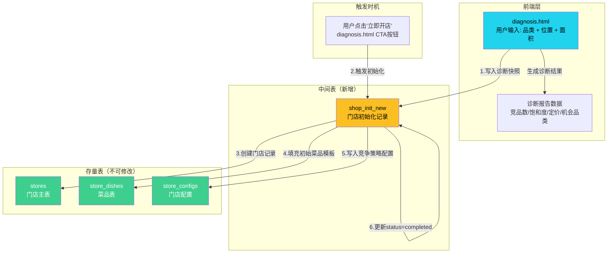
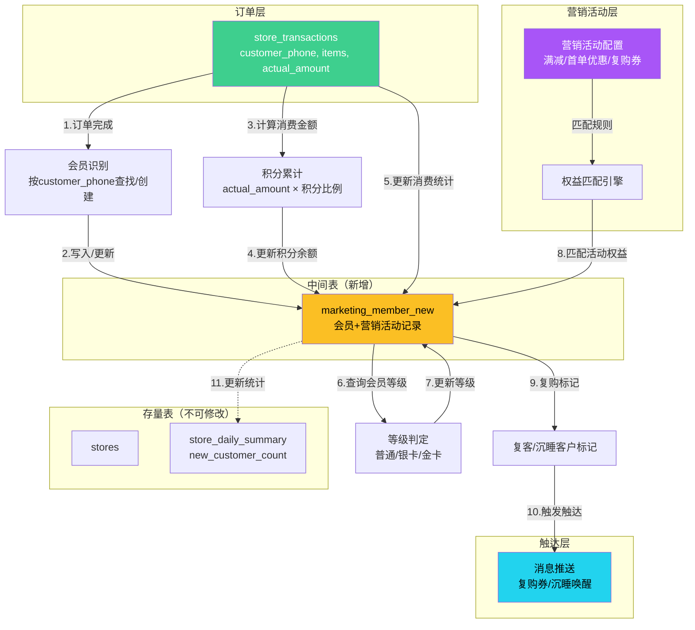
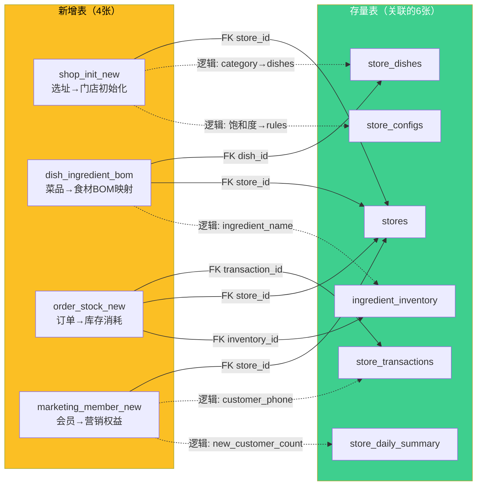
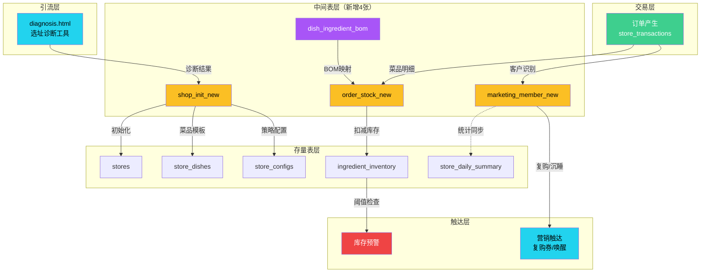

# 餐饮AI店长 — 数据打通方案设计文档

> **版本**：v1.0  
> **创建日期**：2026-07-03  
> **维护方**：餐饮AI店长项目组  
> **文档定位**：数据联动中间表设计文档，描述3张 `_new` 后缀中间表如何打通三个核心业务联动  
> **约束**：现有24张存量表不可修改，仅可通过外键/逻辑关联进行数据打通

---

## 目录

- [1. 背景与目标](#1-背景与目标)
- [2. 现有表结构概览](#2-现有表结构概览)
- [3. 联动1：选址诊断 → 门店初始化](#3-联动1选址诊断--门店初始化)
- [4. 联动2：订单 → 库存联动消耗](#4-联动2订单--库存联动消耗)
- [5. 联动3：营销活动 → 会员权益](#5-联动3营销活动--会员权益)
- [6. 全局关联关系总览](#6-全局关联关系总览)
- [7. 实现状态矩阵](#7-实现状态矩阵)
- [8. 附录：BOM映射参考数据](#8-附录bom映射参考数据)

---

## 1. 背景与目标

### 1.1 问题现状

餐饮AI店长系统目前有24张存量表，覆盖门店管理、订单交易、库存食材、供应商、设备、员工、客服反馈等模块。但三个核心业务场景存在数据断链：

| 断链点 | 现状 | 影响 |
|--------|------|------|
| 选址诊断 → 门店初始化 | `diagnosis.html` 是独立引流工具，诊断结果仅在前端展示，未持久化到数据库 | 用户决定开店时需重新填写所有信息，诊断数据白白浪费 |
| 订单 → 库存消耗 | `store_transactions` 记录了每笔订单的菜品明细，`ingredient_inventory` 记录了食材库存，但两者无关联 | 库存只能手动扣减，易出错、易遗漏，无法实现自动消耗核算 |
| 营销活动 → 会员权益 | 无会员表，营销活动（满减、首单优惠、复购券）是独立功能 | 无法识别复购客户、无法累计积分、无法做会员分层运营 |

### 1.2 设计目标

通过新增 **3张 `_new` 后缀中间表** + **1张BOM映射表**，在不修改任何现有表的前提下，实现三条数据链路的打通：

```
diagnosis.html ──→ shop_init_new ──→ stores / store_dishes / store_configs
                                      （门店初始化数据自动填充）

store_transactions ──→ order_stock_new ──→ ingredient_inventory
                        ↑ dish_ingredient_bom（BOM映射）
                        （订单菜品 → 食材消耗 → 库存扣减）

store_transactions ──→ marketing_member_new
                        （订单客户 → 会员识别 → 营销权益匹配）
```

### 1.3 设计原则

| 原则 | 说明 |
|------|------|
| **存量表零修改** | 24张现有表不做任何 ALTER TABLE 操作，仅通过新增表的 FK/逻辑字段关联 |
| **`_new` 后缀命名** | 所有中间表统一使用 `_new` 后缀，与存量表区分，便于后续迁移 |
| **Supabase 兼容** | DDL 遵循 PostgreSQL 语法，包含 RLS 策略和索引，可直接在 Supabase SQL Editor 执行 |
| **渐进式实现** | 标注每个功能的实现状态（当前可实现 / 需后续开发），支持分阶段上线 |

---

## 2. 现有表结构概览

### 2.1 24张存量表清单

| # | 表名 | 来源 | 核心用途 |
|---|------|------|----------|
| 1 | `stores` | V2 | 门店主表 |
| 2 | `conversations` | V2 | 客服对话记录 |
| 3 | `store_transactions` | V2 | 门店交易/订单流水 |
| 4 | `store_dishes` | V2 | 门店菜品库 |
| 5 | `store_daily_summary` | V2 | 门店日报汇总 |
| 6 | `store_configs` | V2 | 门店模块配置 |
| 7 | `supplier_profiles` | V1 | 供应商档案 |
| 8 | `purchase_acceptance` | V1 | 采购验收记录 |
| 9 | `supplier_scores` | V1 | 供应商评分 |
| 10 | `ingredient_inventory` | V1 | 食材库存（含效期） |
| 11 | `food_safety_checklist` | V1 | 食安自查清单 |
| 12 | `equipment_registry` | V1 | 设备登记 |
| 13 | `maintenance_logs` | V1 | 设备维护日志 |
| 14 | `data_quality_metrics` | V1 | 数据质量指标 |
| 15 | `decision_confidence_logs` | V1 | 决策置信度日志 |
| 16 | `loss_records` | V1 | 损耗记录 |
| 17 | `loss_daily_summary` | V1 | 损耗日汇总 |
| 18 | `staff_profiles` | V1 | 员工档案 |
| 19 | `staff_schedule` | V1 | 员工排班 |
| 20 | `staff_training` | V1 | 员工培训 |
| 21 | `staff_tasks` | V1 | 员工任务 |
| 22 | `feedback_labels` | V3 | 对话标签 |
| 23 | `iteration_reports` | V3 | 迭代报告 |
| 24 | `iteration_tasks` | V3 | 迭代任务 |

### 2.2 本方案涉及的关键存量表结构（不可修改）

#### stores（门店主表）
```sql
-- 已存在，不可修改
id              UUID PK
store_name      TEXT
store_code      TEXT UNIQUE
address         TEXT
status          TEXT          -- active/suspended/closed
owner_id        TEXT
platform_accounts JSONB       -- {"meituan":"shop_id", ...}
settings        JSONB
```

#### store_dishes（门店菜品表）
```sql
-- 已存在，不可修改
id              UUID PK
store_id        UUID FK→stores
dish_name       TEXT
category        TEXT          -- 主食/小吃/饮品/套餐
price           NUMERIC
cost            NUMERIC
status          TEXT          -- available/soldout/seasonal/disabled
is_featured     BOOLEAN
total_sold      NUMERIC       -- 累计销量
```

#### store_transactions（门店交易表）
```sql
-- 已存在，不可修改
id              UUID PK
store_id        UUID FK→stores
transaction_date DATE
channel         TEXT          -- meituan/dianping/tangshi/juqing/online
items           JSONB         -- [{name, qty, price, subtotal}]
total_amount    NUMERIC
actual_amount   NUMERIC       -- 实际到手
status          TEXT          -- completed/refunded/cancelled/pending
customer_phone  TEXT
```

#### store_daily_summary（门店日报汇总表）
```sql
-- 已存在，不可修改
id              UUID PK
store_id        UUID FK→stores
summary_date    DATE
total_revenue   NUMERIC
total_cost      NUMERIC
gross_profit    NUMERIC
order_count     INTEGER
UNIQUE(store_id, summary_date)
```

#### ingredient_inventory（食材库存表）
```sql
-- 已存在，不可修改
id              UUID PK
ingredient_name TEXT
category        TEXT          -- 肉类/蔬菜/调料/冻品
quantity        NUMERIC
unit            TEXT
status          TEXT          -- normal/warning/critical/expired/disposed
expiry_date     DATE
supplier_id     UUID FK→supplier_profiles
```

#### store_configs（门店配置表）
```sql
-- 已存在，不可修改
id              UUID PK
store_id        UUID FK→stores UNIQUE
modules_enabled TEXT[]
ai_settings     JSONB
business_rules  JSONB
```

---

## 3. 联动1：选址诊断 → 门店初始化

### 3.1 业务场景

当前 `diagnosis.html` 是一个独立的前端引流工具：用户输入品类和位置，系统生成区域诊断报告（竞品数量、饱和度评分、定价区间、机会品类等），但结果仅在前端展示，不写入数据库。

**目标**：用户完成诊断后，若决定开店，诊断结果自动填充门店初始化数据，包括：
- 品类信息 → `store_dishes` 初始菜品模板
- 位置信息 → `stores.address`
- 建议定价区间 → `store_dishes.price` 参考值
- 饱和度评分 → `store_configs.business_rules` 竞争策略
- 机会品类 → `store_configs.business_rules` 差异化方向

### 3.2 数据流图



### 3.3 中间表 DDL：shop_init_new

```sql
-- ============================================================
-- 联动1中间表：门店初始化记录 (shop_init_new)
-- 功能：持久化选址诊断结果，驱动门店初始化数据填充
-- 关联存量表：stores, store_dishes, store_configs
-- ============================================================
CREATE TABLE IF NOT EXISTS shop_init_new (
  -- ========== 主键与关联 ==========
  id              UUID DEFAULT gen_random_uuid() PRIMARY KEY,
  store_id        UUID REFERENCES stores(id),         -- 关联stores表，初始化完成后回填
  diagnosis_id    TEXT NOT NULL,                       -- 诊断会话唯一标识（前端生成的UUID/时间戳哈希）

  -- ========== 诊断输入（用户在diagnosis.html填写） ==========
  category        TEXT NOT NULL,                       -- 品类：炒饭/馄饨/粉面/炸鸡/奶茶...
  location        TEXT NOT NULL,                       -- 位置地址
  area_size       NUMERIC,                             -- 面积（㎡）

  -- ========== 诊断结果快照（从diagnosis.html生成结果持久化） ==========
  competitor_count     INTEGER,                        -- 3公里内竞品数量
  competitor_density   NUMERIC(5,2),                   -- 竞品密度（家/km²）
  saturation_score     INTEGER,                        -- 饱和度评分（0-100）
  saturation_level     TEXT,                           -- 饱和度等级：opportunity/balanced/saturated
  price_min            NUMERIC,                        -- 建议定价区间下限
  price_max            NUMERIC,                        -- 建议定价区间上限
  suggested_price      NUMERIC,                        -- 建议定价（区间中值×0.9）
  avg_competitor_rating NUMERIC(3,1),                  -- 竞品平均评分
  opportunity_categories TEXT[] DEFAULT '{}',           -- 机会品类TOP3，如 ['盖浇饭','煲仔饭','铁板烧']
  competitor_pain_points TEXT[] DEFAULT '{}',           -- 竞品痛点，如 ['出餐慢','饭太油','量太少']
  diagnosis_verdict    TEXT,                            -- 诊断结论文本
  diagnosis_snapshot   JSONB,                           -- 诊断结果完整快照（冗余存储，防止前端逻辑变更导致数据丢失）

  -- ========== 初始化控制 ==========
  init_status     TEXT DEFAULT 'pending',              -- pending/completed/failed
  init_started_at  TIMESTAMPTZ,                        -- 初始化开始时间
  init_completed_at TIMESTAMPTZ,                       -- 初始化完成时间
  init_error      TEXT,                                -- 失败原因（status=failed时记录）
  init_result     JSONB DEFAULT '{}',                  -- 初始化结果摘要 {"store_id":"xxx","dish_count":12,"config_written":true}

  -- ========== 元数据 ==========
  created_at      TIMESTAMPTZ DEFAULT NOW(),
  updated_at      TIMESTAMPTZ DEFAULT NOW()
);

-- 索引
CREATE INDEX IF NOT EXISTS idx_shop_init_new_diagnosis_id ON shop_init_new(diagnosis_id);
CREATE INDEX IF NOT EXISTS idx_shop_init_new_store_id ON shop_init_new(store_id);
CREATE INDEX IF NOT EXISTS idx_shop_init_new_status ON shop_init_new(init_status);
CREATE INDEX IF NOT EXISTS idx_shop_init_new_category ON shop_init_new(category);

-- RLS 策略
ALTER TABLE shop_init_new ENABLE ROW LEVEL SECURITY;
CREATE POLICY "Allow public read shop_init_new" ON shop_init_new FOR SELECT USING (true);
CREATE POLICY "Allow public insert shop_init_new" ON shop_init_new FOR INSERT WITH CHECK (true);
CREATE POLICY "Allow public update shop_init_new" ON shop_init_new FOR UPDATE USING (true);
```

### 3.4 触发逻辑

#### 触发时机

| 事件 | 触发动作 | 实现状态 |
|------|----------|----------|
| 用户在 `diagnosis.html` 完成诊断 | 前端将诊断结果写入 `shop_init_new`（status=`pending`） | ⚠️ 需后续开发：diagnosis.html 增加 Supabase 写入逻辑 |
| 用户点击"立即开店"CTA按钮 | 读取 `shop_init_new` 诊断快照，执行门店初始化 | ⚠️ 需后续开发：初始化工作流 |
| 门店初始化完成 | 回填 `store_id`，更新 status=`completed` | ⚠️ 需后续开发 |

#### 初始化流程（伪逻辑描述）

```
1. INSERT INTO shop_init_new (diagnosis_id, category, location, ..., diagnosis_snapshot)
   -- 诊断完成时写入，status=pending

2. 用户点击"立即开店" → 触发初始化：
   a. INSERT INTO stores (store_name, address, status='active', ...)
      -- 使用 location 作为 address，category 作为 store_name 前缀
   b. UPDATE shop_init_new SET store_id=新门店ID, init_started_at=NOW() WHERE diagnosis_id=xxx
   
   c. 根据品类模板批量 INSERT INTO store_dishes (store_id, dish_name, price, ...)
      -- price 参考 suggested_price 和 price_min/price_max
      -- 菜品模板从预设的品类→菜品映射中获取
   
   d. INSERT INTO store_configs (store_id, modules_enabled, business_rules)
      -- business_rules 写入饱和度评分和竞争策略
      -- modules_enabled 根据饱和度等级自动配置
   
   e. UPDATE shop_init_new SET init_status='completed', init_completed_at=NOW(), 
        init_result='{"store_id":"xxx","dish_count":N,"config_written":true}'
```

#### 异常处理

| 异常场景 | 处理方式 |
|----------|----------|
| stores 创建失败 | `init_status='failed'`，`init_error` 记录失败原因，门店不创建 |
| store_dishes 批量插入部分失败 | 记录成功/失败数量到 `init_result`，`init_status='completed'`（部分成功） |
| store_configs 写入失败 | 不阻塞流程，记录到 `init_result.config_written=false` |
| 重复 diagnosis_id | 前端生成唯一ID（UUID），数据库层不加唯一约束（允许重试） |
| store_id 回填失败 | 门店已创建但 shop_init_new 未更新 → 定时任务扫描 `init_started_at IS NOT NULL AND init_status='pending'` 的记录进行补偿 |

### 3.5 与存量表的关联关系

```
shop_init_new.store_id        ──FK──→  stores.id           （初始化完成后回填）
shop_init_new.category        ──逻辑──→  store_dishes.category（菜品模板匹配依据）
shop_init_new.suggested_price ──逻辑──→  store_dishes.price （定价参考）
shop_init_new.saturation_score──逻辑──→  store_configs.business_rules（竞争策略）
shop_init_new.location        ──逻辑──→  stores.address     （地址填充）
```

> **注意**：除 `store_id` 是物理外键外，其余均为逻辑关联（应用层读取 `shop_init_new` 的值后写入对应存量表），不添加物理外键约束。

---

## 4. 联动2：订单 → 库存联动消耗

### 4.1 业务场景

`store_transactions` 的 `items` 字段记录了每笔订单的菜品明细（`[{name, qty, price, subtotal}]`），`ingredient_inventory` 记录了食材库存。但两者没有关联——每笔订单消耗了哪些食材、消耗了多少，完全依赖人工估算。

**目标**：建立 **菜品→食材BOM映射** + **订单消耗记录中间表**，实现：
- 每笔订单完成时，自动根据BOM计算食材消耗量
- 将消耗记录写入 `order_stock_new`
- 扣减 `ingredient_inventory` 对应食材数量
- 当库存低于阈值时，触发预警

### 4.2 BOM映射表设计

BOM（Bill of Materials）映射表是联动2的核心依赖——它定义了"每个菜品消耗哪些食材、消耗多少"。

#### 为什么需要独立BOM表？

| 方案 | 优点 | 缺点 | 决策 |
|------|------|------|------|
| 在 store_dishes 增加BOM字段 | 查询简单 | 修改存量表（违反约束） | ❌ 否决 |
| 在 order_stock_new 内嵌BOM | 数据冗余低 | 每次订单都需查找BOM，无统一管理 | ❌ 否决 |
| **独立 dish_ingredient_bom 表** | 不修改存量表，BOM可独立维护，支持多菜品多食材 | 需额外JOIN查询 | ✅ 采纳 |

#### BOM映射表 DDL

```sql
-- ============================================================
-- BOM映射表：菜品→食材消耗关系 (dish_ingredient_bom)
-- 功能：定义每个菜品消耗哪些食材及消耗量，作为订单→库存联动的计算依据
-- 关联存量表：store_dishes（逻辑关联）, ingredient_inventory（逻辑关联）
-- 注意：此表为联动2的依赖表，非_new后缀，因为它是全新的独立功能表
-- ============================================================
CREATE TABLE IF NOT EXISTS dish_ingredient_bom (
  id              UUID DEFAULT gen_random_uuid() PRIMARY KEY,
  store_id        UUID REFERENCES stores(id),            -- 门店ID（同一菜品不同门店BOM可能不同）
  dish_id         UUID REFERENCES store_dishes(id),      -- 关联菜品（物理外键）
  dish_name       TEXT NOT NULL,                          -- 菜品名称（冗余，便于查询）
  ingredient_name TEXT NOT NULL,                          -- 食材名称（与ingredient_inventory.ingredient_name逻辑关联）
  ingredient_category TEXT,                               -- 食材类别：肉类/蔬菜/调料/冻品
  consumption_qty NUMERIC NOT NULL,                       -- 单份菜品消耗该食材的数量
  unit            TEXT NOT NULL,                          -- 单位：g/ml/个/份
  wastage_rate    NUMERIC DEFAULT 0,                      -- 损耗率（0-1），如0.05表示5%加工损耗
  is_active       BOOLEAN DEFAULT true,                   -- 是否启用
  created_at      TIMESTAMPTZ DEFAULT NOW(),
  updated_at      TIMESTAMPTZ DEFAULT NOW(),
  UNIQUE(dish_id, ingredient_name)                        -- 同一菜品+食材不重复
);

-- 索引
CREATE INDEX IF NOT EXISTS idx_bom_dish_id ON dish_ingredient_bom(dish_id);
CREATE INDEX IF NOT EXISTS idx_bom_store_dish ON dish_ingredient_bom(store_id, dish_name);
CREATE INDEX IF NOT EXISTS idx_bom_ingredient ON dish_ingredient_bom(ingredient_name);
CREATE INDEX IF NOT EXISTS idx_bom_active ON dish_ingredient_bom(is_active) WHERE is_active = true;

-- RLS 策略
ALTER TABLE dish_ingredient_bom ENABLE ROW LEVEL SECURITY;
CREATE POLICY "Allow public read bom" ON dish_ingredient_bom FOR SELECT USING (true);
CREATE POLICY "Allow public insert bom" ON dish_ingredient_bom FOR INSERT WITH CHECK (true);
CREATE POLICY "Allow public update bom" ON dish_ingredient_bom FOR UPDATE USING (true);
```

#### BOM映射示例

以"猪油炒饭"为例：

| dish_name | ingredient_name | consumption_qty | unit | wastage_rate |
|-----------|-----------------|-----------------|------|--------------|
| 猪油炒饭 | 隔夜米饭 | 300 | g | 0.02 |
| 猪油炒饭 | 猪油 | 15 | g | 0.00 |
| 猪油炒饭 | 鸡蛋 | 1.5 | 个 | 0.00 |
| 猪油炒饭 | 葱花 | 10 | g | 0.10 |
| 猪油炒饭 | 酱油 | 8 | ml | 0.00 |
| 猪油炒饭 | 盐 | 2 | g | 0.00 |

### 4.3 数据流图

```mermaid
flowchart TD
    subgraph 订单["订单层"]
        STX["store_transactions<br/>items: [{name, qty, price, subtotal}]"]
    end

    subgraph BOM["BOM映射层（新增）"]
        BOM["dish_ingredient_bom<br/>菜品→食材消耗关系"]
    end

    subgraph 中间层["中间表（新增）"]
        OSN["order_stock_new<br/>订单-食材消耗记录"]
    end

    subgraph 库存["库存层"]
        INV["ingredient_inventory<br/>食材库存"]
    end

    subgraph 预警["预警层"]
        ALT["库存预警<br/>status: warning/critical"]
    end

    STX -->|1.订单完成触发| CALC["消耗计算<br/>遍历items×BOM"]
    BOM -->|2.查询菜品BOM| CALC
    CALC -->|3.写入消耗记录| OSN
    OSN -->|4.扣减库存数量| INV
    INV -->|5.检查阈值| ALT
    ALT -->|6.推送预警| NOTIFY["飞书群/小程序通知"]

    style OSN fill:#fbbf24,color:#000
    style BOM fill:#a855f7,color:#fff
    style STX fill:#3ecf8e,color:#fff
    style INV fill:#3ecf8e,color:#fff
    style ALT fill:#ef4444,color:#fff
```

### 4.4 中间表 DDL：order_stock_new

```sql
-- ============================================================
-- 联动2中间表：订单-食材消耗记录 (order_stock_new)
-- 功能：记录每笔订单消耗的食材明细，驱动ingredient_inventory库存扣减
-- 关联存量表：store_transactions, ingredient_inventory
-- 依赖表：dish_ingredient_bom
-- ============================================================
CREATE TABLE IF NOT EXISTS order_stock_new (
  -- ========== 主键与关联 ==========
  id              UUID DEFAULT gen_random_uuid() PRIMARY KEY,
  transaction_id  UUID REFERENCES store_transactions(id), -- 关联订单（物理外键）
  store_id        UUID REFERENCES stores(id),             -- 门店ID（冗余，便于按门店查询）
  inventory_id    UUID REFERENCES ingredient_inventory(id), -- 关联库存批次（物理外键，扣减的批次）

  -- ========== 消耗明细 ==========
  dish_name       TEXT NOT NULL,                          -- 菜品名称（从transaction.items[].name提取）
  dish_qty        INTEGER NOT NULL,                       -- 订单中该菜品数量（从transaction.items[].qty提取）
  ingredient_name TEXT NOT NULL,                          -- 消耗的食材名称
  ingredient_category TEXT,                               -- 食材类别
  base_consumption NUMERIC NOT NULL,                      -- 基础消耗量（BOM.consumption_qty × dish_qty）
  wastage_amount   NUMERIC DEFAULT 0,                     -- 损耗量（base_consumption × wastage_rate）
  total_consumption NUMERIC NOT NULL,                     -- 实际消耗总量 = base + wastage
  unit            TEXT NOT NULL,                          -- 单位

  -- ========== 库存扣减状态 ==========
  stock_before    NUMERIC,                                -- 扣减前库存量（快照）
  stock_after     NUMERIC,                                -- 扣减后库存量（快照）
  deduction_status TEXT DEFAULT 'success',                -- success/insufficient/skipped/failed
  deduction_note  TEXT,                                   -- 备注（如"库存不足，仅扣减可用量"）

  -- ========== 时间 ==========
  consumption_time TIMESTAMPTZ DEFAULT NOW(),             -- 消耗时间（订单完成时间）

  -- ========== 元数据 ==========
  created_at      TIMESTAMPTZ DEFAULT NOW(),
  updated_at      TIMESTAMPTZ DEFAULT NOW()
);

-- 索引
CREATE INDEX IF NOT EXISTS idx_osn_transaction_id ON order_stock_new(transaction_id);
CREATE INDEX IF NOT EXISTS idx_osn_store_id ON order_stock_new(store_id);
CREATE INDEX IF NOT EXISTS idx_osn_inventory_id ON order_stock_new(inventory_id);
CREATE INDEX IF NOT EXISTS idx_osn_ingredient ON order_stock_new(ingredient_name);
CREATE INDEX IF NOT EXISTS idx_osn_dish ON order_stock_new(dish_name);
CREATE INDEX IF NOT EXISTS idx_osn_time ON order_stock_new(consumption_time DESC);
CREATE INDEX IF NOT EXISTS idx_osn_status ON order_stock_new(deduction_status);
CREATE INDEX IF NOT EXISTS idx_osn_store_time ON order_stock_new(store_id, consumption_time DESC);

-- RLS 策略
ALTER TABLE order_stock_new ENABLE ROW LEVEL SECURITY;
CREATE POLICY "Allow public read order_stock_new" ON order_stock_new FOR SELECT USING (true);
CREATE POLICY "Allow public insert order_stock_new" ON order_stock_new FOR INSERT WITH CHECK (true);
CREATE POLICY "Allow public update order_stock_new" ON order_stock_new FOR UPDATE USING (true);
```

### 4.5 触发逻辑

#### 触发时机

| 事件 | 触发动作 | 实现状态 |
|------|----------|----------|
| `store_transactions` 新增订单且 status=`completed` | 遍历 items，查BOM，计算消耗，写入 `order_stock_new`，扣减 `ingredient_inventory` | ⚠️ 需后续开发：Supabase Trigger 或 MCP Server 消费逻辑 |
| 库存扣减后 quantity < 阈值 | 更新 `ingredient_inventory.status` 为 `warning`/`critical` | ⚠️ 需后续开发：库存预警阈值配置 |
| 订单 status 变为 `refunded` | 标记对应 `order_stock_new` 记录，回滚库存 | ⚠️ 需后续开发：退款库存回滚逻辑 |

#### 消耗计算流程（伪逻辑描述）

```
输入：store_transactions.items = [
  {"name":"猪油炒饭","qty":2,"price":15,"subtotal":30},
  {"name":"紫菜蛋花汤","qty":1,"price":6,"subtotal":6}
]

1. 遍历每个 item：
   FOR EACH item IN transaction.items:
     a. 查询 dish_ingredient_bom WHERE dish_name=item.name AND store_id=transaction.store_id AND is_active=true
     b. 若无BOM记录 → 记录 deduction_status='skipped', deduction_note='未配置BOM'
     c. 若有BOM记录 → 遍历每个BOM条目：
        - base_consumption = bom.consumption_qty × item.qty
        - wastage_amount = base_consumption × bom.wastage_rate
        - total_consumption = base_consumption + wastage_amount
        
     d. 查询 ingredient_inventory WHERE ingredient_name=bom.ingredient_name AND status IN ('normal','warning')
        - 按 FIFO 原则（先消耗即将过期的批次）：ORDER BY expiry_date ASC
        - 若库存充足 → 扣减，stock_before/stock_after 记录快照，deduction_status='success'
        - 若库存不足 → 扣减可用量，deduction_status='insufficient', deduction_note='库存不足'
        - 若无库存 → deduction_status='failed', deduction_note='无可用库存'
     
     e. INSERT INTO order_stock_new (transaction_id, store_id, inventory_id, dish_name, dish_qty, 
        ingredient_name, base_consumption, wastage_amount, total_consumption, unit, 
        stock_before, stock_after, deduction_status, deduction_note)
     
     f. UPDATE ingredient_inventory SET quantity = quantity - total_consumption 
        WHERE id = inventory_id
     
     g. 检查扣减后库存：
        IF quantity <= 0 → status='critical'
        ELIF quantity <= safety_threshold → status='warning'
```

#### 异常处理

| 异常场景 | 处理方式 |
|----------|----------|
| 菜品未配置BOM | `deduction_status='skipped'`，记录到 `order_stock_new`，不扣减库存，不影响订单 |
| 食材库存不足 | 部分扣减，`deduction_status='insufficient'`，记录实际扣减量，触发补货预警 |
| 食材库存为零 | `deduction_status='failed'`，不扣减，记录到 `order_stock_new`，触发紧急补货预警 |
| 多批次食材消耗 | 按 FIFO（先过期先消耗）分配，每个批次生成一条 `order_stock_new` 记录 |
| 订单退款 | 查询该 transaction_id 的所有 `order_stock_new` 记录，逆向加回库存，标记 `deduction_note='退款回滚'` |
| BOM配置变更 | 已生成的 `order_stock_new` 记录不受影响（快照设计），新订单使用新BOM |
| 食材名称不匹配 | `dish_ingredient_bom.ingredient_name` 与 `ingredient_inventory.ingredient_name` 必须完全一致（区分大小写），不匹配时 `deduction_status='skipped'` |

### 4.6 与存量表的关联关系

```
order_stock_new.transaction_id  ──FK──→  store_transactions.id     （订单关联）
order_stock_new.store_id        ──FK──→  stores.id                  （门店关联）
order_stock_new.inventory_id    ──FK──→  ingredient_inventory.id    （库存批次关联）
order_stock_new.ingredient_name ──逻辑──→  ingredient_inventory.ingredient_name（食材名称匹配）
order_stock_new.dish_name       ──逻辑──→  store_transactions.items[].name（菜品名称匹配）

dish_ingredient_bom.dish_id     ──FK──→  store_dishes.id            （菜品关联）
dish_ingredient_bom.store_id    ──FK──→  stores.id                   （门店关联）
dish_ingredient_bom.ingredient_name ──逻辑──→  ingredient_inventory.ingredient_name（食材名称匹配）
```

---

## 5. 联动3：营销活动 → 会员权益

### 5.1 业务场景

当前系统没有会员表，`store_transactions` 中的 `customer_phone` 字段记录了客户手机号但未被利用。营销活动（满减、首单优惠、复购券）是独立功能，无法与客户身份关联。

**目标**：建立会员中间表，实现：
- 从 `store_transactions.customer_phone` 自动识别/注册会员
- 根据消费记录自动分层（普通/银卡/金卡）
- 累计积分（消费金额 × 积分比例）
- 关联营销活动（记录参与的活动、优惠金额）
- 复购标记（首次消费/复客/沉睡客户）

### 5.2 数据流图



### 5.3 中间表 DDL：marketing_member_new

```sql
-- ============================================================
-- 联动3中间表：会员与营销活动记录 (marketing_member_new)
-- 功能：从订单自动识别会员，累计积分，关联营销活动，标记复购状态
-- 关联存量表：store_transactions, stores, store_daily_summary
-- ============================================================
CREATE TABLE IF NOT EXISTS marketing_member_new (
  -- ========== 主键与关联 ==========
  id              UUID DEFAULT gen_random_uuid() PRIMARY KEY,
  store_id        UUID REFERENCES stores(id),             -- 门店ID
  customer_phone  TEXT,                                   -- 客户手机号（从store_transactions.customer_phone提取）
  customer_name   TEXT,                                   -- 客户名称（从store_transactions.customer_name提取）

  -- ========== 会员基础信息 ==========
  member_no       TEXT,                                   -- 会员编号（自动生成，如 M+门店码+序号）
  register_channel TEXT,                                  -- 注册来源渠道：meituan/dianping/tangshi/juqing/online
  register_time   TIMESTAMPTZ DEFAULT NOW(),              -- 注册时间（首次消费时间）

  -- ========== 会员等级 ==========
  member_level    TEXT DEFAULT 'normal',                  -- normal(普通)/silver(银卡)/gold(金卡)
  level_updated_at TIMESTAMPTZ,                           -- 等级最近更新时间
  level_criteria   JSONB DEFAULT '{}',                    -- 升级条件快照 {"total_spent":500,"order_count":10,"days_active":30}

  -- ========== 积分 ==========
  points_balance  INTEGER DEFAULT 0,                      -- 积分余额
  points_earned_total INTEGER DEFAULT 0,                  -- 累计获得积分
  points_redeemed_total INTEGER DEFAULT 0,                -- 累计兑换积分
  points_ratio    NUMERIC DEFAULT 1,                      -- 积分比例（每元获得X积分，默认1:1）

  -- ========== 消费统计 ==========
  total_orders    INTEGER DEFAULT 0,                      -- 累计订单数
  total_spent     NUMERIC DEFAULT 0,                      -- 累计消费金额（actual_amount总和）
  avg_order_value NUMERIC DEFAULT 0,                      -- 客单价
  first_order_date DATE,                                  -- 首次消费日期
  last_order_date DATE,                                   -- 最近消费日期
  last_order_amount NUMERIC,                              -- 最近一次消费金额

  -- ========== 复购标记 ==========
  customer_type   TEXT DEFAULT 'new',                     -- new(首次消费)/repeat(复客)/dormant(沉睡客户)/lost(流失客户)
  customer_type_updated_at TIMESTAMPTZ,                   -- 客户类型更新时间
  dormant_threshold_days INTEGER DEFAULT 30,              -- 沉睡判定阈值（默认30天未消费）
  lost_threshold_days INTEGER DEFAULT 90,                 -- 流失判定阈值（默认90天未消费）

  -- ========== 营销活动关联 ==========
  marketing_activities JSONB DEFAULT '[]',                -- 参与的营销活动列表
  -- 结构: [{"activity_id":"xxx","activity_type":"full_reduction","activity_name":"满30减5",
  --         "discount_amount":5.00,"transaction_id":"xxx","participate_time":"2026-07-03T12:00:00Z"}]
  total_discount_received NUMERIC DEFAULT 0,              -- 累计获得优惠金额
  coupon_count   INTEGER DEFAULT 0,                       -- 累计使用优惠券数量

  -- ========== 元数据 ==========
  created_at      TIMESTAMPTZ DEFAULT NOW(),
  updated_at      TIMESTAMPTZ DEFAULT NOW(),
  UNIQUE(store_id, customer_phone)                        -- 同一门店+手机号唯一
);

-- 索引
CREATE INDEX IF NOT EXISTS idx_mmn_store_phone ON marketing_member_new(store_id, customer_phone);
CREATE INDEX IF NOT EXISTS idx_mmn_member_no ON marketing_member_new(member_no);
CREATE INDEX IF NOT EXISTS idx_mmn_level ON marketing_member_new(member_level);
CREATE INDEX IF NOT EXISTS idx_mmn_customer_type ON marketing_member_new(customer_type);
CREATE INDEX IF NOT EXISTS idx_mmn_last_order ON marketing_member_new(last_order_date DESC);
CREATE INDEX IF NOT EXISTS idx_mmn_store_type ON marketing_member_new(store_id, customer_type);
CREATE INDEX IF NOT EXISTS idx_mmn_points ON marketing_member_new(points_balance DESC);

-- RLS 策略
ALTER TABLE marketing_member_new ENABLE ROW LEVEL SECURITY;
CREATE POLICY "Allow public read marketing_member_new" ON marketing_member_new FOR SELECT USING (true);
CREATE POLICY "Allow public insert marketing_member_new" ON marketing_member_new FOR INSERT WITH CHECK (true);
CREATE POLICY "Allow public update marketing_member_new" ON marketing_member_new FOR UPDATE USING (true);
```

### 5.4 触发逻辑

#### 触发时机

| 事件 | 触发动作 | 实现状态 |
|------|----------|----------|
| `store_transactions` 新增订单且 status=`completed` 且有 `customer_phone` | 查找/创建会员记录，更新消费统计和积分 | ⚠️ 需后续开发：Supabase Trigger 或 MCP Server 消费逻辑 |
| 会员消费统计变化 | 判定会员等级是否需要升级/降级 | ⚠️ 需后续开发：等级判定逻辑 |
| 营销活动匹配 | 记录活动参与信息到 `marketing_activities` | ⚠️ 需后续开发：营销活动配置和匹配引擎 |
| 定时任务（每日凌晨） | 扫描沉睡/流失客户，更新 `customer_type` | ⚠️ 需后续开发：定时任务调度 |

#### 会员识别与更新流程（伪逻辑描述）

```
输入：store_transactions 新增一条 status='completed' 的订单，含 customer_phone

1. 会员识别：
   SELECT * FROM marketing_member_new WHERE store_id=订单.store_id AND customer_phone=订单.customer_phone
   
   IF NOT FOUND:
     -- 新会员注册
     INSERT INTO marketing_member_new (
       store_id, customer_phone, customer_name,
       member_no = 'M' + store_code + 序号,
       register_channel = 订单.channel,
       register_time = NOW(),
       member_level = 'normal',
       customer_type = 'new',
       first_order_date = 订单.transaction_date,
       total_orders = 1,
       total_spent = 订单.actual_amount,
       points_balance = FLOOR(订单.actual_amount × points_ratio),
       points_earned_total = FLOOR(订单.actual_amount × points_ratio),
       last_order_date = 订单.transaction_date,
       last_order_amount = 订单.actual_amount
     )
   ELSE:
     -- 老会员更新
     UPDATE marketing_member_new SET
       total_orders = total_orders + 1,
       total_spent = total_spent + 订单.actual_amount,
       avg_order_value = total_spent / total_orders,
       points_balance = points_balance + FLOOR(订单.actual_amount × points_ratio),
       points_earned_total = points_earned_total + FLOOR(订单.actual_amount × points_ratio),
       last_order_date = 订单.transaction_date,
       last_order_amount = 订单.actual_amount,
       customer_type = 'repeat',  -- 已有记录→复客
       customer_type_updated_at = NOW(),
       updated_at = NOW()
     WHERE store_id=订单.store_id AND customer_phone=订单.customer_phone

2. 等级判定：
   -- 银卡：累计消费 ≥ 500元 或 累计订单 ≥ 10单
   -- 金卡：累计消费 ≥ 2000元 或 累计订单 ≥ 30单
   IF total_spent >= 2000 OR total_orders >= 30:
     member_level = 'gold'
   ELIF total_spent >= 500 OR total_orders >= 10:
     member_level = 'silver'
   ELSE:
     member_level = 'normal'  -- 保持不变

3. 营销活动匹配（如有活动配置）：
   -- 检查当前是否有适用的营销活动
   -- 如满减：IF 订单.total_amount >= 活动门槛 → 计算优惠金额
   -- 如首单优惠：IF customer_type == 'new' → 记录首单优惠
   -- 如复购券：IF customer_type == 'repeat' AND 上次消费距今 >= 7天 → 发放复购券
   
   -- 将匹配结果追加到 marketing_activities JSONB 数组
   UPDATE marketing_member_new SET
     marketing_activities = marketing_activities || jsonb_build_object(...),
     total_discount_received = total_discount_received + 优惠金额,
     coupon_count = coupon_count + 1

4. 沉睡/流失判定（定时任务，每日凌晨执行）：
   FOR EACH member IN marketing_member_new WHERE customer_type IN ('new','repeat'):
     days_since_last = CURRENT_DATE - last_order_date
     IF days_since_last >= lost_threshold_days:    -- 默认90天
       customer_type = 'lost'
     ELIF days_since_last >= dormant_threshold_days: -- 默认30天
       customer_type = 'dormant'
     -- 触发触达：沉睡客户→复购券推送，流失客户→唤醒短信
```

#### 会员等级规则

| 等级 | 升级条件 | 权益（建议） |
|------|----------|-------------|
| normal（普通） | 默认 | 无特殊权益 |
| silver（银卡） | 累计消费≥500元 或 累计订单≥10单 | 积分1.2倍、生日券、优先出餐 |
| gold（金卡） | 累计消费≥2000元 或 累计订单≥30单 | 积分1.5倍、每月专属券、免费加料、优先出餐 |

> **注意**：等级规则和权益为建议值，可通过 `store_configs.business_rules` 配置覆盖。

#### 复购标记规则

| 标记 | 判定条件 | 触达动作 |
|------|----------|----------|
| new（首次消费） | `marketing_member_new` 中无该手机号记录 | 欢迎语 + 首单优惠 |
| repeat（复客） | 已有记录且有新的消费 | 积分到账通知 |
| dormant（沉睡客户） | 最近消费距今≥30天且<90天 | 复购券推送 |
| lost（流失客户） | 最近消费距今≥90天 | 唤醒短信/优惠券 |

#### 异常处理

| 异常场景 | 处理方式 |
|----------|----------|
| 订单无 customer_phone | 不触发会员逻辑，不影响订单流程 |
| customer_phone 格式异常 | 校验手机号格式（11位数字），不合法则跳过会员识别 |
| 同一手机号跨门店消费 | 每个门店独立维护会员记录（`UNIQUE(store_id, customer_phone)`） |
| 积分计算溢出 | 积分使用 INTEGER 类型，上限 2,147,483,647，足够覆盖 |
| 营销活动重复参与 | `marketing_activities` 中检查同一 activity_id+transaction_id 是否已存在 |
| 等级降级 | 当前设计不支持自动降级（仅升级），降级需人工操作，避免客户体验问题 |
| 定时任务失败 | 沉睡/流失标记延迟，不影响核心业务流程，下次执行时补偿 |

### 5.5 与存量表的关联关系

```
marketing_member_new.store_id        ──FK──→  stores.id                    （门店关联）
marketing_member_new.customer_phone  ──逻辑──→  store_transactions.customer_phone（客户识别）
marketing_member_new.customer_name   ──逻辑──→  store_transactions.customer_name （客户名称）
marketing_member_new.register_channel──逻辑──→  store_transactions.channel    （渠道来源）
marketing_member_new.total_orders    ──逻辑──→  COUNT(store_transactions)    （订单统计）
marketing_member_new.total_spent     ──逻辑──→  SUM(store_transactions.actual_amount)（消费统计）
marketing_member_new.last_order_date ──逻辑──→  MAX(store_transactions.transaction_date)（最近消费）
```

> **注意**：`marketing_member_new` 与 `store_transactions` 之间无物理外键。关联逻辑为：通过 `store_id + customer_phone` 匹配同一客户的所有订单。这是设计决策——避免在 `store_transactions` 上增加外键约束（不可修改存量表）。

---

## 6. 全局关联关系总览

### 6.1 新增表与存量表关联矩阵



### 6.2 关联类型说明

| 关联类型 | 说明 | 数量 |
|----------|------|------|
| **物理外键（FK）** | DDL 中 `REFERENCES` 声明，数据库强制约束 | 8个 |
| **逻辑关联** | 应用层通过字段值匹配，无数据库约束 | 7个 |

#### 物理外键清单

| 新增表 | 外键字段 | 引用表 | 引用字段 |
|--------|----------|--------|----------|
| shop_init_new | store_id | stores | id |
| dish_ingredient_bom | store_id | stores | id |
| dish_ingredient_bom | dish_id | store_dishes | id |
| order_stock_new | transaction_id | store_transactions | id |
| order_stock_new | store_id | stores | id |
| order_stock_new | inventory_id | ingredient_inventory | id |
| marketing_member_new | store_id | stores | id |

#### 逻辑关联清单

| 新增表 | 逻辑字段 | 关联存量表 | 关联字段 | 匹配方式 |
|--------|----------|-----------|----------|----------|
| shop_init_new | category | store_dishes | category | 品类名匹配，用于菜品模板选择 |
| shop_init_new | saturation_score | store_configs | business_rules | 值写入JSONB |
| dish_ingredient_bom | ingredient_name | ingredient_inventory | ingredient_name | 名称完全匹配 |
| order_stock_new | dish_name | store_transactions | items[].name | JSONB内字段匹配 |
| order_stock_new | ingredient_name | ingredient_inventory | ingredient_name | 名称完全匹配 |
| marketing_member_new | customer_phone | store_transactions | customer_phone | 手机号匹配 |
| marketing_member_new | total_orders/total_spent | store_transactions | 聚合统计 | COUNT/SUM聚合 |

### 6.3 数据流转全景



---

## 7. 实现状态矩阵

### 7.1 新增表实现状态

| 表名 | DDL就绪 | RLS就绪 | 索引就绪 | 数据写入 | 联动逻辑 | 状态 |
|------|---------|---------|---------|---------|---------|------|
| shop_init_new | ✅ | ✅ | ✅ | ⚠️ 需开发 | ⚠️ 需开发 | **DDL可执行，逻辑待开发** |
| dish_ingredient_bom | ✅ | ✅ | ✅ | ⚠️ 需开发 | ✅ 设计完成 | **DDL可执行，BOM数据待录入** |
| order_stock_new | ✅ | ✅ | ✅ | ⚠️ 需开发 | ⚠️ 需开发 | **DDL可执行，逻辑待开发** |
| marketing_member_new | ✅ | ✅ | ✅ | ⚠️ 需开发 | ⚠️ 需开发 | **DDL可执行，逻辑待开发** |

### 7.2 联动功能实现状态

#### 联动1：选址诊断 → 门店初始化

| 功能项 | 实现状态 | 说明 |
|--------|----------|------|
| diagnosis.html 诊断结果持久化 | ⚠️ 需后续开发 | 前端需增加 Supabase 写入逻辑，将诊断结果写入 `shop_init_new` |
| 门店初始化工作流 | ⚠️ 需后续开发 | 读取诊断快照 → 创建stores → 创建store_dishes → 创建store_configs |
| 品类→菜品模板库 | ⚠️ 需后续开发 | 预置各品类的初始菜品模板（参考 diagnosis.html 的 categoryData） |
| 诊断结果→竞争策略映射 | ⚠️ 需后续开发 | 饱和度评分 → business_rules 策略建议 |
| 重复诊断处理 | ✅ 可实现 | 同一 diagnosis_id 允许多条记录，取最新 completed 的 |

#### 联动2：订单 → 库存联动消耗

| 功能项 | 实现状态 | 说明 |
|--------|----------|------|
| BOM映射表建表 | ✅ 当前可实现 | DDL 可直接在 Supabase 执行 |
| BOM数据录入 | ⚠️ 需后续开发 | 需按门店逐个菜品配置BOM，建议提供批量导入模板 |
| 订单完成→消耗计算 | ⚠️ 需后续开发 | Supabase Trigger 或 MCP Server 定时消费 |
| 库存自动扣减 | ⚠️ 需后续开发 | 消耗计算后 UPDATE ingredient_inventory |
| 库存预警推送 | ⚠️ 需后续开发 | 扣减后检查阈值 → 飞书群/小程序推送 |
| 退款库存回滚 | ⚠️ 需后续开发 | 订单 status 变为 refunded 时逆向操作 |
| FIFO批次消耗 | ⚠️ 需后续开发 | 按 expiry_date ASC 排序消耗 |

#### 联动3：营销活动 → 会员权益

| 功能项 | 实现状态 | 说明 |
|--------|----------|------|
| 会员表建表 | ✅ 当前可实现 | DDL 可直接在 Supabase 执行 |
| 订单→会员识别 | ⚠️ 需后续开发 | Supabase Trigger 或 MCP Server 消费逻辑 |
| 积分累计 | ⚠️ 需后续开发 | actual_amount × points_ratio 计算并累加 |
| 会员等级判定 | ⚠️ 需后续开发 | 按累计消费/订单数自动升级 |
| 营销活动配置 | ⚠️ 需后续开发 | 需设计营销活动配置表（满减/首单/复购券规则） |
| 营销活动匹配引擎 | ⚠️ 需后续开发 | 根据会员等级和订单匹配适用活动 |
| 沉睡/流失判定 | ⚠️ 需后续开发 | 定时任务每日扫描，更新 customer_type |
| 触达推送 | ⚠️ 需后续开发 | 复购券/唤醒短信推送 |

### 7.3 建议实施顺序

```
Phase 1（立即可做）：执行4张表的DDL建表
    ├── shop_init_new
    ├── dish_ingredient_bom
    ├── order_stock_new
    └── marketing_member_new

Phase 2（BOM数据准备）：录入首批BOM映射数据
    └── 以首店"哇塞猛火猪油炒饭"为试点，录入全部菜品的BOM

Phase 3（联动2优先上线）：订单→库存联动
    ├── MCP Server 增加订单消费逻辑
    ├── 库存扣减 + 预警推送
    └── 退款回滚

Phase 4（联动3上线）：会员体系
    ├── 订单→会员识别 + 积分累计
    ├── 等级判定
    ├── 沉睡/流失定时任务
    └── 营销触达

Phase 5（联动1上线）：选址→门店初始化
    ├── diagnosis.html 增加数据写入
    ├── 门店初始化工作流
    └── 品类→菜品模板库
```

> **优先级说明**：联动2优先是因为它直接减少人工操作（库存手动扣减），ROI 最高；联动3次之，会员体系是营销基础；联动1最后，因为选址诊断是低频场景。

---

## 8. 附录：BOM映射参考数据

### 8.1 首店BOM模板（哇塞猛火猪油炒饭）

以下为首店主要菜品的BOM参考数据，实际使用时需根据真实配方调整：

| 菜品名 | 食材名 | 消耗量 | 单位 | 损耗率 |
|--------|--------|--------|------|--------|
| 猪油炒饭 | 隔夜米饭 | 300 | g | 0.02 |
| 猪油炒饭 | 猪油 | 15 | g | 0.00 |
| 猪油炒饭 | 鸡蛋 | 1.5 | 个 | 0.00 |
| 猪油炒饭 | 葱花 | 10 | g | 0.10 |
| 猪油炒饭 | 酱油 | 8 | ml | 0.00 |
| 猪油炒饭 | 盐 | 2 | g | 0.00 |
| 猪油炒饭 | 白胡椒粉 | 1 | g | 0.00 |
| 辣椒炒饭 | 隔夜米饭 | 300 | g | 0.02 |
| 辣椒炒饭 | 猪油 | 15 | g | 0.00 |
| 辣椒炒饭 | 鸡蛋 | 1.5 | 个 | 0.00 |
| 辣椒炒饭 | 小米椒 | 15 | g | 0.05 |
| 辣椒炒饭 | 酱油 | 8 | ml | 0.00 |
| 辣椒炒饭 | 盐 | 2 | g | 0.00 |
| 紫菜蛋花汤 | 紫菜 | 3 | g | 0.00 |
| 紫菜蛋花汤 | 鸡蛋 | 1 | 个 | 0.00 |
| 紫菜蛋花汤 | 盐 | 1 | g | 0.00 |
| 紫菜蛋花汤 | 香油 | 2 | ml | 0.00 |
| 紫菜蛋花汤 | 葱花 | 5 | g | 0.10 |

### 8.2 BOM录入注意事项

| 事项 | 说明 |
|------|------|
| 食材名称一致性 | `dish_ingredient_bom.ingredient_name` 必须与 `ingredient_inventory.ingredient_name` **完全一致**（含大小写），否则消耗计算无法匹配 |
| 损耗率定义 | `wastage_rate` 表示加工过程中的自然损耗比例（如葱花切碎损耗10%），不含库存过期损耗 |
| 多门店BOM | 同一菜品在不同门店可能有不同BOM（份量不同），通过 `store_id` 区分 |
| BOM版本管理 | 修改BOM时直接 UPDATE（覆盖），已生成的 `order_stock_new` 记录不受影响（快照设计） |
| 套餐BOM | 套餐菜品需展开为子菜品的BOM之和，建议在 `dish_ingredient_bom` 中按子菜品分别录入 |

---

> **文档结束**  
> 本文档为纯设计文档，所有 SQL 仅作为表结构定义，不包含可运行的业务逻辑代码。  
> 联动触发逻辑需通过 Supabase Trigger、MCP Server 或定时任务实现，具体实现方案另行设计。
