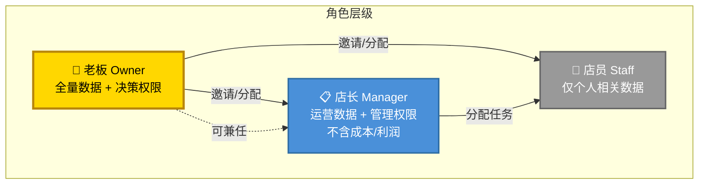
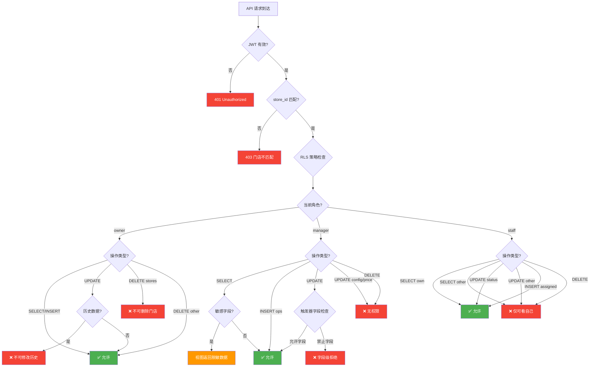
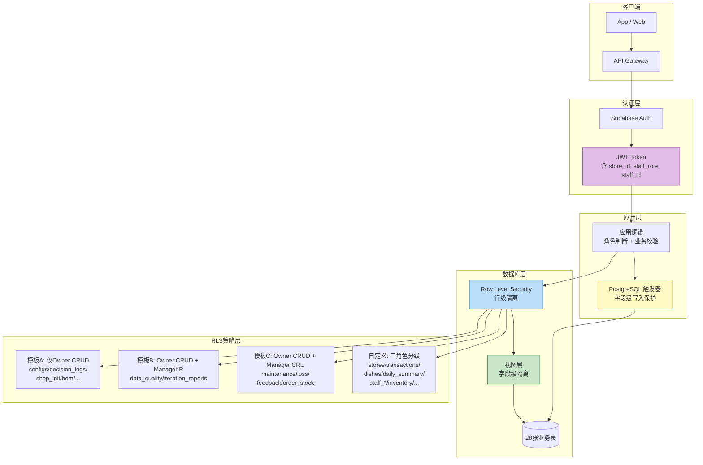

# 餐饮AI店长 — 三级角色权限隔离设计文档

> **文档版本**：v1.0  
> **创建日期**：2025-07-11  
> **文档状态**：设计稿  
> **适用范围**：24张存量表 + 4张P0.5新增中间表，共计28张表

---

## 目录

1. [角色定义与职责边界](#1-角色定义与职责边界)
2. [权限矩阵总表（28表 × 3角色 × CRUD）](#2-权限矩阵总表28表--3角色--crud)
3. [Supabase RLS 策略设计](#3-supabase-rls-策略设计)
4. [角色分配与切换逻辑](#4-角色分配与切换逻辑)
5. [数据隔离方案](#5-数据隔离方案)
6. [Mermaid 权限架构图](#6-mermaid-权限架构图)
7. [附录](#7-附录)

---

## 1. 角色定义与职责边界

### 1.1 三级角色总览

| 角色 | 代码 | 定位 | 数据可见范围 | 操作权限层级 |
|------|------|------|--------------|-------------|
| 老板 | `owner` | 门店所有者，全量数据+决策权限 | 全部门店数据 | 全量CRUD（除删除门店/修改历史数据） |
| 店长 | `manager` | 门店日常管理者，运营权限 | 运营数据（不含成本/利润/供应商价格） | 运营CRUD（不含定价/配置/删员工） |
| 店员 | `staff` | 一线执行人员，仅自身相关 | 仅本人数据 | 任务执行级（打卡/录入/查看自己） |

### 1.2 老板（Owner）详细权限

**可看数据**：
- 营收数据（交易流水、日报）
- 成本数据（采购验收、供应商价格、BOM成本）
- 利润数据（日报中的利润字段、损耗数据）
- 员工数据（档案、排班、培训、任务）
- 供应链数据（供应商档案、评分、库存）
- 营销数据（会员营销、选址初始化）
- 系统数据（配置、数据质量、决策日志、迭代报告）

**可操作**：
- 门店配置管理（store_configs）
- 菜品定价管理（store_dishes）
- 员工全生命周期管理（入职/离职/档案修改）
- 供应商管理（新增/修改/评分）
- 查看所有报表（日报/损耗日报/迭代报告）
- 角色分配（邀请店长/店员）

**不可做**：
- ❌ 删除门店（stores表DELETE禁止）
- ❌ 修改历史交易流水（store_transactions历史记录UPDATE禁止）
- ❌ 修改已生成的日报（store_daily_summary历史记录UPDATE禁止）

### 1.3 店长（Manager）详细权限

**可看数据**：
- 日报（不含利润字段）
- 库存数据（食材库存、损耗记录）
- 差评与反馈（feedback_labels）
- 员工排班（staff_schedule）
- 食品安全检查（food_safety_checklist）
- 采购验收记录（purchase_acceptance，不含供应商价格列）
- 设备维护（equipment_registry、maintenance_logs）
- 数据质量指标（data_quality_metrics）

**可操作**：
- 库存管理（盘点、调整、预警处理）
- 差评回复（feedback_labels更新）
- 排班调整（staff_schedule增改）
- 采购记录录入（purchase_acceptance创建）
- 设备维护记录（maintenance_logs创建/更新）
- 食品安全检查管理（food_safety_checklist创建/更新）
- 员工任务分配（staff_tasks创建/更新）

**不可看**：
- ❌ 利润数据（store_daily_summary中的profit相关字段）
- ❌ 供应商价格（supplier_profiles中的price字段）
- ❌ 成本核算详情（dish_ingredient_bom中的成本列）
- ❌ 交易流水总额（store_transactions中的amount列）

**不可做**：
- ❌ 修改定价（store_dishes的price字段UPDATE禁止）
- ❌ 删除员工档案（staff_profiles DELETE禁止）
- ❌ 配置AI参数（store_configs UPDATE禁止）
- ❌ 修改门店信息（stores表UPDATE禁止）

### 1.4 店员（Staff）详细权限

**可看数据**：
- 自己的排班（staff_schedule WHERE staff_id = current_user_id）
- 自己的任务（staff_tasks WHERE assigned_to = current_user_id）
- 食品安全检查表（food_safety_checklist，被分配的检查任务）
- 菜品列表（store_dishes，仅名称和图片，不含成本价）

**可操作**：
- 完成任务打卡（staff_tasks状态更新）
- 库存盘点录入（ingredient_inventory，被授权的盘点任务）
- 食品安全检查录入（food_safety_checklist，被分配的检查项）

**不可看**：
- ❌ 其他店员信息（staff_profiles其他记录）
- ❌ 任何财务数据（交易流水、日报、成本、利润）
- ❌ 客户/会员数据（marketing_member_new）
- ❌ 供应商数据（supplier_profiles、supplier_scores）
- ❌ 设备维护日志（maintenance_logs）
- ❌ 数据质量/决策日志/迭代报告

**不可做**：
- ❌ 修改任何系统配置
- ❌ 查看历史报表
- ❌ 创建/删除任何主数据

---

## 2. 权限矩阵总表（28表 × 3角色 × CRUD）

### 权限符号说明

| 符号 | 含义 |
|------|------|
| ✅ | 允许 |
| ❌ | 禁止 |
| ✅* | 有条件允许（见备注） |

### 2.1 V1基础表（6张）

| # | 表名 | 角色 | Create | Read | Update | Delete | 备注 |
|---|------|------|--------|------|--------|--------|------|
| 1 | stores | owner | ❌ | ✅ | ✅* | ❌ | *不可修改store_code；DELETE全局禁止 |
| | | manager | ❌ | ✅ | ❌ | ❌ | 仅读基本信息 |
| | | staff | ❌ | ✅ | ❌ | ❌ | 仅读门店名称、地址 |
| 2 | conversations | owner | ✅ | ✅ | ✅ | ✅ | 全量对话记录 |
| | | manager | ✅ | ✅* | ❌ | ❌ | *仅本门店且与自身相关的对话 |
| | | staff | ✅ | ✅* | ❌ | ❌ | *仅自己的对话记录 |
| 3 | store_transactions | owner | ✅ | ✅ | ✅* | ❌ | *仅当日记录可修改，历史不可改 |
| | | manager | ✅ | ✅* | ❌ | ❌ | *可读交易笔数，不可读amount列 |
| | | staff | ❌ | ❌ | ❌ | ❌ | 完全不可见 |
| 4 | store_dishes | owner | ✅ | ✅ | ✅ | ✅ | 全量菜品管理 |
| | | manager | ❌ | ✅* | ✅* | ❌ | *可读菜品名称/图片/分类；*可改上下架状态，不可改price |
| | | staff | ❌ | ✅* | ❌ | ❌ | *仅菜品名称、图片、是否在售 |
| 5 | store_daily_summary | owner | ✅ | ✅ | ✅* | ❌ | *仅当日日报可修改 |
| | | manager | ✅ | ✅* | ✅* | ❌ | *利润字段不可见；*仅可更新运营备注 |
| | | staff | ❌ | ❌ | ❌ | ❌ | 完全不可见 |
| 6 | store_configs | owner | ✅ | ✅ | ✅ | ❌ | 全量配置管理 |
| | | manager | ❌ | ✅* | ❌ | ❌ | *仅可读非敏感配置项 |
| | | staff | ❌ | ❌ | ❌ | ❌ | 完全不可见 |

### 2.2 V2运营表（15张）

| # | 表名 | 角色 | Create | Read | Update | Delete | 备注 |
|---|------|------|--------|------|--------|--------|------|
| 7 | supplier_profiles | owner | ✅ | ✅ | ✅ | ✅* | *仅可停用，不可物理删除 |
| | | manager | ❌ | ✅* | ❌ | ❌ | *供应商名称/联系方式可见，price列不可见 |
| | | staff | ❌ | ❌ | ❌ | ❌ | 完全不可见 |
| 8 | purchase_acceptance | owner | ✅ | ✅ | ✅ | ✅ | 全量采购验收 |
| | | manager | ✅ | ✅* | ✅ | ❌ | *供应商价格列不可见 |
| | | staff | ❌ | ❌ | ❌ | ❌ | 完全不可见 |
| 9 | supplier_scores | owner | ✅ | ✅ | ✅ | ✅ | 全量供应商评分 |
| | | manager | ✅ | ✅ | ❌ | ❌ | 可创建评分，不可修改 |
| | | staff | ❌ | ❌ | ❌ | ❌ | 完全不可见 |
| 10 | ingredient_inventory | owner | ✅ | ✅ | ✅ | ✅ | 全量库存管理 |
| | | manager | ✅ | ✅ | ✅ | ❌ | 可盘点/调整库存 |
| | | staff | ✅* | ✅* | ✅* | ❌ | *仅被分配的盘点任务，仅录入数量 |
| 11 | food_safety_checklist | owner | ✅ | ✅ | ✅ | ✅ | 全量食品安全检查 |
| | | manager | ✅ | ✅ | ✅ | ❌ | 可创建/管理检查任务 |
| | | staff | ✅* | ✅* | ✅* | ❌ | *仅被分配的检查项，仅录入检查结果 |
| 12 | equipment_registry | owner | ✅ | ✅ | ✅ | ✅ | 全量设备管理 |
| | | manager | ✅ | ✅ | ✅ | ❌ | 可登记/更新设备状态 |
| | | staff | ❌ | ✅* | ❌ | ❌ | *仅可读设备名称、位置（用于操作定位） |
| 13 | maintenance_logs | owner | ✅ | ✅ | ✅ | ✅ | 全量维护日志 |
| | | manager | ✅ | ✅ | ✅ | ❌ | 可创建/更新维护记录 |
| | | staff | ❌ | ❌ | ❌ | ❌ | 完全不可见 |
| 14 | data_quality_metrics | owner | ✅ | ✅ | ✅ | ✅ | 全量数据质量 |
| | | manager | ❌ | ✅ | ❌ | ❌ | 仅可读，不可操作 |
| | | staff | ❌ | ❌ | ❌ | ❌ | 完全不可见 |
| 15 | decision_confidence_logs | owner | ✅ | ✅ | ✅ | ✅ | 全量决策日志 |
| | | manager | ❌ | ❌ | ❌ | ❌ | 完全不可见 |
| | | staff | ❌ | ❌ | ❌ | ❌ | 完全不可见 |
| 16 | loss_records | owner | ✅ | ✅ | ✅ | ✅ | 全量损耗记录 |
| | | manager | ✅ | ✅ | ✅ | ❌ | 可录入/管理损耗记录 |
| | | staff | ❌ | ❌ | ❌ | ❌ | 完全不可见 |
| 17 | loss_daily_summary | owner | ✅ | ✅ | ✅* | ❌ | *仅当日可改 |
| | | manager | ✅ | ✅* | ❌ | ❌ | *可读损耗数量，不可读损耗金额 |
| | | staff | ❌ | ❌ | ❌ | ❌ | 完全不可见 |
| 18 | staff_profiles | owner | ✅ | ✅ | ✅ | ❌ | 可增改，不可物理删除（仅离职标记） |
| | | manager | ✅* | ✅* | ✅* | ❌ | *仅可创建/读取/修改本门店员工，不可看薪资字段 |
| | | staff | ❌ | ✅* | ✅* | ❌ | *仅可读/改自己的档案（姓名/电话/头像） |
| 19 | staff_schedule | owner | ✅ | ✅ | ✅ | ✅ | 全量排班管理 |
| | | manager | ✅ | ✅ | ✅ | ❌ | 可创建/调整排班 |
| | | staff | ❌ | ✅* | ❌ | ❌ | *仅可读自己的排班 |
| 20 | staff_training | owner | ✅ | ✅ | ✅ | ✅ | 全量培训管理 |
| | | manager | ✅ | ✅ | ✅ | ❌ | 可创建/管理培训计划 |
| | | staff | ❌ | ✅* | ✅* | ❌ | *仅自己的培训记录，*可标记完成 |
| 21 | staff_tasks | owner | ✅ | ✅ | ✅ | ✅ | 全量任务管理 |
| | | manager | ✅ | ✅ | ✅ | ❌ | 可创建/分配/更新任务 |
| | | staff | ❌ | ✅* | ✅* | ❌ | *仅assigned_to自己的任务；*可更新状态为已完成 |

### 2.3 V3迭代表（3张）

| # | 表名 | 角色 | Create | Read | Update | Delete | 备注 |
|---|------|------|--------|------|--------|--------|------|
| 22 | feedback_labels | owner | ✅ | ✅ | ✅ | ✅ | 全量反馈标签 |
| | | manager | ✅ | ✅ | ✅ | ❌ | 可创建/管理反馈标签 |
| | | staff | ❌ | ❌ | ❌ | ❌ | 完全不可见 |
| 23 | iteration_reports | owner | ✅ | ✅ | ✅ | ✅ | 全量迭代报告 |
| | | manager | ❌ | ✅ | ❌ | ❌ | 仅可读，不可操作 |
| | | staff | ❌ | ❌ | ❌ | ❌ | 完全不可见 |
| 24 | iteration_tasks | owner | ✅ | ✅ | ✅ | ✅ | 全量迭代任务 |
| | | manager | ❌ | ✅* | ✅* | ❌ | *仅与运营相关的迭代任务 |
| | | staff | ❌ | ❌ | ❌ | ❌ | 完全不可见 |

### 2.4 P0.5新增中间表（4张）

| # | 表名 | 角色 | Create | Read | Update | Delete | 备注 |
|---|------|------|--------|------|--------|--------|------|
| 25 | shop_init_new | owner | ✅ | ✅ | ✅ | ✅ | 全量选址初始化 |
| | | manager | ❌ | ✅ | ❌ | ❌ | 仅可读选址结果 |
| | | staff | ❌ | ❌ | ❌ | ❌ | 完全不可见 |
| 26 | dish_ingredient_bom | owner | ✅ | ✅ | ✅ | ✅ | 全量BOM管理 |
| | | manager | ❌ | ✅* | ❌ | ❌ | *可读菜品-原料映射，成本列不可见 |
| | | staff | ❌ | ❌ | ❌ | ❌ | 完全不可见 |
| 27 | order_stock_new | owner | ✅ | ✅ | ✅ | ✅ | 全量订单库存消耗 |
| | | manager | ✅ | ✅ | ✅ | ❌ | 可创建/管理消耗记录 |
| | | staff | ❌ | ❌ | ❌ | ❌ | 完全不可见 |
| 28 | marketing_member_new | owner | ✅ | ✅ | ✅ | ✅ | 全量会员营销 |
| | | manager | ❌ | ✅* | ❌ | ❌ | *可读会员数量统计，不可读会员详情 |
| | | staff | ❌ | ❌ | ❌ | ❌ | 完全不可见 |

### 2.5 权限统计汇总

| 角色 | 可见表数 | 可CRUD表数 | 仅读表数 | 完全不可见表数 |
|------|---------|-----------|---------|--------------|
| owner | 28 | 24 | 4（stores/conversations/transactions/daily_summary有条件限制） | 0 |
| manager | 22 | 12 | 10 | 6（transactions_amount/decision_logs/staff不可见表） |
| staff | 8 | 4（有条件） | 4 | 20 |

---

## 3. Supabase RLS 策略设计

### 3.1 JWT Claims 结构设计

用户登录后，Supabase Auth 生成的 JWT 中包含以下自定义 claims：

```json
{
  "sub": "user-uuid",
  "role": "authenticated",
  "app_metadata": {
    "store_id": "store-uuid",
    "staff_role": "owner",        // owner | manager | staff
    "staff_id": "staff-uuid",     // 对应 staff_profiles.id，staff角色必填
    "is_active": true
  }
}
```

### 3.2 辅助函数定义

```sql
-- ============================================================
-- 辅助函数：从JWT中提取角色信息
-- ============================================================

-- 获取当前用户的门店ID
CREATE OR REPLACE FUNCTION auth.store_id()
RETURNS UUID
LANGUAGE sql
STABLE
AS $$
  SELECT NULLIF(current_setting('request.jwt.claims', true)::json->'app_metadata'->>'store_id', '')::UUID;
$$;

-- 获取当前用户的角色（owner/manager/staff）
CREATE OR REPLACE FUNCTION auth.staff_role()
RETURNS TEXT
LANGUAGE sql
STABLE
AS $$
  SELECT NULLIF(current_setting('request.jwt.claims', true)::json->'app_metadata'->>'staff_role', '');
$$;

-- 获取当前用户的staff_id
CREATE OR REPLACE FUNCTION auth.staff_id()
RETURNS UUID
LANGUAGE sql
STABLE
AS $$
  SELECT NULLIF(current_setting('request.jwt.claims', true)::json->'app_metadata'->>'staff_id', '')::UUID;
$$;

-- 判断当前用户是否为老板
CREATE OR REPLACE FUNCTION auth.is_owner()
RETURNS BOOLEAN
LANGUAGE sql
STABLE
AS $$
  SELECT auth.staff_role() = 'owner';
$$;

-- 判断当前用户是否为店长
CREATE OR REPLACE FUNCTION auth.is_manager()
RETURNS BOOLEAN
LANGUAGE sql
STABLE
AS $$
  SELECT auth.staff_role() = 'manager';
$$;

-- 判断当前用户是否为店员
CREATE OR REPLACE FUNCTION auth.is_staff()
RETURNS BOOLEAN
LANGUAGE sql
STABLE
AS $$
  SELECT auth.staff_role() = 'staff';
$$;

-- 判断当前用户是否为老板或店长
CREATE OR REPLACE FUNCTION auth.is_owner_or_manager()
RETURNS BOOLEAN
LANGUAGE sql
STABLE
AS $$
  SELECT auth.staff_role() IN ('owner', 'manager');
$$;
```

### 3.3 RLS 策略示例 — 按角色分级

#### 3.3.1 stores（门店信息表）

```sql
-- ============================================================
-- 表: stores — 门店信息
-- owner:  读✅ 改✅(限制) 删❌
-- manager: 读✅ 改❌ 删❌
-- staff:   读✅(仅基本信息) 改❌ 删❌
-- ============================================================

ALTER TABLE stores ENABLE ROW LEVEL SECURITY;

-- SELECT: 所有角色可读（限本门店）
CREATE POLICY stores_select_own_store
  ON stores FOR SELECT
  TO authenticated
  USING (id = auth.store_id());

-- UPDATE: 仅老板可改，且不可修改 store_code
CREATE POLICY stores_update_owner_only
  ON stores FOR UPDATE
  TO authenticated
  USING (auth.is_owner() AND id = auth.store_id())
  WITH CHECK (auth.is_owner() AND id = auth.store_id());

-- DELETE: 全局禁止（不创建DELETE策略即默认拒绝）
-- 如需显式禁止：
CREATE POLICY stores_delete_denied
  ON stores FOR DELETE
  TO authenticated
  USING (FALSE);
```

#### 3.3.2 store_transactions（交易流水表）

```sql
-- ============================================================
-- 表: store_transactions — 交易流水
-- owner:  增✅ 读✅ 改✅(仅当日) 删❌
-- manager: 增✅ 读✅(不含amount) 改❌ 删❌
-- staff:   全部❌
-- ============================================================

ALTER TABLE store_transactions ENABLE ROW LEVEL SECURITY;

-- SELECT: 老板全量；店长可读（字段级隔离见视图）；店员不可见
CREATE POLICY transactions_select_role_based
  ON store_transactions FOR SELECT
  TO authenticated
  USING (
    store_id = auth.store_id()
    AND (
      auth.is_owner()
      OR auth.is_manager()
    )
  );

-- INSERT: 老板和店长可创建
CREATE POLICY transactions_insert_owner_manager
  ON store_transactions FOR INSERT
  TO authenticated
  WITH CHECK (
    store_id = auth.store_id()
    AND auth.is_owner_or_manager()
  );

-- UPDATE: 仅老板，且仅当日记录
CREATE POLICY transactions_update_owner_today_only
  ON store_transactions FOR UPDATE
  TO authenticated
  USING (
    auth.is_owner()
    AND store_id = auth.store_id()
    AND transaction_date >= CURRENT_DATE
  )
  WITH CHECK (
    auth.is_owner()
    AND store_id = auth.store_id()
  );

-- DELETE: 全局禁止
CREATE POLICY transactions_delete_denied
  ON store_transactions FOR DELETE
  TO authenticated
  USING (FALSE);
```

#### 3.3.3 store_dishes（菜品管理表）

```sql
-- ============================================================
-- 表: store_dishes — 菜品管理
-- owner:  全量CRUD
-- manager: 读✅(不含成本价) 改✅(仅上下架) 删❌
-- staff:   读✅(仅名称/图片/在售状态) 改❌ 删❌
-- ============================================================

ALTER TABLE store_dishes ENABLE ROW LEVEL SECURITY;

-- SELECT: 三角色均可读（字段级隔离见视图）
CREATE POLICY dishes_select_all_roles
  ON store_dishes FOR SELECT
  TO authenticated
  USING (store_id = auth.store_id());

-- INSERT: 仅老板
CREATE POLICY dishes_insert_owner_only
  ON store_dishes FOR INSERT
  TO authenticated
  WITH CHECK (
    store_id = auth.store_id()
    AND auth.is_owner()
  );

-- UPDATE: 老板全量改；店长仅可改is_available字段
-- 方案一：通过触发器限制店长可改字段
-- 方案二：分开策略（推荐使用列级权限）
CREATE POLICY dishes_update_owner_full
  ON store_dishes FOR UPDATE
  TO authenticated
  USING (
    store_id = auth.store_id()
    AND auth.is_owner()
  )
  WITH CHECK (
    store_id = auth.store_id()
    AND auth.is_owner()
  );

-- 店长仅可改上下架状态（通过触发器实现字段级控制）
-- 见 5.2 字段级权限方案

-- DELETE: 仅老板
CREATE POLICY dishes_delete_owner_only
  ON store_dishes FOR DELETE
  TO authenticated
  USING (
    store_id = auth.store_id()
    AND auth.is_owner()
  );
```

#### 3.3.4 staff_profiles（员工档案表）

```sql
-- ============================================================
-- 表: staff_profiles — 员工档案
-- owner:  增✅ 读✅ 改✅ 删❌（仅离职标记）
-- manager: 增✅ 读✅(不含薪资) 改✅(不含薪资) 删❌
-- staff:   读✅(仅自己) 改✅(仅自己基本信息) 删❌
-- ============================================================

ALTER TABLE staff_profiles ENABLE ROW LEVEL SECURITY;

-- SELECT: 老板全量；店长本门店（薪资字段见视图隔离）；店员仅自己
CREATE POLICY staff_profiles_select_role_based
  ON staff_profiles FOR SELECT
  TO authenticated
  USING (
    store_id = auth.store_id()
    AND (
      auth.is_owner()
      OR auth.is_manager()
      OR id = auth.staff_id()  -- 店员仅看自己
    )
  );

-- INSERT: 老板和店长
CREATE POLICY staff_profiles_insert_owner_manager
  ON staff_profiles FOR INSERT
  TO authenticated
  WITH CHECK (
    store_id = auth.store_id()
    AND auth.is_owner_or_manager()
  );

-- UPDATE: 老板全量改；店长不含薪资字段（触发器控制）；店员仅改自己基本信息
CREATE POLICY staff_profiles_update_role_based
  ON staff_profiles FOR UPDATE
  TO authenticated
  USING (
    store_id = auth.store_id()
    AND (
      auth.is_owner()
      OR auth.is_manager()
      OR (auth.is_staff() AND id = auth.staff_id())
    )
  )
  WITH CHECK (
    store_id = auth.store_id()
  );

-- DELETE: 全局禁止（使用软删除：设置status='resigned'）
CREATE POLICY staff_profiles_delete_denied
  ON staff_profiles FOR DELETE
  TO authenticated
  USING (FALSE);
```

#### 3.3.5 staff_schedule（员工排班表）

```sql
-- ============================================================
-- 表: staff_schedule — 员工排班
-- owner:  全量CRUD
-- manager: 增✅ 读✅ 改✅ 删❌
-- staff:   读✅(仅自己) 改❌ 删❌
-- ============================================================

ALTER TABLE staff_schedule ENABLE ROW LEVEL SECURITY;

-- SELECT: 老板/店长全量；店员仅自己
CREATE POLICY schedule_select_role_based
  ON staff_schedule FOR SELECT
  TO authenticated
  USING (
    store_id = auth.store_id()
    AND (
      auth.is_owner_or_manager()
      OR staff_id = auth.staff_id()
    )
  );

-- INSERT: 老板和店长
CREATE POLICY schedule_insert_owner_manager
  ON staff_schedule FOR INSERT
  TO authenticated
  WITH CHECK (
    store_id = auth.store_id()
    AND auth.is_owner_or_manager()
  );

-- UPDATE: 老板和店长
CREATE POLICY schedule_update_owner_manager
  ON staff_schedule FOR UPDATE
  TO authenticated
  USING (
    store_id = auth.store_id()
    AND auth.is_owner_or_manager()
  )
  WITH CHECK (
    store_id = auth.store_id()
    AND auth.is_owner_or_manager()
  );

-- DELETE: 仅老板
CREATE POLICY schedule_delete_owner_only
  ON staff_schedule FOR DELETE
  TO authenticated
  USING (
    store_id = auth.store_id()
    AND auth.is_owner()
  );
```

#### 3.3.6 staff_tasks（员工任务表）

```sql
-- ============================================================
-- 表: staff_tasks — 员工任务
-- owner:  全量CRUD
-- manager: 增✅ 读✅ 改✅ 删❌
-- staff:   读✅(仅自己的) 改✅(仅状态→已完成) 删❌
-- ============================================================

ALTER TABLE staff_tasks ENABLE ROW LEVEL SECURITY;

-- SELECT: 老板/店长全量；店员仅分配给自己的任务
CREATE POLICY tasks_select_role_based
  ON staff_tasks FOR SELECT
  TO authenticated
  USING (
    store_id = auth.store_id()
    AND (
      auth.is_owner_or_manager()
      OR assigned_to = auth.staff_id()
    )
  );

-- INSERT: 老板和店长
CREATE POLICY tasks_insert_owner_manager
  ON staff_tasks FOR INSERT
  TO authenticated
  WITH CHECK (
    store_id = auth.store_id()
    AND auth.is_owner_or_manager()
  );

-- UPDATE: 老板/店长全量改；店员仅可改status字段
CREATE POLICY tasks_update_role_based
  ON staff_tasks FOR UPDATE
  TO authenticated
  USING (
    store_id = auth.store_id()
    AND (
      auth.is_owner_or_manager()
      OR (auth.is_staff() AND assigned_to = auth.staff_id())
    )
  )
  WITH CHECK (
    store_id = auth.store_id()
  );

-- DELETE: 仅老板
CREATE POLICY tasks_delete_owner_only
  ON staff_tasks FOR DELETE
  TO authenticated
  USING (
    store_id = auth.store_id()
    AND auth.is_owner()
  );
```

#### 3.3.7 ingredient_inventory（食材库存表）

```sql
-- ============================================================
-- 表: ingredient_inventory — 食材库存
-- owner:  全量CRUD
-- manager: 增✅ 读✅ 改✅ 删❌
-- staff:   增✅(盘点任务) 读✅(被分配的) 改✅(仅数量) 删❌
-- ============================================================

ALTER TABLE ingredient_inventory ENABLE ROW LEVEL SECURITY;

-- SELECT: 老板/店长全量；店员仅被分配盘点的食材
CREATE POLICY inventory_select_role_based
  ON ingredient_inventory FOR SELECT
  TO authenticated
  USING (
    store_id = auth.store_id()
    AND (
      auth.is_owner_or_manager()
      OR (
        auth.is_staff()
        AND id IN (
          SELECT inventory_id FROM staff_tasks
          WHERE assigned_to = auth.staff_id()
            AND task_type = 'inventory_check'
            AND store_id = auth.store_id()
        )
      )
    )
  );

-- INSERT: 老板/店长全量；店员仅盘点记录
CREATE POLICY inventory_insert_role_based
  ON ingredient_inventory FOR INSERT
  TO authenticated
  WITH CHECK (
    store_id = auth.store_id()
    AND auth.is_owner_or_manager()
  );

-- UPDATE: 老板/店长全量改；店员仅改quantity字段（触发器控制）
CREATE POLICY inventory_update_role_based
  ON ingredient_inventory FOR UPDATE
  TO authenticated
  USING (
    store_id = auth.store_id()
    AND (
      auth.is_owner_or_manager()
      OR (
        auth.is_staff()
        AND id IN (
          SELECT inventory_id FROM staff_tasks
          WHERE assigned_to = auth.staff_id()
            AND task_type = 'inventory_check'
            AND store_id = auth.store_id()
        )
      )
    )
  )
  WITH CHECK (
    store_id = auth.store_id()
  );

-- DELETE: 仅老板
CREATE POLICY inventory_delete_owner_only
  ON ingredient_inventory FOR DELETE
  TO authenticated
  USING (
    store_id = auth.store_id()
    AND auth.is_owner()
  );
```

#### 3.3.8 supplier_profiles（供应商档案表）

```sql
-- ============================================================
-- 表: supplier_profiles — 供应商档案
-- owner:  全量CRUD（DELETE为软删除）
-- manager: 读✅(不含价格列) 改❌ 删❌
-- staff:   全部❌
-- ============================================================

ALTER TABLE supplier_profiles ENABLE ROW LEVEL SECURITY;

-- SELECT: 仅老板和店长（店长价格列通过视图隔离）
CREATE POLICY supplier_select_owner_manager
  ON supplier_profiles FOR SELECT
  TO authenticated
  USING (
    store_id = auth.store_id()
    AND auth.is_owner_or_manager()
  );

-- INSERT: 仅老板
CREATE POLICY supplier_insert_owner_only
  ON supplier_profiles FOR INSERT
  TO authenticated
  WITH CHECK (
    store_id = auth.store_id()
    AND auth.is_owner()
  );

-- UPDATE: 仅老板
CREATE POLICY supplier_update_owner_only
  ON supplier_profiles FOR UPDATE
  TO authenticated
  USING (
    store_id = auth.store_id()
    AND auth.is_owner()
  )
  WITH CHECK (
    store_id = auth.store_id()
    AND auth.is_owner()
  );

-- DELETE: 仅老板（实际为软删除：设置status='inactive'）
CREATE POLICY supplier_delete_owner_only
  ON supplier_profiles FOR DELETE
  TO authenticated
  USING (
    store_id = auth.store_id()
    AND auth.is_owner()
  );
```

#### 3.3.9 food_safety_checklist（食品安全检查表）

```sql
-- ============================================================
-- 表: food_safety_checklist — 食品安全检查
-- owner:  全量CRUD
-- manager: 增✅ 读✅ 改✅ 删❌
-- staff:   增✅(被分配的) 读✅(被分配的) 改✅(仅结果) 删❌
-- ============================================================

ALTER TABLE food_safety_checklist ENABLE ROW LEVEL SECURITY;

-- SELECT: 老板/店长全量；店员仅被分配的检查项
CREATE POLICY safety_select_role_based
  ON food_safety_checklist FOR SELECT
  TO authenticated
  USING (
    store_id = auth.store_id()
    AND (
      auth.is_owner_or_manager()
      OR assigned_to = auth.staff_id()
    )
  );

-- INSERT: 老板/店长全量；店员可录入检查结果
CREATE POLICY safety_insert_role_based
  ON food_safety_checklist FOR INSERT
  TO authenticated
  WITH CHECK (
    store_id = auth.store_id()
    AND (
      auth.is_owner_or_manager()
      OR (auth.is_staff() AND assigned_to = auth.staff_id())
    )
  );

-- UPDATE: 老板/店长全量改；店员仅改检查结果字段
CREATE POLICY safety_update_role_based
  ON food_safety_checklist FOR UPDATE
  TO authenticated
  USING (
    store_id = auth.store_id()
    AND (
      auth.is_owner_or_manager()
      OR (auth.is_staff() AND assigned_to = auth.staff_id())
    )
  )
  WITH CHECK (
    store_id = auth.store_id()
  );

-- DELETE: 仅老板
CREATE POLICY safety_delete_owner_only
  ON food_safety_checklist FOR DELETE
  TO authenticated
  USING (
    store_id = auth.store_id()
    AND auth.is_owner()
  );
```

#### 3.3.10 store_daily_summary（日报表）

```sql
-- ============================================================
-- 表: store_daily_summary — 日报
-- owner:  增✅ 读✅ 改✅(仅当日) 删❌
-- manager: 增✅ 读✅(不含利润列) 改✅(仅运营备注) 删❌
-- staff:   全部❌
-- ============================================================

ALTER TABLE store_daily_summary ENABLE ROW LEVEL SECURITY;

-- SELECT: 仅老板和店长（店长利润字段通过视图隔离）
CREATE POLICY daily_summary_select_owner_manager
  ON store_daily_summary FOR SELECT
  TO authenticated
  USING (
    store_id = auth.store_id()
    AND auth.is_owner_or_manager()
  );

-- INSERT: 老板和店长
CREATE POLICY daily_summary_insert_owner_manager
  ON store_daily_summary FOR INSERT
  TO authenticated
  WITH CHECK (
    store_id = auth.store_id()
    AND auth.is_owner_or_manager()
  );

-- UPDATE: 老板仅当日可改；店长仅运营备注字段（触发器控制）
CREATE POLICY daily_summary_update_role_based
  ON store_daily_summary FOR UPDATE
  TO authenticated
  USING (
    store_id = auth.store_id()
    AND auth.is_owner_or_manager()
    AND (
      auth.is_owner()
      OR auth.is_manager()
    )
  )
  WITH CHECK (
    store_id = auth.store_id()
  );

-- DELETE: 全局禁止
CREATE POLICY daily_summary_delete_denied
  ON store_daily_summary FOR DELETE
  TO authenticated
  USING (FALSE);
```

### 3.4 RLS 策略通用模板

对其余表，按以下模板快速生成策略：

```sql
-- ============================================================
-- 通用模板 A: 仅老板可CRUD（适用于 decision_confidence_logs 等敏感表）
-- ============================================================
ALTER TABLE {table_name} ENABLE ROW LEVEL SECURITY;

CREATE POLICY {table}_select_owner
  ON {table_name} FOR SELECT TO authenticated
  USING (store_id = auth.store_id() AND auth.is_owner());

CREATE POLICY {table}_insert_owner
  ON {table_name} FOR INSERT TO authenticated
  WITH CHECK (store_id = auth.store_id() AND auth.is_owner());

CREATE POLICY {table}_update_owner
  ON {table_name} FOR UPDATE TO authenticated
  USING (store_id = auth.store_id() AND auth.is_owner())
  WITH CHECK (store_id = auth.store_id() AND auth.is_owner());

CREATE POLICY {table}_delete_owner
  ON {table_name} FOR DELETE TO authenticated
  USING (store_id = auth.store_id() AND auth.is_owner());

-- ============================================================
-- 通用模板 B: 老板CRUD + 店长读（适用于 data_quality_metrics 等）
-- ============================================================
ALTER TABLE {table_name} ENABLE ROW LEVEL SECURITY;

CREATE POLICY {table}_select_owner_manager
  ON {table_name} FOR SELECT TO authenticated
  USING (store_id = auth.store_id() AND auth.is_owner_or_manager());

CREATE POLICY {table}_insert_owner
  ON {table_name} FOR INSERT TO authenticated
  WITH CHECK (store_id = auth.store_id() AND auth.is_owner());

CREATE POLICY {table}_update_owner
  ON {table_name} FOR UPDATE TO authenticated
  USING (store_id = auth.store_id() AND auth.is_owner())
  WITH CHECK (store_id = auth.store_id() AND auth.is_owner());

CREATE POLICY {table}_delete_owner
  ON {table_name} FOR DELETE TO authenticated
  USING (store_id = auth.store_id() AND auth.is_owner());

-- ============================================================
-- 通用模板 C: 老板CRUD + 店长CRU（适用于 maintenance_logs 等）
-- ============================================================
ALTER TABLE {table_name} ENABLE ROW LEVEL SECURITY;

CREATE POLICY {table}_select_owner_manager
  ON {table_name} FOR SELECT TO authenticated
  USING (store_id = auth.store_id() AND auth.is_owner_or_manager());

CREATE POLICY {table}_insert_owner_manager
  ON {table_name} FOR INSERT TO authenticated
  WITH CHECK (store_id = auth.store_id() AND auth.is_owner_or_manager());

CREATE POLICY {table}_update_owner_manager
  ON {table_name} FOR UPDATE TO authenticated
  USING (store_id = auth.store_id() AND auth.is_owner_or_manager())
  WITH CHECK (store_id = auth.store_id() AND auth.is_owner_or_manager());

CREATE POLICY {table}_delete_owner
  ON {table_name} FOR DELETE TO authenticated
  USING (store_id = auth.store_id() AND auth.is_owner());
```

### 3.5 各表 RLS 模板适用对照

| # | 表名 | 适用模板 | 特殊处理 |
|---|------|---------|---------|
| 1 | stores | 自定义 | DELETE全局禁止 |
| 2 | conversations | 自定义 | staff仅读自己 |
| 3 | store_transactions | 自定义 | owner仅当日可改；manager字段级隔离 |
| 4 | store_dishes | 自定义 | manager仅改is_available；staff字段级隔离 |
| 5 | store_daily_summary | 自定义 | owner仅当日可改；manager字段级隔离 |
| 6 | store_configs | 模板A | 仅owner |
| 7 | supplier_profiles | 模板A | manager字段级隔离 |
| 8 | purchase_acceptance | 模板C | manager字段级隔离 |
| 9 | supplier_scores | 自定义 | manager可创建不可改 |
| 10 | ingredient_inventory | 自定义 | staff有条件CRU |
| 11 | food_safety_checklist | 自定义 | staff有条件CRU |
| 12 | equipment_registry | 模板C | staff仅读基本信息 |
| 13 | maintenance_logs | 模板C | — |
| 14 | data_quality_metrics | 模板B | — |
| 15 | decision_confidence_logs | 模板A | — |
| 16 | loss_records | 模板C | — |
| 17 | loss_daily_summary | 自定义 | owner仅当日可改；manager字段级隔离 |
| 18 | staff_profiles | 自定义 | staff仅读/改自己 |
| 19 | staff_schedule | 自定义 | staff仅读自己 |
| 20 | staff_training | 自定义 | staff仅读/改自己 |
| 21 | staff_tasks | 自定义 | staff仅读/改自己任务 |
| 22 | feedback_labels | 模板C | — |
| 23 | iteration_reports | 模板B | — |
| 24 | iteration_tasks | 模板B | manager仅运营相关 |
| 25 | shop_init_new | 模板A | — |
| 26 | dish_ingredient_bom | 模板A | manager字段级隔离 |
| 27 | order_stock_new | 模板C | — |
| 28 | marketing_member_new | 模板A | manager字段级隔离 |

---

## 4. 角色分配与切换逻辑

### 4.1 角色分配流程

#### 4.1.1 老板角色分配

```
注册流程：
1. 用户在App端注册账号（手机号/微信授权）
2. 创建门店时，系统自动将创建者角色设为 owner
3. JWT app_metadata 写入：
   - store_id: 新建门店ID
   - staff_role: "owner"
   - staff_id: 新建 staff_profiles 记录ID
4. 老板获得全部权限，可邀请店长和店员
```

#### 4.1.2 店长角色分配

```
邀请流程（由老板发起）：
1. 老板在「员工管理 → 添加员工」中选择角色"店长"
2. 填写店长信息（姓名/手机号），系统创建 staff_profiles 记录
3. 系统发送邀请链接（短信/微信），包含一次性token
4. 店长点击链接，完成注册/绑定已有账号
5. 激活后 JWT app_metadata 更新：
   - store_id: 邀请门店ID
   - staff_role: "manager"
   - staff_id: 对应 staff_profiles 记录ID
```

#### 4.1.3 店员角色分配

```
邀请流程（由老板或店长发起）：
1. 老板/店长在「员工管理 → 添加员工」中选择角色"店员"
2. 填写店员信息（姓名/手机号），系统创建 staff_profiles 记录
3. 系统发送邀请链接（短信/微信）
4. 店员点击链接，完成注册/绑定已有账号
5. 激活后 JWT app_metadata 更新：
   - store_id: 邀请门店ID
   - staff_role: "staff"
   - staff_id: 对应 staff_profiles 记录ID
```

### 4.2 多角色兼任机制

#### 设计方案：主角色 + 代理角色

```
场景：老板兼任店长（日常也参与门店运营管理）

实现方式：
1. staff_profiles 表中，主角色为 owner
2. 新增字段 delegate_roles TEXT[]（默认为空数组）
3. 老板可设置 delegate_roles = ['manager']
4. JWT claims 中同时包含：
   - staff_role: "owner"        （主角色，决定最高权限）
   - delegate_roles: ["manager"] （代理角色，可选）
5. RLS 策略中，权限判断取并集：
   auth.is_owner() OR (auth.staff_role() = 'manager')
   → 由于 owner 已经拥有 manager 的全部权限，无需额外处理
```

#### 反向场景：店长不能兼任老板

```
规则：
- 仅老板可邀请/指定老板角色
- 店长不能将自己或他人提升为老板
- 老板角色转让需要二次验证（短信验证码 + 旧老板确认）
- 一家门店同时只能有一个 active 的 owner
```

#### 跨门店角色

```
场景：用户在A门店是店长，在B门店是店员

实现方式：
1. staff_profiles 表支持一人多条记录（不同 store_id）
2. JWT app_metadata 设计为多门店结构：
   {
     "app_metadata": {
       "stores": [
         {"store_id": "store-A", "staff_role": "manager", "staff_id": "staff-1"},
         {"store_id": "store-B", "staff_role": "staff", "staff_id": "staff-2"}
       ],
       "active_store_id": "store-A",
       "store_id": "store-A",
       "staff_role": "manager",
       "staff_id": "staff-1"
     }
   }
3. 前端切换门店时，调用后端接口刷新JWT
4. RLS 函数读取 active_store_id 进行权限判断
```

### 4.3 角色切换前端交互设计

#### 4.3.1 门店切换（跨门店用户）

```
交互流程：
┌──────────────────────────────────────────────────┐
│  顶部导航栏                                         │
│  ┌──────────────────────────┐                     │
│  │ 🏪 湘菜馆（A店）    ▼    │  ← 点击展开门店列表  │
│  └──────────────────────────┘                     │
│                                                   │
│  点击后弹出底部Sheet：                              │
│  ┌──────────────────────────────────────────────┐ │
│  │ 选择门店                                      │ │
│  ├──────────────────────────────────────────────┤ │
│  │ ✅ 湘菜馆（A店）    店长                       │ │
│  │ ⬜ 火锅店（B店）    店员                       │ │
│  └──────────────────────────────────────────────┘ │
│                                                   │
│  切换后：                                          │
│  1. 调用 POST /api/auth/switch-store              │
│  2. 后端返回新的JWT（含新的store_id/role）          │
│  3. 前端更新本地token                              │
│  4. 刷新当前页面数据                                │
│  5. 导航栏显示新门店名称 + 角色标签                  │
└──────────────────────────────────────────────────┘
```

#### 4.3.2 角色标签展示

```
导航栏角色标签设计：

  ┌─────────────────────────────────┐
  │ 🏪 湘菜馆（A店）    👑 老板      │  ← owner: 金色标签
  └─────────────────────────────────┘

  ┌─────────────────────────────────┐
  │ 🏪 湘菜馆（A店）    📋 店长      │  ← manager: 蓝色标签
  └─────────────────────────────────┘

  ┌─────────────────────────────────┐
  │ 🏪 湘菜馆（A店）    👤 店员      │  ← staff: 灰色标签
  └─────────────────────────────────┘
```

#### 4.3.3 菜单动态渲染规则

```
前端菜单根据 staff_role 动态渲染：

owner 菜单：
  ├── 📊 数据看板（营收/成本/利润）
  ├── 📋 日报管理
  ├── 🍽️ 菜品管理（含定价）
  ├── 👥 员工管理（含薪资）
  ├── 🚚 供应商管理（含价格）
  ├── 📦 库存管理
  ├── ⭐ 食品安全
  ├── 🔧 设备维护
  ├── 📈 迭代报告
  ├── 🎯 会员营销
  ├── 📊 数据质量
  └── ⚙️ 系统配置

manager 菜单：
  ├── 📋 日报管理（不含利润）
  ├── 🍽️ 菜品管理（不含定价，仅上下架）
  ├── 👥 员工管理（不含薪资）
  ├── 📦 库存管理
  ├── ⭐ 食品安全
  ├── 🔧 设备维护
  ├── 📝 采购验收（不含价格）
  ├── 💬 差评管理
  ├── 📊 任务管理
  └── 📈 迭代报告（仅读）

staff 菜单：
  ├── 📅 我的排班
  ├── ✅ 我的任务
  ├── ⭐ 食品安全检查
  └── 📦 库存盘点（被分配的）
```

---

## 5. 数据隔离方案

### 5.1 店员数据隔离 — staff_id 过滤

#### 5.1.1 行级隔离

店员只能看到与自己相关的数据行，通过 RLS 的 `staff_id = auth.staff_id()` 条件实现：

```
隔离维度：
├── staff_profiles    → WHERE id = auth.staff_id()
├── staff_schedule    → WHERE staff_id = auth.staff_id()
├── staff_tasks       → WHERE assigned_to = auth.staff_id()
├── staff_training    → WHERE staff_id = auth.staff_id()
├── food_safety_checklist → WHERE assigned_to = auth.staff_id()
└── ingredient_inventory  → 通过 staff_tasks 关联，仅被分配盘点的食材
```

#### 5.1.2 关联查询隔离

店员查看任务时，任务关联的其他数据也需隔离：

```sql
-- 店员查看任务详情时，关联的菜品信息仅返回名称和图片
-- 通过视图实现：
CREATE VIEW staff_task_detail_view AS
SELECT
  t.id,
  t.title,
  t.description,
  t.status,
  t.due_date,
  t.assigned_to,
  -- 关联菜品：仅返回名称和图片
  d.dish_name,
  d.dish_image_url,
  -- 不返回：d.cost_price, d.profit_margin 等敏感字段
  t.store_id
FROM staff_tasks t
LEFT JOIN store_dishes d ON t.related_dish_id = d.id
WHERE t.store_id = auth.store_id()
  AND (
    auth.is_owner_or_manager()
    OR t.assigned_to = auth.staff_id()
  );
```

### 5.2 店长字段级隔离 — 视图方案

#### 5.2.1 敏感字段隔离视图

对店长不可见的敏感字段，通过创建视图进行字段级隔离：

```sql
-- ============================================================
-- 视图: store_daily_summary_manager_view
-- 用途: 店长查看日报，隐藏利润相关字段
-- ============================================================
CREATE VIEW store_daily_summary_manager_view AS
SELECT
  id,
  store_id,
  report_date,
  total_orders,           -- 订单数 ✅ 可见
  total_customers,        -- 客流 ✅ 可见
  avg_order_value,        -- 客单价 ✅ 可见
  -- total_revenue,       -- 营收总额 ❌ 隐藏
  -- total_cost,          -- 总成本 ❌ 隐藏
  -- gross_profit,        -- 毛利润 ❌ 隐藏
  -- net_profit,          -- 净利润 ❌ 隐藏
  -- profit_margin,       -- 利润率 ❌ 隐藏
  food_cost_ratio,        -- 食材成本率 ❌ 隐藏（替换为NULL）
  labor_cost_ratio,       -- 人工成本率 ❌ 隐藏
  top_dishes,             -- 热销菜品 ✅ 可见
  customer_feedback,      -- 客户反馈 ✅ 可见
  operational_notes,      -- 运营备注 ✅ 可见
  created_at,
  updated_at
FROM store_daily_summary
WHERE store_id = auth.store_id();

-- ============================================================
-- 视图: supplier_profiles_manager_view
-- 用途: 店长查看供应商，隐藏价格相关字段
-- ============================================================
CREATE VIEW supplier_profiles_manager_view AS
SELECT
  id,
  store_id,
  supplier_name,          -- 供应商名称 ✅ 可见
  contact_person,         -- 联系人 ✅ 可见
  contact_phone,          -- 联系电话 ✅ 可见
  supplier_category,      -- 供应品类 ✅ 可见
  -- unit_price,          -- 单价 ❌ 隐藏
  -- min_order_qty,       -- 起订量 ❌ 隐藏
  -- payment_terms,       -- 付款条件 ❌ 隐藏
  delivery_cycle,         -- 配送周期 ✅ 可见
  quality_rating,         -- 质量评分 ✅ 可见
  status,                 -- 状态 ✅ 可见
  created_at,
  updated_at
FROM supplier_profiles
WHERE store_id = auth.store_id();

-- ============================================================
-- 视图: purchase_acceptance_manager_view
-- 用途: 店长查看采购验收，隐藏价格金额
-- ============================================================
CREATE VIEW purchase_acceptance_manager_view AS
SELECT
  id,
  store_id,
  acceptance_date,        -- 验收日期 ✅ 可见
  supplier_id,            -- 供应商ID ✅ 可见
  ingredient_name,        -- 食材名称 ✅ 可见
  quantity,               -- 数量 ✅ 可见
  unit,                   -- 单位 ✅ 可见
  quality_status,         -- 质量状态 ✅ 可见
  -- unit_price,          -- 单价 ❌ 隐藏
  -- total_amount,        -- 总金额 ❌ 隐藏
  accepted_by,            -- 验收人 ✅ 可见
  notes,                  -- 备注 ✅ 可见
  created_at
FROM purchase_acceptance
WHERE store_id = auth.store_id();

-- ============================================================
-- 视图: store_dishes_staff_view
-- 用途: 店员查看菜品，仅基本信息
-- ============================================================
CREATE VIEW store_dishes_staff_view AS
SELECT
  id,
  store_id,
  dish_name,              -- 菜品名称 ✅ 可见
  dish_image_url,         -- 菜品图片 ✅ 可见
  category,               -- 分类 ✅ 可见
  is_available,           -- 是否在售 ✅ 可见
  -- price,               -- 售价 ❌ 隐藏
  -- cost_price,          -- 成本价 ❌ 隐藏
  -- profit_margin,       -- 利润率 ❌ 隐藏
  description             -- 描述 ✅ 可见
FROM store_dishes
WHERE store_id = auth.store_id();

-- ============================================================
-- 视图: loss_daily_summary_manager_view
-- 用途: 店长查看损耗日报，隐藏金额列
-- ============================================================
CREATE VIEW loss_daily_summary_manager_view AS
SELECT
  id,
  store_id,
  report_date,
  ingredient_name,        -- 食材名称 ✅ 可见
  loss_quantity,          -- 损耗数量 ✅ 可见
  loss_unit,              -- 损耗单位 ✅ 可见
  loss_reason,            -- 损耗原因 ✅ 可见
  -- loss_amount,         -- 损耗金额 ❌ 隐藏
  -- loss_cost_ratio,     -- 损耗成本比 ❌ 隐藏
  created_at
FROM loss_daily_summary
WHERE store_id = auth.store_id();
```

#### 5.2.2 字段级隔离 — 触发器方案（补充）

对于需要直接操作原表（而非视图）的场景，使用触发器进行字段级保护：

```sql
-- ============================================================
-- 触发器: 限制店长修改 store_dishes 时只能改 is_available
-- ============================================================
CREATE OR REPLACE FUNCTION trg_dishes_manager_field_guard()
RETURNS TRIGGER
LANGUAGE plpgsql
SECURITY DEFINER
AS $$
DECLARE
  current_role TEXT;
BEGIN
  current_role := auth.staff_role();

  -- 店长修改菜品时，仅允许修改 is_available 字段
  IF current_role = 'manager' THEN
    -- 检查是否有非 is_available 字段被修改
    IF ROW(NEW.*) IS DISTINCT FROM ROW(OLD.*) THEN
      -- 逐字段对比，仅 is_available 允许变化
      IF NEW.dish_name <> OLD.dish_name
         OR NEW.price <> OLD.price
         OR NEW.cost_price <> OLD.cost_price
         OR NEW.category <> OLD.category
         OR NEW.description <> OLD.description
      THEN
        RAISE EXCEPTION '店长仅可修改菜品上下架状态，不可修改其他字段';
      END IF;
    END IF;
  END IF;

  RETURN NEW;
END;
$$;

CREATE TRIGGER trg_dishes_manager_guard
  BEFORE UPDATE ON store_dishes
  FOR EACH ROW
  EXECUTE FUNCTION trg_dishes_manager_field_guard();

-- ============================================================
-- 触发器: 限制店员修改 staff_tasks 时只能改 status
-- ============================================================
CREATE OR REPLACE FUNCTION trg_tasks_staff_field_guard()
RETURNS TRIGGER
LANGUAGE plpgsql
SECURITY DEFINER
AS $$
BEGIN
  IF auth.is_staff() THEN
    IF NEW.title <> OLD.title
       OR NEW.description <> OLD.description
       OR NEW.assigned_to <> OLD.assigned_to
       OR NEW.due_date <> OLD.due_date
       OR NEW.priority <> OLD.priority
    THEN
      RAISE EXCEPTION '店员仅可更新任务状态，不可修改其他字段';
    END IF;
  END IF;
  RETURN NEW;
END;
$$;

CREATE TRIGGER trg_tasks_staff_guard
  BEFORE UPDATE ON staff_tasks
  FOR EACH ROW
  EXECUTE FUNCTION trg_tasks_staff_field_guard();

-- ============================================================
-- 触发器: 限制老板修改历史交易流水
-- ============================================================
CREATE OR REPLACE FUNCTION trg_transactions_history_guard()
RETURNS TRIGGER
LANGUAGE plpgsql
SECURITY DEFINER
AS $$
BEGIN
  IF auth.is_owner() AND OLD.transaction_date < CURRENT_DATE THEN
    RAISE EXCEPTION '不可修改历史交易流水记录（仅当日记录可修改）';
  END IF;
  RETURN NEW;
END;
$$;

CREATE TRIGGER trg_transactions_history
  BEFORE UPDATE ON store_transactions
  FOR EACH ROW
  EXECUTE FUNCTION trg_transactions_history_guard();
```

### 5.3 老板跨门店管理

#### 5.3.1 多门店数据架构

```
设计原则：
- 一个用户（auth.users）可关联多个门店
- 通过 staff_profiles 表的一对多关系实现
- 每个 staff_profiles 记录对应一个门店的一个角色

数据结构：
auth.users (1) ──── (N) staff_profiles (N) ──── (1) stores

staff_profiles 表扩展：
  id          UUID PRIMARY KEY
  user_id     UUID REFERENCES auth.users(id)
  store_id    UUID REFERENCES stores(id)
  role        TEXT  -- owner | manager | staff
  status      TEXT  -- active | resigned
  ...
  
UNIQUE(user_id, store_id)  -- 一个用户在一个门店只能有一个角色
```

#### 5.3.2 跨门店查询接口

```sql
-- ============================================================
-- 视图: owner_stores_overview
-- 用途: 老板查看自己所有门店的概览
-- ============================================================
CREATE VIEW owner_stores_overview AS
SELECT
  s.id AS store_id,
  s.store_name,
  s.status,
  sp.role,
  -- 今日概览
  ds.total_orders AS today_orders,
  ds.total_customers AS today_customers,
  -- 营收/成本/利润仅老板可见
  ds.total_revenue AS today_revenue,
  ds.gross_profit AS today_profit,
  -- 员工数
  (SELECT COUNT(*) FROM staff_profiles sp2
   WHERE sp2.store_id = s.id AND sp2.status = 'active') AS active_staff_count
FROM stores s
INNER JOIN staff_profiles sp ON sp.store_id = s.id
LEFT JOIN store_daily_summary ds ON ds.store_id = s.id
  AND ds.report_date = CURRENT_DATE
WHERE sp.user_id = auth.uid()   -- 当前登录用户
  AND sp.role = 'owner'
  AND sp.status = 'active';
```

#### 5.3.3 跨门店切换安全

```
安全要点：
1. 切换门店时必须刷新JWT（不能复用旧token）
2. 新JWT中的 store_id 必须与用户 staff_profiles 记录匹配
3. 切换接口需要验证：
   - 用户在该门店有 active 的 staff_profiles 记录
   - 该门店 status = 'active'
4. 切换后，所有RLS策略自动基于新 store_id 生效
5. 前端需清除上一个门店的本地缓存数据
```

### 5.4 数据隔离汇总表

| 隔离维度 | 实现方式 | 适用角色 | 涉及表 |
|---------|---------|---------|--------|
| 门店级隔离 | RLS: `store_id = auth.store_id()` | 所有角色 | 全部28张表 |
| 行级隔离（个人） | RLS: `staff_id = auth.staff_id()` | staff | staff_profiles/schedule/tasks/training |
| 行级隔离（任务关联） | RLS: 子查询关联 staff_tasks | staff | ingredient_inventory/food_safety_checklist |
| 字段级隔离（利润） | 视图隐藏列 | manager | store_daily_summary/loss_daily_summary |
| 字段级隔离（价格） | 视图隐藏列 | manager | supplier_profiles/purchase_acceptance |
| 字段级隔离（成本） | 视图隐藏列 | manager | dish_ingredient_bom/store_dishes |
| 字段级隔离（薪资） | 视图隐藏列 | manager | staff_profiles |
| 字段级写入限制 | 触发器字段保护 | manager/staff | store_dishes/staff_tasks/store_transactions |
| 历史数据保护 | 触发器日期检查 | owner | store_transactions/store_daily_summary |
| 软删除 | 应用层 + RLS `status='active'` | owner | staff_profiles/supplier_profiles |

---

## 6. Mermaid 权限架构图

### 6.1 角色层级图



### 6.2 数据流向图 — 各角色数据可见范围

```mermaid
graph LR
    subgraph 数据层
        S1[门店信息 stores]
        S2[交易流水 transactions]
        S3[菜品管理 dishes]
        S4[日报 daily_summary]
        S5[门店配置 configs]
        S6[对话记录 conversations]

        S7[供应商档案 supplier_profiles]
        S8[采购验收 purchase_acceptance]
        S9[供应商评分 supplier_scores]
        S10[食材库存 ingredient_inventory]
        S11[食品安全 food_safety_checklist]
        S12[设备登记 equipment_registry]
        S13[维护日志 maintenance_logs]
        S14[数据质量 data_quality_metrics]
        S15[决策日志 decision_confidence_logs]
        S16[损耗记录 loss_records]
        S17[损耗日报 loss_daily_summary]
        S18[员工档案 staff_profiles]
        S19[员工排班 staff_schedule]
        S20[员工培训 staff_training]
        S21[员工任务 staff_tasks]

        S22[反馈标签 feedback_labels]
        S23[迭代报告 iteration_reports]
        S24[迭代任务 iteration_tasks]

        S25[选址初始化 shop_init_new]
        S26[BOM映射 dish_ingredient_bom]
        S27[订单消耗 order_stock_new]
        S28[会员营销 marketing_member_new]
    end

    subgraph 老板可见
        O_ALL[全量数据 28张表<br/>含成本/利润/价格/薪资]
    end

    subgraph 店长可见
        M_OPS[运营数据 22张表<br/>含日报(无利润)/库存/<br/>差评/排班/设备/采购(无价格)]
        M_HIDE[❌ 不可见 6项<br/>交易金额/利润/供应商价格<br/>成本BOM/决策日志/会员详情]
    end

    subgraph 店员可见
        ST_OWN[个人数据 8张表<br/>排班/任务/食品安全/<br/>培训/库存盘点(被分配)]
        ST_HIDE[❌ 不可见 20张表<br/>所有财务/供应链/<br/>其他员工/系统数据]
    end

    S1 & S2 & S3 & S4 & S5 & S6 & S7 & S8 & S9 & S10 --> O_ALL
    S11 & S12 & S13 & S14 & S15 & S16 & S17 & S18 & S19 & S20 --> O_ALL
    S21 & S22 & S23 & S24 & S25 & S26 & S27 & S28 --> O_ALL

    S1 & S3 & S4 & S6 & S8 & S10 & S11 & S12 & S13 & S14 --> M_OPS
    S16 & S17 & S18 & S19 & S20 & S21 & S22 & S23 & S24 & S27 --> M_OPS
    S2 -.->|金额列隐藏| M_HIDE
    S7 -.->|价格列隐藏| M_HIDE
    S15 -.->|完全不可见| M_HIDE
    S26 -.->|成本列隐藏| M_HIDE
    S28 -.->|详情不可见| M_HIDE

    S3 & S10 & S11 & S18 & S19 & S20 & S21 & S6 --> ST_OWN

    style O_ALL fill:#FFD700,stroke:#B8860B,stroke-width:2px
    style M_OPS fill:#4A90D9,stroke:#2E6DA4,stroke-width:2px,color:#fff
    style M_HIDE fill:#ff6b6b,stroke:#c0392b,stroke-width:2px,color:#fff
    style ST_OWN fill:#999,stroke:#666,stroke-width:2px,color:#fff
    style ST_HIDE fill:#ff6b6b,stroke:#c0392b,stroke-width:2px,color:#fff
```

### 6.3 权限决策流程图



### 6.4 RLS 分层架构图



---

## 7. 附录

### 7.1 权限缩略语对照表

| 缩写 | 全称 | 说明 |
|------|------|------|
| C | Create | 创建/插入 |
| R | Read | 读取/查询 |
| U | Update | 更新/修改 |
| D | Delete | 删除 |
| RLS | Row Level Security | PostgreSQL 行级安全 |
| JWT | JSON Web Token | 身份令牌 |

### 7.2 敏感字段清单

以下字段对店长和/或店员不可见，需通过视图或触发器进行隔离：

| 表名 | 敏感字段 | 对manager隐藏 | 对staff隐藏 | 隔离方式 |
|------|---------|:---:|:---:|---------|
| store_transactions | amount | ✅ | ✅ | 视图 |
| store_daily_summary | total_revenue, total_cost, gross_profit, net_profit, profit_margin | ✅ | ✅ | 视图 |
| store_dishes | price, cost_price, profit_margin | ✅ | ✅ | 视图 |
| supplier_profiles | unit_price, min_order_qty, payment_terms | ✅ | ✅ | 视图 |
| purchase_acceptance | unit_price, total_amount | ✅ | ✅ | 视图 |
| loss_daily_summary | loss_amount, loss_cost_ratio | ✅ | ✅ | 视图 |
| dish_ingredient_bom | cost_per_unit, total_cost | ✅ | ✅ | 视图 |
| staff_profiles | salary, bank_account | ✅ | ✅ | 视图 |
| marketing_member_new | member_phone, member_balance, transaction_amount | ✅ | ✅ | 视图 |
| store_configs | ai_model_params, cost_config | ✅ | ✅ | 视图 |

### 7.3 软删除规则

以下表禁止物理删除（DELETE），采用软删除方式：

| 表名 | 软删除字段 | 说明 |
|------|-----------|------|
| stores | status = 'closed' | 门店关闭，数据保留 |
| staff_profiles | status = 'resigned' | 员工离职，数据保留 |
| supplier_profiles | status = 'inactive' | 供应商停用，数据保留 |
| store_transactions | — | 完全禁止删除 |
| store_daily_summary | — | 完全禁止删除 |
| loss_daily_summary | — | 完全禁止删除 |
| decision_confidence_logs | — | 完全禁止删除（审计日志） |
| data_quality_metrics | — | 完全禁止删除（审计日志） |

### 7.4 变更记录

| 日期 | 版本 | 变更内容 | 变更人 |
|------|------|---------|--------|
| 2025-07-11 | v1.0 | 初始创建，覆盖28张表×3角色权限矩阵、RLS策略、数据隔离方案 | — |

---

> **文档说明**：本文档为纯设计文档，所有SQL仅作为RLS策略示例参考，不包含可运行业务代码。实际实施时需根据Supabase项目配置和数据库schema进行调整。
